# CẬP NHẬT NỘI DUNG BÁO CÁO ĐỒ ÁN — TIẾN ĐỘ 50%

> **Họ tên:** Nguyễn Hoàng Triều — MSSV: 2213612
> **Ngày cập nhật:** Tháng 3, 2026
> **Phạm vi tài liệu này:** Gợi ý nội dung cần bổ sung / cập nhật cho từng chương trong báo cáo 50%. Các chương phần cứng (chỉ có tiêu đề) và chương Kết luận **không cần cập nhật**, tập trung vào các chương phần mềm.

---

## MỤC LỤC CẬP NHẬT

1. [Chương 2 — Kiến trúc phần mềm hệ thống](#chuong-2--kien-truc-phan-mem-he-thong)
2. [Chương 3 — Module Base Setting (cấu hình module bằng JSON)](#chuong-3--module-base-setting-cau-hinh-module-bang-json)
3. [Chương 4 — Web Config Portal (cổng cấu hình nhúng)](#chuong-4--web-config-portal-cong-cau-hinh-nhung)
4. [Chương 5 — BLE Mesh Native trên ESP32-S3](#chuong-5--ble-mesh-native-tren-esp32-s3)
5. [Chương 6 — Ứng dụng kiểm thử: Điều khiển đèn Tuya E27](#chuong-6--ung-dung-kiem-thu-dieu-khien-den-tuya-e27)
6. [Chương 7 — Cập nhật bo mạch phần cứng mới](#chuong-7--cap-nhat-bo-mach-phan-cung-moi)
7. [Hướng tiếp theo (Công việc còn lại)](#huong-tiep-theo)

---

## CHƯƠNG 2 — KIẾN TRÚC PHẦN MỀM HỆ THỐNG

### Nội dung cần bổ sung

Phần này mô tả tổng quan kiến trúc phần mềm của toàn hệ thống — nên đặt trước các chương triển khai cụ thể để người đọc nắm được bức tranh tổng thể.

---

### 2.1 Tổng quan hệ thống Dual-MCU

Hệ thống DA2 Gateway gồm hai vi điều khiển ESP32-S3 hoạt động phối hợp:

| Thành phần | Vai trò |
|---|---|
| `DA2_esp` (WAN MCU) | Kết nối Internet (WiFi / LTE 4G), MQTT/HTTP/CoAP lên server, Web Config Portal, firmware FOTA |
| `DA2_esp_LAN` (LAN MCU) | Quản lý module RF (BLE / LoRa / Zigbee / RS485), lưu trữ SD Card, Module Base Setting |
| `STM32WB55` | Module BLE Central — giao tiếp AT command với LAN MCU |
| `DATN_config_app` | Python Tkinter PC App — cấu hình ban đầu qua UART/USB |

---

### 2.2 Sơ đồ kiến trúc hệ thống

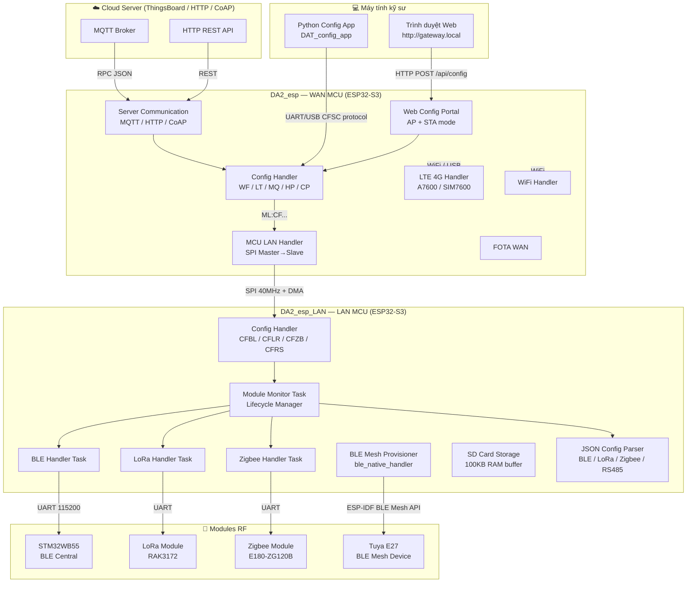

---

### 2.3 Phân tầng phần mềm LAN MCU

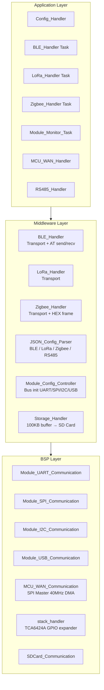

---

### 2.4 Giao thức lệnh cấu hình (Command Protocol)

Toàn bộ luồng lệnh đi qua hàng đợi trung tâm `g_config_handler_queue`. Phân biệt nguồn lệnh bằng trường `command_source_t`:

| Source | Giá trị | Mô tả |
|---|---|---|
| `CMD_SOURCE_UART` | 0 | PC App kết nối UART/USB |
| `CMD_SOURCE_WAN` | 1 | SPI từ WAN MCU (MQTT/HTTP/Web) |
| `CMD_SOURCE_HTTP` | 3 | Web Config Portal POST /api/config |

**Định tuyến lệnh tại WAN MCU** (prefix 2 ký tự):

| Prefix | Handler |
|---|---|
| `WF` | WiFi config |
| `LT` | LTE config |
| `MQ` | MQTT config |
| `HP` | HTTP config |
| `CP` | CoAP config |
| `SV` | Server type selection |
| `IN` | Internet type selection |
| `ML` | Forward → LAN MCU qua SPI |
| `FW` | FOTA WAN |

**Định tuyến lệnh tại LAN MCU** (prefix 4 ký tự sau `ML:`):

| Prefix | Handler | JSON load | AT/HEX cmd |
|---|---|---|---|
| `CFBL` | BLE AT | `CFBL:0:JSON:<json>` | `CFBL:0:<at_cmd>` |
| `CFLR` | LoRa AT | `CFLR:0:JSON:<json>` | `CFLR:0:<at_cmd>` |
| `CFZB` | Zigbee HEX | `CFZB:0:JSON:<json>` | `CFZB:0:<hex_cmd>` |
| `CFBN` | BLE Mesh Native | `CFBN:JSON:0:<json>` | `CFBN:0:SCAN/PROVISION/CONTROL` |
| `CFBG` | BLE GATT Central | `CFBG:JSON:0:<json>` | `CFBG:0:<cmd>` |
| `CFRS` | RS485 | — | `CFRS:BR:<baud>` |
| `CFFW` | FOTA LAN | — | `CFFW:<url>` |
| `CFSC` | Config Scan (đọc) | — | — |

---

## CHƯƠNG 3 — MODULE BASE SETTING (CẤU HÌNH MODULE BẰNG JSON)

### Nội dung cần bổ sung

Đây là đóng góp kỹ thuật chính của đồ án — cần trình bày kỹ nhất.

---

### 3.1 Vấn đề và động lực

Hệ thống cần hỗ trợ nhiều loại module RF (BLE, LoRa, Zigbee) từ nhiều nhà sản xuất khác nhau. Mỗi module có cú pháp AT command, giao thức vật lý, và trình tự GPIO hoàn toàn khác nhau:

| Hàm | STM32WB55 | HC-05 | ESP32 AT | nRF52 |
|---|---|---|---|---|
| SW Reset | `AT+RESET\r\n` | `AT+RESET\r\n` | `AT+RST\r\n` | `AT+RESET\r\n` |
| Set Name | `AT+NAME=` | `AT+NAME:` | `AT+BLENAME=` | `AT+GAPDEVNAME=` |
| Scan | `AT+SCAN=` | `AT+INQ` | `AT+BLESCAN=` | `AT+GAPSCAN` |
| Connect | `AT+CONNECT=` | `AT+LINK=` | `AT+BLECONN=` | `AT+GAPCONNECT=` |

**Nhận xét:** Cùng một **chức năng** (`MODULE_SCAN`) nhưng AT command hoàn toàn khác nhau giữa các module. Nếu hardcode, mỗi lần thay module phải recompile firmware.

**Giải pháp:** Chuẩn hóa theo **tên hàm (function name)** thay vì theo command. Toàn bộ chi tiết command nằm trong file JSON — firmware chỉ biết tên hàm.

---

### 3.2 Kiến trúc ba tầng trừu tượng

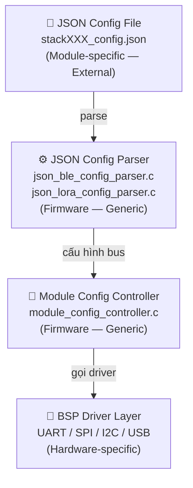

---

### 3.3 Cấu trúc JSON schema

File JSON mô tả toàn bộ cách tương tác với một module. Ví dụ cho `stack_002_config.json` (BLE STM32WB55):

```json
{
  "module_id": "002",
  "module_type": "BLE",
  "module_name": "STM32WB_BLE_Gateway",
  "module_communication": {
    "port_type": "uart",
    "parameters": {
      "baudrate": 115200,
      "parity": "none",
      "stopbit": 1
    }
  },
  "functions": [
    {
      "function_name": "MODULE_HW_RESET",
      "command": "",
      "is_prefix": false,
      "gpio_start_control": [{ "pin": "01", "state": "LOW" }],
      "delay_start": 100,
      "expect_response": "",
      "timeout": 0,
      "gpio_end_control": [{ "pin": "01", "state": "HIGH" }],
      "delay_end": 1000
    },
    {
      "function_name": "MODULE_START_DISCOVERY",
      "command": "AT+SCAN=",
      "is_prefix": true,
      "gpio_start_control": [],
      "delay_start": 0,
      "expect_response": "+SCAN:",
      "timeout": 7000,
      "gpio_end_control": [],
      "delay_end": 0
    }
  ]
}
```

Ý nghĩa từng trường:

| Trường | Kiểu | Mô tả |
|---|---|---|
| `function_name` | string | Tên hàm chuẩn — firmware nhận biết qua enum |
| `command` | string | AT command gửi xuống module (hoặc rỗng nếu GPIO-only) |
| `is_prefix` | bool | `true`: command là prefix, phần còn lại do server gửi. `false`: command chính xác |
| `gpio_start_control` | array | Danh sách GPIO cần toggle trước khi gửi command |
| `delay_start` | ms | Độ trễ sau GPIO start và trước khi gửi command |
| `expect_response` | string | Chuỗi prefix mong đợi trong phản hồi |
| `timeout` | ms | Timeout chờ phản hồi |
| `gpio_end_control` | array | GPIO toggle sau khi gửi xong command |
| `delay_end` | ms | Độ trễ sau GPIO end |

---

### 3.4 Cơ chế phân biệt Non-Prefix và Prefix command

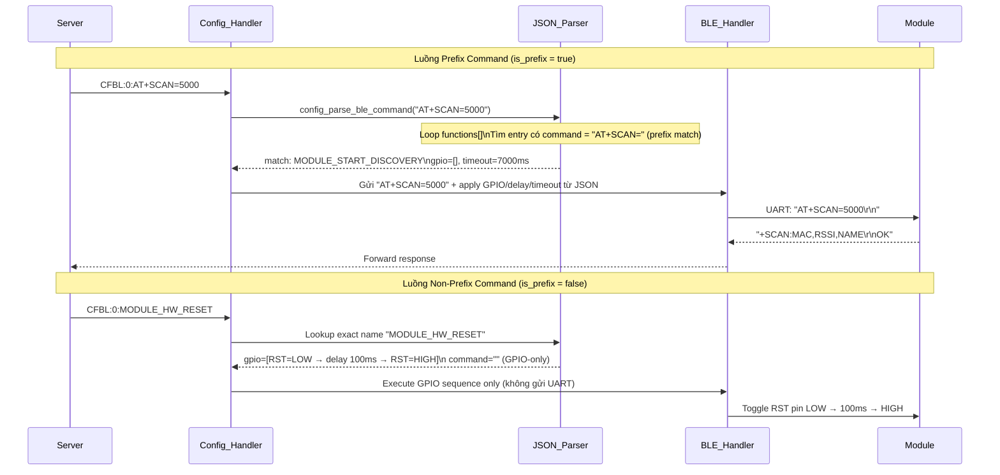

---

### 3.5 Luồng khởi động và tự động nhận dạng module

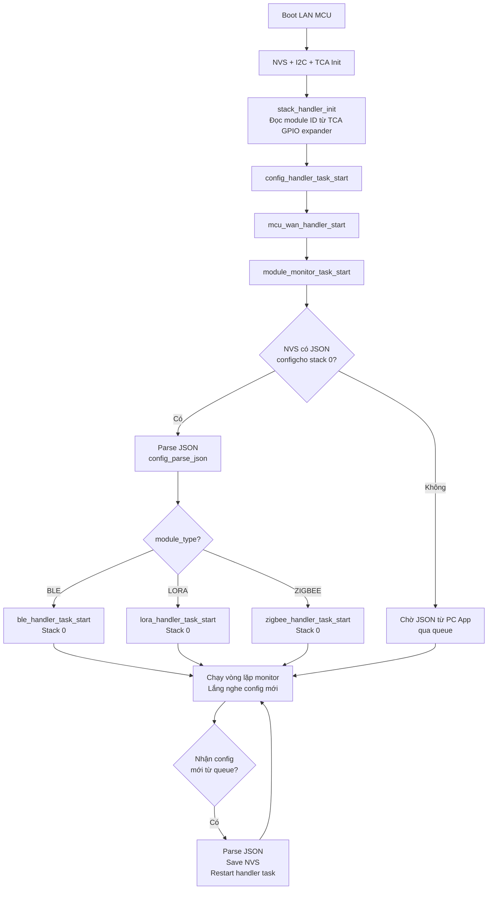

---

### 3.6 Danh sách file cài đặt

**Firmware DA2_esp_LAN:**

| File | Layer | Mô tả |
|---|---|---|
| `Middleware/JSON_Config_Parser/src/json_config_parser.c` | Middleware | Parse metadata chung (module_id, comm type, baudrate...) |
| `Middleware/JSON_Config_Parser/src/json_ble_config_parser.c` | Middleware | Parse BLE functions + GPIO sequences |
| `Middleware/JSON_Config_Parser/src/json_lora_config_parser.c` | Middleware | Parse LoRa functions |
| `Middleware/JSON_Config_Parser/src/json_zigbee_config_parser.c` | Middleware | Parse Zigbee HEX functions |
| `Middleware/JSON_Config_Parser/src/json_rs485_config_parser.c` | Middleware | Parse RS485 baudrate config |
| `Middleware/Module_Config_Controller/` | Middleware | Khởi tạo bus UART/SPI/I2C/USB theo parsed config |
| `Application/Module_Monitor_Task/src/module_monitor_task.c` | Application | Lifecycle manager: detect → parse → start handler |
| `Application/Config_Handler/src/config_handler_ble_commands.c` | Application | Routing CFBL: commands + prefix matching |
| `Application/Config_Handler/src/config_handler_lora_commands.c` | Application | Routing CFLR: commands |
| `Application/Config_Handler/src/config_handler_zigbee_commands.c` | Application | Routing CFZB: commands |
| `Application/Config_Handler/src/config_global.c` | Application | Global state: stack IDs, JSON buffers |

**PC App DATN_config_app:**

| File | Mô tả |
|---|---|
| `src/config/stack_002_config.json` | Template JSON cho BLE STM32WB55 |
| `src/config/stack_003_config.json` | Template JSON cho LoRa RAK3172 |
| `src/config/stack_001_config.json` | Template JSON cho Zigbee E180-ZG120B |
| `src/config/stack_id_map.json` | Mapping stack ID → module type + cmd prefix |
| `src/ui/advanced/ble_tab.py` | JSON Config Builder UI cho BLE |
| `src/ui/advanced/lora_tab.py` | JSON Config Builder UI cho LoRa |
| `src/ui/advanced/zigbee_tab.py` | JSON Config Builder UI cho Zigbee |

---

### 3.7 Kết quả kiểm thử

Sau khi triển khai, hệ thống đã được kiểm thử với module BLE STM32WB55:

| Test case | Kết quả |
|---|---|
| Gửi JSON config từ PC App → WAN MCU → SPI → LAN MCU | ✅ Pass |
| JSON được parse đúng: module_id, baudrate, parity, stopbit | ✅ Pass |
| NVS lưu JSON, reload đúng sau power cycle | ✅ Pass |
| Module Monitor Task tự restart BLE handler sau khi nhận config mới | ✅ Pass |
| Prefix command `AT+SCAN=5000` match đúng `MODULE_START_DISCOVERY` | ✅ Pass |
| GPIO-only command `MODULE_HW_RESET` không gửi UART, chỉ toggle pin | ✅ Pass |
| Thay JSON config (module khác) → handler tự restart với config mới | ✅ Pass |

---

## CHƯƠNG 4 — WEB CONFIG PORTAL (CỔNG CẤU HÌNH NHÚNG)

### Nội dung cần bổ sung

---

### 4.1 Lý do thiết kế

Trong phiên bản trước, cấu hình gateway chỉ có thể thực hiện qua Python PC App — yêu cầu cài đặt phần mềm và kết nối cáp USB. Web Config Portal cho phép kỹ sư và người dùng cấu hình hoàn toàn qua **trình duyệt web** trên bất kỳ thiết bị nào (máy tính, điện thoại). Đây cũng là yêu cầu cần thiết cho triển khai sản phẩm thực tế.

---

### 4.2 Kiến trúc tổng thể Web Portal

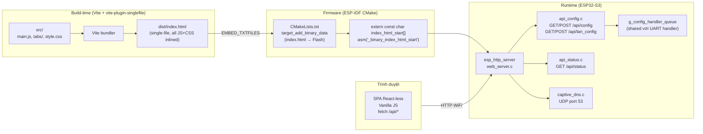

---

### 4.3 Chế độ AP và STA — Quy trình cấp phát WiFi

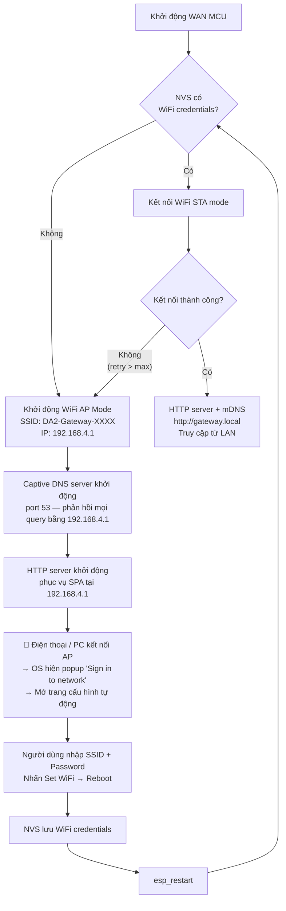

---

### 4.4 Cấu trúc REST API

| Endpoint | Phương thức | Mô tả |
|---|---|---|
| `/api/config` | GET | Trả về toàn bộ cấu hình WAN (WiFi, LTE, MQTT, HTTP, CoAP) dạng JSON |
| `/api/config` | POST | Cập nhật cấu hình WAN — đẩy lệnh vào `g_config_handler_queue` |
| `/api/lan_config` | GET | Trả về cấu hình LAN (BLE/LoRa/Zigbee JSON templates) |
| `/api/lan_config` | POST | Gửi JSON config cho module LAN (CFBL/CFLR/CFZB) |
| `/api/status` | GET | Trạng thái live: uptime, RSSI, firmware version, internet status |
| `/api/reboot` | POST | Gọi `esp_restart()` sau 500ms |

**Ví dụ response GET /api/config:**
```json
{
  "internet_type": 0,
  "server_type": 0,
  "wifi": { "ssid": "MyNetwork", "password": "***", "auth_mode": "PERSONAL" },
  "lte": { "modem": "A7600C1", "apn": "m-wap" },
  "mqtt": { "broker": "mqtt://demo.thingsboard.io:1883", "token": "***" }
}
```

---

### 4.5 Giao diện Web SPA

Giao diện được xây dựng bằng Vanilla JS (không framework) với Vite bundler. Toàn bộ JS và CSS được inline vào một file `index.html` duy nhất để nhúng vào firmware.

**Basic Mode** — tab cố định:
- `📶 WiFi` — SSID, Password, Auth Mode, Set WiFi Config
- `🌐 Server` — chọn protocol (MQTT/HTTP/CoAP) và cấu hình chi tiết
- `🔌 Interfaces` — trạng thái kết nối Internet, module RF

**Advanced Mode** — thêm các tab:
- `📱 LTE` — modem model, APN, username, password
- `🔷 BLE` — JSON Config Builder (hai pane: form + JSON preview)
- `🔵 BLE Native` — BLE Mesh Provisioner config (net key, app key, commands)
- `🟩 LoRa` — JSON Config Builder
- `🔶 Zigbee` — JSON Config Builder
- `🔌 RS485` — baudrate
- `🔄 FW` — Firmware OTA URL

**JSON Config Builder** (dùng chung cho BLE / LoRa / Zigbee):

```
┌─ Header ──────────────────────────────────────────────────────┐
│  Stack Slot: [S1▼]  Preset: [BLE STM32WB55▼]  [🔄 Reload]   │
│  Module ID: [002]   Module Name: [STM32WB_BLE_Gateway]        │
├─ LEFT (55%) ──────────────────┬─ RIGHT (45%) ─────────────────┤
│ 🔌 Communication              │ 📄 Generated JSON             │
│   Port type: [uart▼]          │  { "module_id": "002", ...}   │
│   Baudrate: [115200]          │  (editable, syntax highlight) │
│   Parity: [none▼]             ├───────────────────────────────┤
│                               │ 🚀 Actions                    │
│ ⚙️ Functions (accordion)      │  [✅ Send to Gateway]         │
│  ▼ MODULE_HW_RESET            │  [💾 Save JSON File]          │
│     GPIO: pin01 LOW→HIGH      │  [📂 Load JSON File]          │
│  ▼ MODULE_SW_RESET            ├───────────────────────────────┤
│     CMD: AT+RESET\r\n         │ 📊 Status                     │
│     Expected: OK, 2000ms      │  Last sent: 2026-03-21 10:30  │
│  ▼ MODULE_START_DISCOVERY     │  Response: JSON_PARSED_OK     │
│     CMD prefix: AT+SCAN=      │                               │
└───────────────────────────────┴───────────────────────────────┘
```

---

### 4.6 Quyết định thiết kế — EMBED_TXTFILES thay vì LittleFS

| Tiêu chí | EMBED_TXTFILES ✅ (đã chọn) | LittleFS partition ❌ |
|---|---|---|
| Thay đổi partitions.csv | Không cần | Phải thêm partition mới |
| Web UI và firmware luôn đồng bộ | Cùng binary, tự đồng bộ | Có thể lệch phiên bản |
| Phức tạp trong C | Tối thiểu (`extern const char*`) | Phải mount FS, xử lý lỗi |
| Ảnh hưởng đến FOTA flow | Không bao giờ | Có thể ảnh hưởng nếu shrink OTA |
| Kích thước điển hình của SPA | 150–300 KB (nằm gọn trong 7 MB OTA) | Như nhau |

---

### 4.7 Kết quả kiểm thử

| Test case | Kết quả |
|---|---|
| Kết nối phone vào AP — hiện captive portal tự động (Android + iOS) | ✅ Pass |
| Nhập WiFi credentials → reboot → kết nối STA thành công | ✅ Pass |
| Truy cập `http://gateway.local` từ LAN (mDNS hoạt động) | ✅ Pass |
| `GET /api/config` trả đầy đủ JSON cấu hình hiện tại | ✅ Pass |
| `POST /api/config` với WiFi config → gateway update và reconnect WiFi | ✅ Pass |
| `POST /api/lan_config` gửi BLE JSON → LAN MCU nhận và parse | ✅ Pass |
| `POST /api/reboot` → gateway restart trong 500ms | ✅ Pass |
| Firmware OTA tab: nhập URL → kích hoạt FOTA thành công | ✅ Pass |

---

## CHƯƠNG 5 — BLE MESH NATIVE TRÊN ESP32-S3

### Nội dung cần bổ sung

---

### 5.1 Lý do triển khai

Trong quá trình kiểm thử điều khiển đèn Tuya E27 qua BLE truyền thống (STM32WB55 AT command), phát hiện vấn đề cơ bản:

- Tuya E27 liên tục phát frame `ADV_NONCONN_IND (0x03)` — đây là **BLE Mesh Unprovisioned Device Beacon** theo BT SIG Mesh Profile v1.0.
- Lệnh `AT+CONNECT=<MAC>` của STM32WB55 chỉ kết nối được với thiết bị phát `ADV_IND (0x00)` (connectable advertisement).
- Kết quả: `AT+CONNECT` bị treo vĩnh viễn, không timeout.

| Phương pháp | Kiểu advertisement | Tuya E27 | Kết quả |
|---|---|---|---|
| GATT Central (STM32WB55 AT) | Cần `ADV_IND 0x00` | Phát `ADV_NONCONN_IND 0x03` | ❌ Không kết nối được |
| BLE Mesh Provisioner (ESP32-S3) | Nhận `ADV_NONCONN_IND 0x03` | Phát `ADV_NONCONN_IND 0x03` | ✅ Hoạt động |

**Giải pháp:** Triển khai **BLE Mesh Provisioner** trực tiếp trên ESP32-S3 (LAN MCU) sử dụng ESP-IDF BLE Mesh API. WAN MCU không thay đổi gì.

---

### 5.2 Kiến trúc triển khai

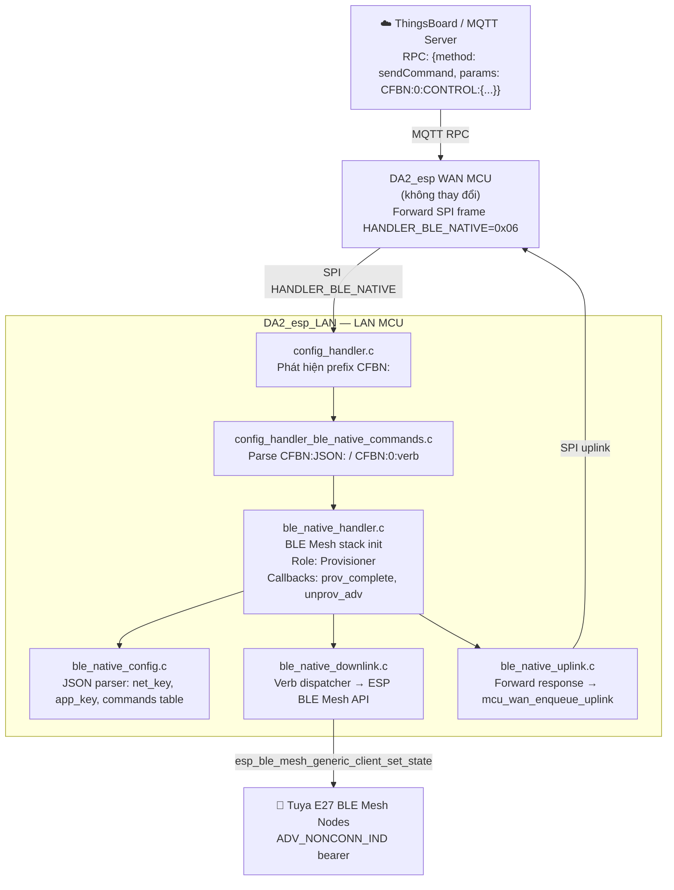

---

### 5.3 Các BLE Mesh model đăng ký

| Model | SIG ID | Vai trò |
|---|---|---|
| Config Server | bắt buộc | Yêu cầu theo BT SIG Mesh spec |
| Config Client | bắt buộc | Bind app-key lên các node từ xa |
| Generic OnOff Client | `0x1001` | Bật/Tắt thiết bị |
| Light Lightness Client | `0x1303` | Điều chỉnh độ sáng |
| Light CTL Client | `0x1305` | Điều chỉnh nhiệt độ màu |
| Scene Client | `0x1205` | Lưu/gọi lại scene |

Model selection tại runtime được điều khiển bởi trường `"model_id"` trong bảng commands JSON — **không hardcode trong firmware**.

---

### 5.4 Giao thức lệnh CFBN:

Tuân theo cùng pattern với `CFBL:`, `CFLR:`, `CFZB:`:

| Lệnh | Mô tả | Response |
|---|---|---|
| `CFBN:JSON:0:<json>` | Nạp config: net_key, app_key, provisioner address, bảng commands | `CFBN:0:OK:JSON_LOADED` |
| `CFBN:0:SCAN` | Scan unprovisioned devices | `+UNPROV:UUID,RSSI` (async stream) |
| `CFBN:0:PROVISION:<uuid>` | Provision một device | `+PROV_DONE:addr` or `+PROV_FAIL` |
| `CFBN:0:CONTROL:<json>` | Gửi lệnh điều khiển theo model_id + opcode | Response qua notify |
| `CFBN:0:STATUS:<addr>` | Request status từ node | `+STATUS:addr,value` |

---

### 5.5 Luồng hoạt động sau khi nạp JSON

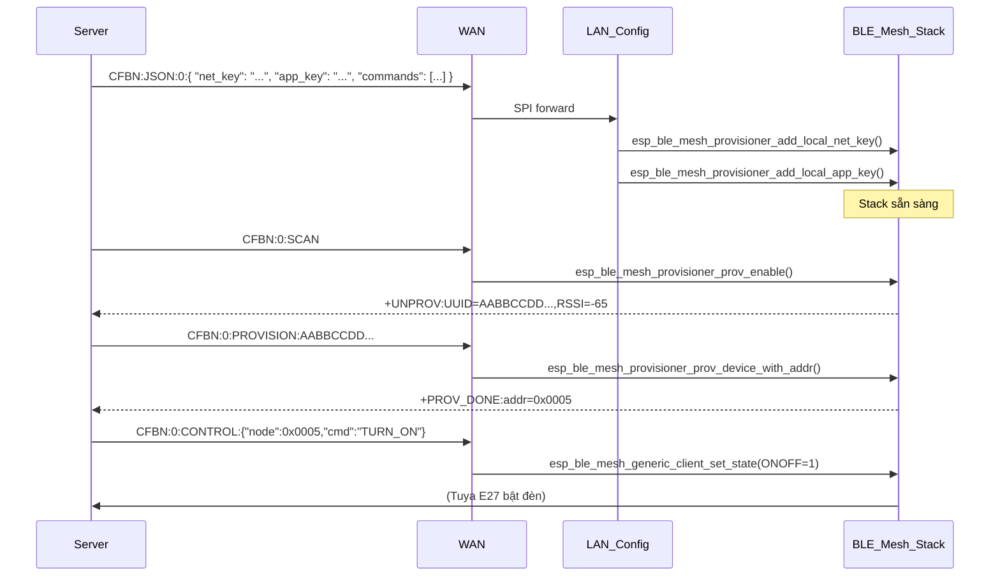

---

### 5.6 Trạng thái kiểm thử

Code đã được viết và biên dịch thành công. **Chưa kiểm thử trên phần cứng** — chờ hoàn thành bo mạch mới. Các điểm cần xác minh khi kiểm thử:

- Khởi tạo BLE Mesh stack không xung đột với Wi-Fi stack
- Callback `ESP_BLE_MESH_PROVISIONER_RECV_UNPROV_ADV_PKT_EVT` nhận đúng beacon từ Tuya E27
- Provisioning flow hoàn thành: PB-ADV → Provisioning PDU → PROV_DONE
- OnOff / Lightness / CTL client model gửi đúng opcode và nhận ACK

---

## CHƯƠNG 6 — ỨNG DỤNG KIỂM THỬ: ĐIỀU KHIỂN ĐÈN TUYA E27

### Nội dung cần bổ sung

---

### 6.1 Mô tả kịch bản kiểm thử

Kịch bản kiểm thử tích hợp đầu-cuối: Điều khiển đèn LED thông minh **Tuya E27** thông qua gateway DA2, từ ThingsBoard MQTT dashboard xuống đèn vật lý. Đây là ứng dụng thực tế nhất để kiểm chứng toàn bộ hệ thống.

```
ThingsBoard Dashboard
        │ MQTT RPC
        ▼
DA2_esp (WAN MCU)
        │ CFBL: commands qua SPI
        ▼
DA2_esp_LAN (LAN MCU)
        │ UART 115200 baud
        ▼
STM32WB55 (BLE Central)
        │ BLE GATT Write (Service 1910, Char 0x2B11)
        ▼
Tuya E27 (BLE Peripheral)
```

---

### 6.2 GATT Info của Tuya E27

| Thông số | Giá trị |
|---|---|
| Service UUID | `1910` |
| Write Characteristic | `2B11` — gửi lệnh xuống đèn |
| Notify Characteristic | `2B10` — nhận phản hồi từ đèn |
| UART baudrate STM32WB55 | 115200 baud, 8N1 |

---

### 6.3 Giao thức Tuya DP (Data Point)

Tuya E27 dùng định dạng TLV binary qua BLE GATT:

```
Header:  55 AA
Seq:     XX XX  (sequence number, tăng mỗi lần gửi)
Length:  00 XX  (độ dài payload)
DP ID:   XX     (Data Point ID: 02=mode, 03=brightness, 04=CCT, 05=on_off)
DP Type: XX     (01=bool, 02=enum, 03=value/int32, 05=string)
DP Len:  00 XX  (độ dài data)
Data:    XX...
Checksum: XX    (tổng các byte từ Header đến hết Data, mod 256)
```

---

### 6.4 Bảng lệnh điều khiển (qua STM32WB55 AT)

Sau khi thực hiện init flow và kết nối thành công, handle write characteristic = `0x000E`:

| Lệnh | CFBL command | Payload GATT |
|---|---|---|
| Bật đèn | `CFBL:0:AT+WRITE=0,0x000E,...` | `55AA00010006000501010001010F` |
| Tắt đèn | `CFBL:0:AT+WRITE=0,0x000E,...` | `55AA00020006000501010001000E` |
| Độ sáng 100% (DP03=1000) | `CFBL:0:AT+WRITE=0,0x000E,...` | `55AA0003...000003E8...` |
| Độ sáng 50% (DP03=500) | `CFBL:0:AT+WRITE=0,0x000E,...` | `55AA0004...000001F4...` |
| CCT ấm (DP04=0) | `CFBL:0:AT+WRITE=0,0x000E,...` | `55AA0006...0000000024...` |
| CCT lạnh (DP04=1000) | `CFBL:0:AT+WRITE=0,0x000E,...` | `55AA0007...000003E8...` |
| Chế độ RGB | `CFBL:0:AT+WRITE=0,0x000E,...` | `55AA00080006000502040001011B` |
| Màu đỏ HSV(0°,100%,100%) | `CFBL:0:AT+WRITE=0,0x000E,...` | `55AA0009...303030303634363437...` |

---

### 6.5 Init flow chi tiết

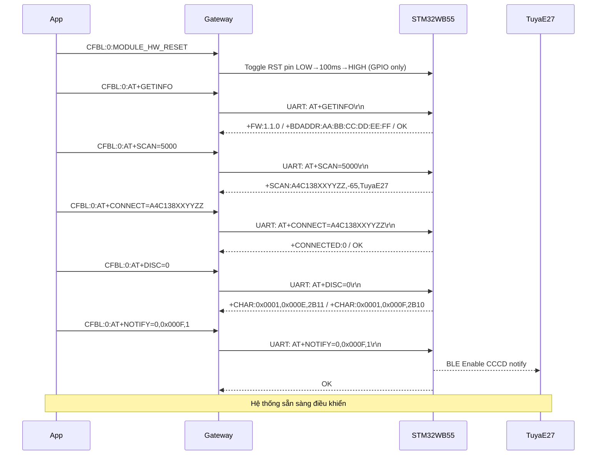

---

### 6.6 Trạng thái kiểm thử

| Hạng mục | Trạng thái |
|---|---|
| Command sequences (STM32WB55 AT path) | ✅ Tài liệu hóa đầy đủ, payload Tuya DP đã xác minh |
| Command sequences (ESP32 AT BLE path) | ✅ Tài liệu hóa |
| Command routing gateway (CFBL: → UART) | ✅ Đã kiểm thử với Module Base Setting |
| Kiểm thử vật lý đèn phản hồi lệnh | ⏳ Chưa thực hiện (chờ bo mạch mới) |
| Tích hợp ThingsBoard dashboard | ⏳ Chưa thực hiện |

---

## CHƯƠNG 7 — CẬP NHẬT BO MẠCH PHẦN CỨNG MỚI

### Nội dung cần bổ sung

> **Lưu ý:** Chương này **không phải chương phần cứng** (không có sơ đồ mạch, PCB layout). Đây là chương mô tả các thay đổi firmware cần thiết để tương thích với phiên bản bo mạch mới.

---

### 7.1 Những thay đổi phần cứng chính

| Thay đổi | Bo cũ | Bo mới |
|---|---|---|
| IO Expander | TCA6424A (24 chân, 3 port, `0x22`) trên mainboard | TCA6416A (16 chân, 2 port) **trên từng adapter board** (`0x20` / `0x21`) |
| Phát hiện Stack ID | Giả lập / hardcode | Đọc từ P00–P03 (4-bit) của TCA6416A |
| Số GPIO per stack (WAN) | 13 (11 GPIO + WAKE# + PERST#) | 16 (P00–P17 flat mapping) |
| Số GPIO per stack (LAN) | 11 per stack | 16 per adapter |
| LTE WAKE# pin | TCA pin 11 | P05 |
| LTE PERST# pin | TCA pin 12 | P06 |
| LAN2 UART TX/RX | GPIO15 / GPIO16 | GPIO8 / GPIO21 |
| SPI3 (LAN module) | các GPIO cũ | CS0=38, CS1=39, CLK=41, MISO=42, MOSI=40 |
| IO Expander INT pin (LAN1) | GPIO21 (chung) | GPIO47 |
| IO Expander INT pin (LAN2) | GPIO21 (chung) | GPIO48 |
| USB Switch Control | Không có | GPIO46 (mới) |

---

### 7.2 Tiến độ thay đổi firmware

| Task | Nội dung | DA2_esp (WAN) | DA2_esp_LAN (LAN) | Trạng thái |
|---|---|---|---|---|
| Task 1 | SPI pins WAN↔LAN (CS=10, CLK=12, MOSI=11, MISO=13) | ✅ | ✅ | Hoàn thành |
| Task 2 | INT, RESET, DATA_READY pins | ✅ | ✅ | Hoàn thành |
| Task 3 | UART WAN↔LAN compatibility (TX=42,RX=41 WAN; TX=43,RX=44 LAN) | ✅ | ✅ | Hoàn thành |
| Task 4 | Power & Charger Module Control (pwr_source_handler) | ❌ | — | Chưa bắt đầu |
| Task 5 | WAN Stack Handler rewrite (TCA6416A, 16-pin enum) | ❌ | — | Chưa bắt đầu |
| Task 6 | LTE control pin remap (WAKE#: 11→5, PERST#: 12→6) | ❌ | — | Chưa bắt đầu |
| Task 7 | LAN adapter connector pin: LAN2 UART, SPI3 | — | ❌ | Chưa bắt đầu |
| Task 8 | LAN Stack Handler rewrite (multi-instance TCA6416A) | — | ❌ | Chưa bắt đầu |
| Task 9 | LAN Module SPI pin update | — | ❌ | Chưa bắt đầu |
| Task 10 | LAN2 Module UART pin update (GPIO8/21) | — | ❌ | Chưa bắt đầu |
| Task 11 | USB Switch Control (GPIO46) | — | ❌ | Chưa bắt đầu |
| Task 12 | SD Card / SDIO pin check | — | ❌ | Chưa bắt đầu |
| Task 13 | TCA6416A register map, I2C addresses (0x20/0x21) | ❌ | ❌ | Chưa bắt đầu |
| Task 14 | WAN Power Source Handler update | ❌ | — | Chưa bắt đầu |

**Tiến độ:** 3 / 14 tasks hoàn thành (21%)

---

### 7.3 Thay đổi kiến trúc quan trọng nhất — Multi-Instance Stack Handler (Task 8)

Thay đổi phức tạp nhất: LAN Stack Handler phải được viết lại hoàn toàn từ một TCA singleton thành hai TCA6416A instance độc lập:

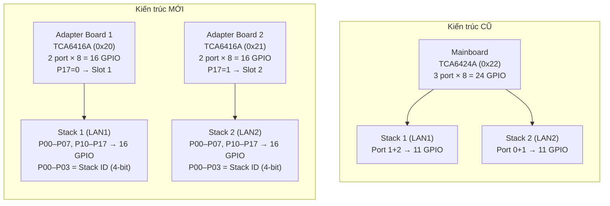

**Luồng khởi động mới của `stack_handler_init()`:**
1. Scan I2C bus tìm TCA6416A tại `0x20` và `0x21`.
2. Với mỗi TCA tìm thấy, đọc **P17 (IOX_SLOTDET)**:
   - P17 = 0 → Đây là **Adapter Slot 1 (LAN ADAPTER 1)**
   - P17 = 1 → Đây là **Adapter Slot 2 (LAN ADAPTER 2)**
3. Đọc P00–P03 → 4-bit Stack ID (0b0000 đến 0b1111)
4. Lưu: handle TCA riêng cho từng slot, `stack_1_id`, `stack_2_id`

---

## HƯỚNG TIẾP THEO

### Công việc còn lại theo thứ tự ưu tiên

| # | Công việc | Mức độ ưu tiên | Ghi chú |
|---|---|---|---|
| 1 | Hoàn thành Task 5 + Task 8: Rewrite Stack Handler (WAN & LAN) cho TCA6416A | 🔴 Cao | Block toàn bộ kiểm thử trên bo mới |
| 2 | Hoàn thành Task 6: LTE pin remap | 🔴 Cao | Cần để kết nối 4G hoạt động |
| 3 | Hoàn thành Task 7 + 9 + 10: LAN pin updates | 🔴 Cao | UART, SPI pins cho module RF |
| 4 | Hoàn thành Task 13: TCA6416A register map | 🔴 Cao | Dependency của Task 5 + 8 |
| 5 | Hoàn thành Task 4 + 14: Power control | 🟡 Vừa | Cần để khởi động bo mới |
| 6 | Kiểm thử BLE Mesh Native (Chương 5) trên phần cứng | 🟡 Vừa | Cần bo mới + Tuya E27 |
| 7 | Kiểm thử ứng dụng đèn E27 end-to-end (Chương 6) | 🟡 Vừa | Cần BLE Mesh hoạt động |
| 8 | Tích hợp ThingsBoard MQTT dashboard điều khiển đèn | 🟢 Thấp | Demo cuối kỳ |
| 9 | Hoàn thiện PC App v5.0 (Basic Info Card, LoRa/Zigbee tab) | 🟢 Thấp | Tham khảo TODO_ADD_APP.md |
| 10 | Kiểm thử FOTA LAN MCU qua PPP tunnel | 🟢 Thấp | |

---

### Tóm tắt tiến độ tổng thể

| Hạng mục | Trạng thái |
|---|---|
| **Module Base Setting (JSON-driven)** | ✅ Triển khai và kiểm thử xong (BLE) |
| **Web Config Portal** | ✅ Triển khai và kiểm thử xong |
| **BLE Mesh Native Provisioner** | 🔧 Code xong, chưa kiểm thử phần cứng |
| **Test App: Tuya E27** | 🔧 Tài liệu hóa xong, payload xác minh, chưa chạy trên phần cứng |
| **Cập nhật bo mạch mới** | 🔄 21% (3/14 tasks hoàn thành) |
| **PC App v5.0** | 🔄 Thiết kế xong, một phần triển khai |

---

*Tài liệu này tóm tắt những nội dung cần bổ sung vào báo cáo đồ án giữa kỳ. Các chương phần cứng (sơ đồ nguyên lý, PCB layout) và chương Kết luận không thuộc phạm vi cập nhật.*
