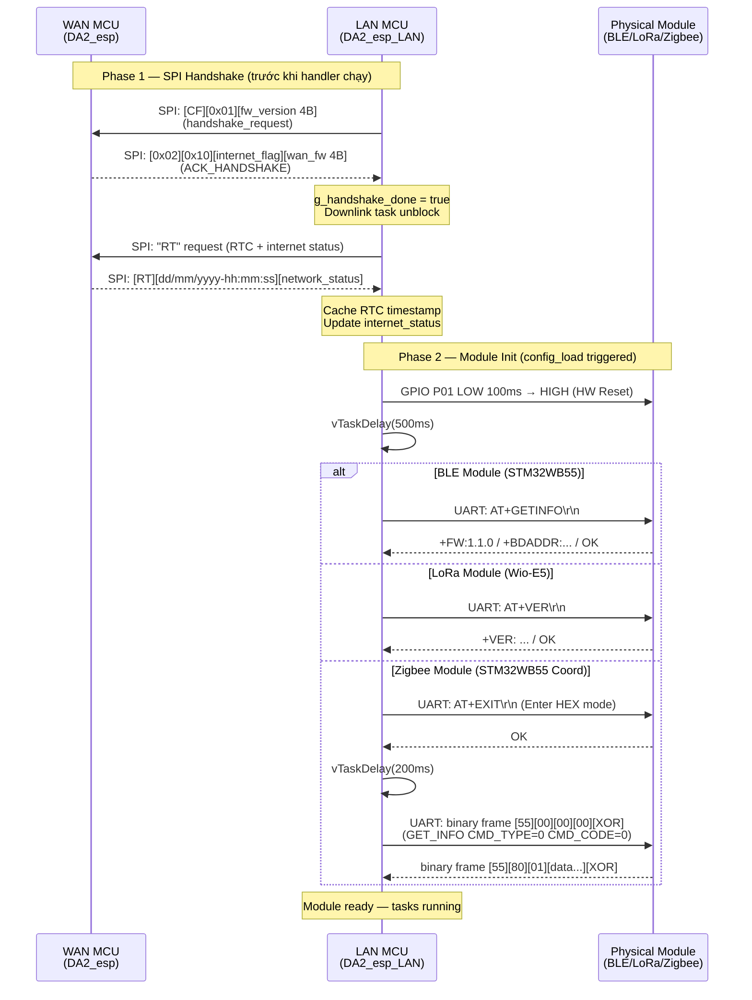
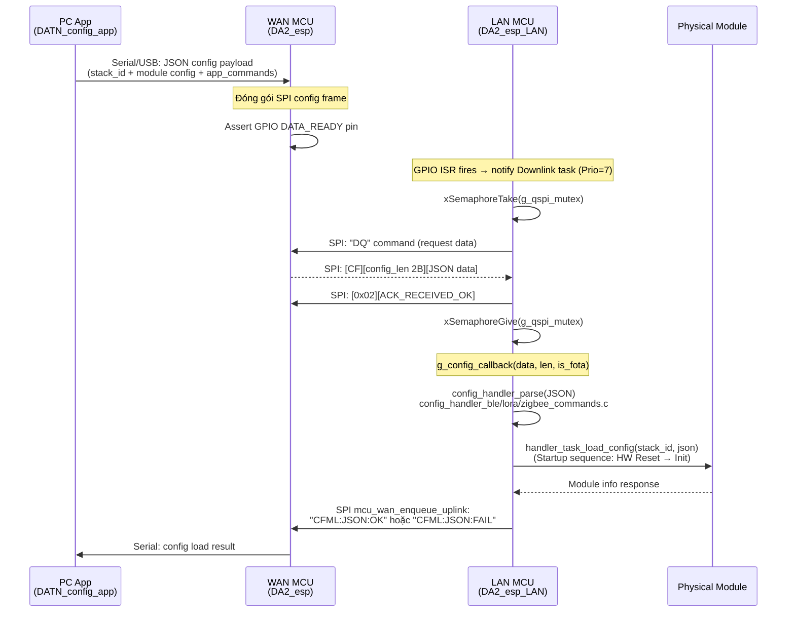
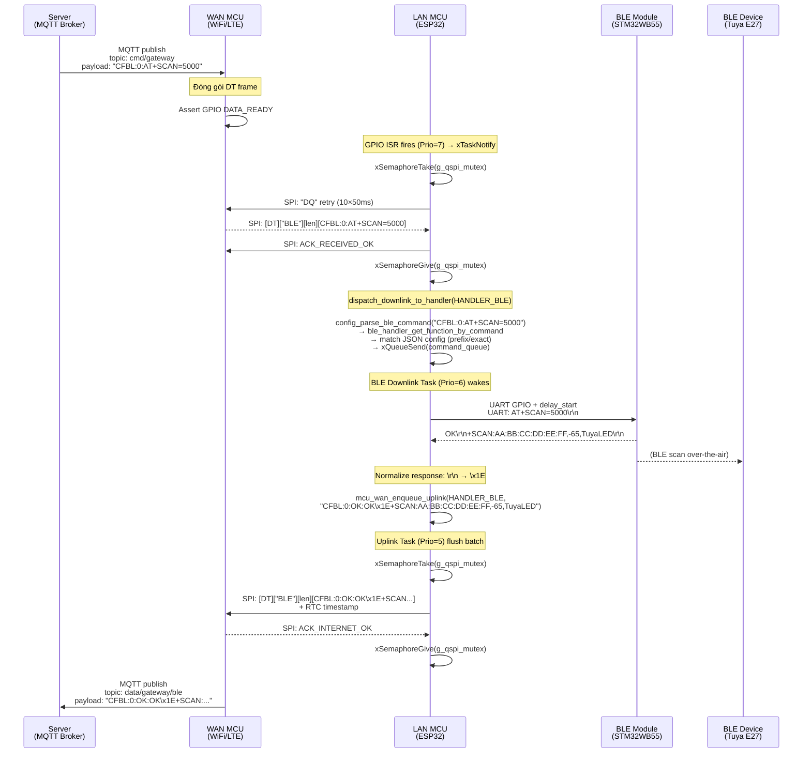
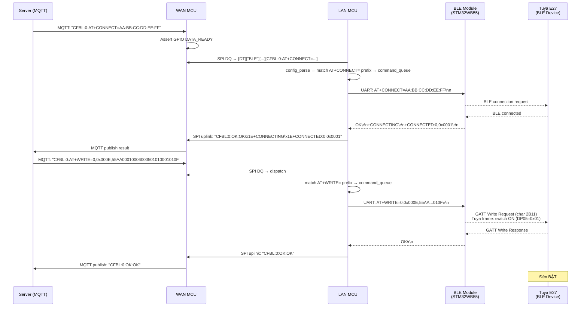
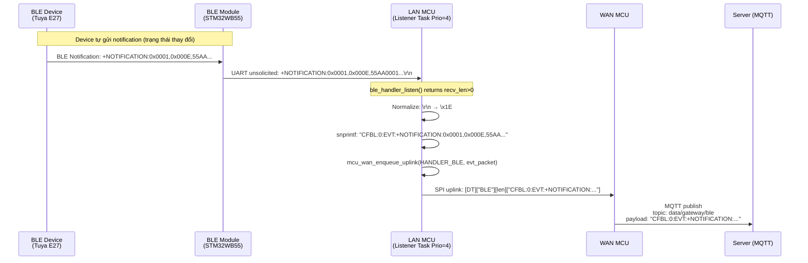
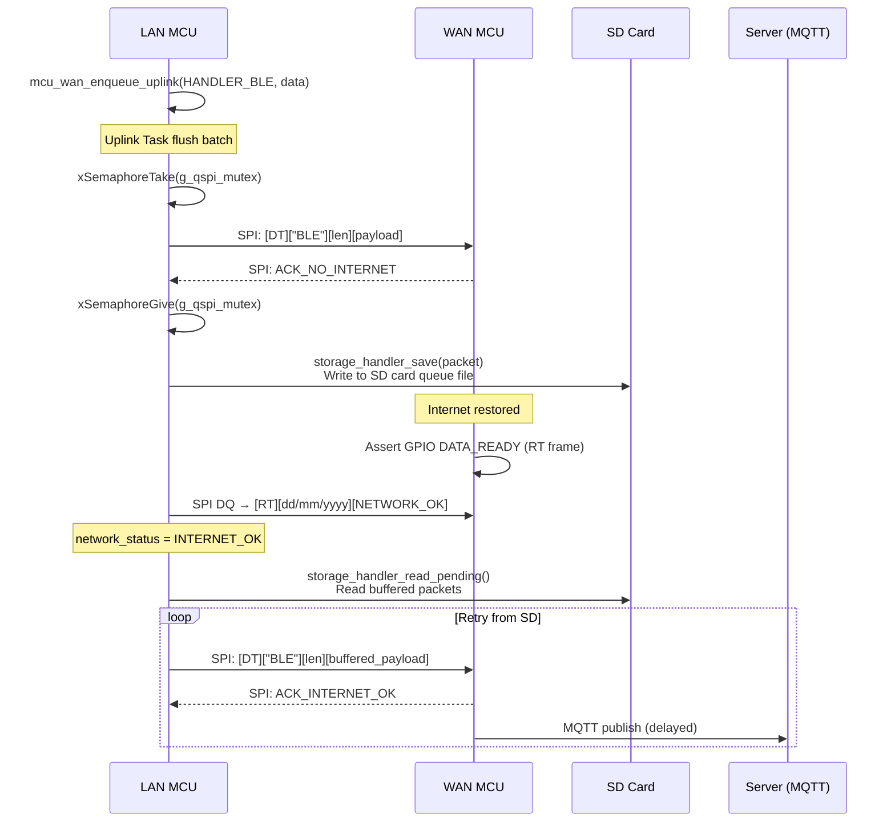
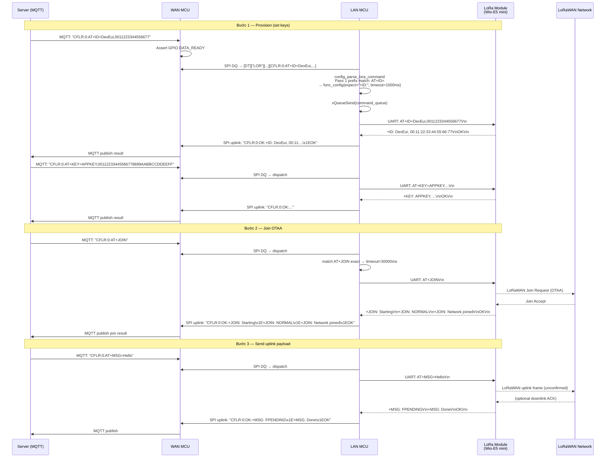
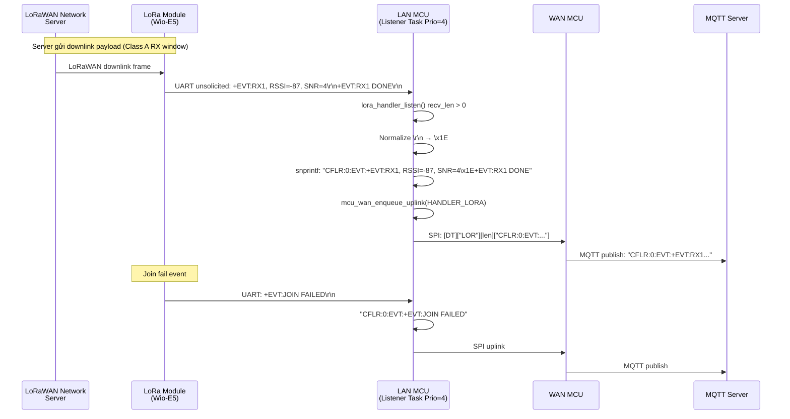
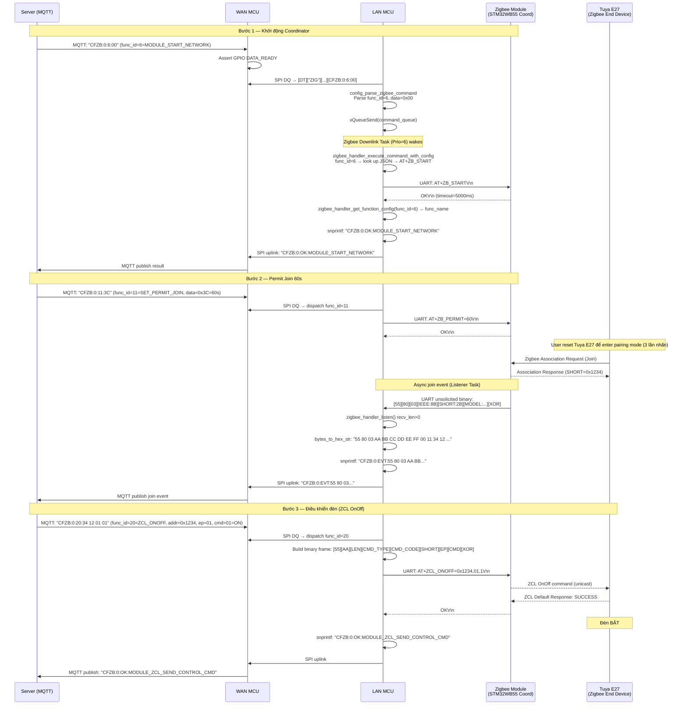
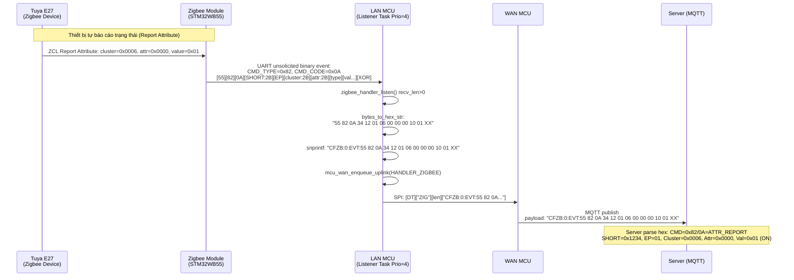

# Gateway Handler Sequence Diagrams

Tài liệu mô tả luồng giao tiếp đầy đủ của 3 wireless handler (BLE, LoRa, Zigbee) trong hệ thống gateway DA2, từ physical module → LAN MCU → WAN MCU → MQTT → Server.

---

## Mục lục

1. [Kiến trúc tổng quan](#1-kiến-trúc-tổng-quan)
2. [Startup & Handshake Sequence](#2-startup--handshake-sequence)
3. [Config Load Sequence](#3-config-load-sequence)
4. [BLE Sequence Diagrams](#4-ble-sequence-diagrams)
5. [LoRa Sequence Diagrams](#5-lora-sequence-diagrams)
6. [Zigbee Sequence Diagrams](#6-zigbee-sequence-diagrams)
7. [SPI Frame Format Reference](#7-spi-frame-format-reference)
8. [So sánh 3 handler](#8-so-sánh-3-handler)

---

## 1. Kiến trúc tổng quan

```
┌─────────┐   MQTT pub/sub   ┌───────────┐   QSPI + GPIO ISR   ┌────────────────────────────────────────┐   UART   ┌──────────────┐
│  Server │ ◄──────────────► │  WAN MCU  │ ◄─────────────────► │         LAN MCU (ESP32)                │ ◄──────► │  BLE Module  │
│ (MQTT)  │                  │ (DA2_esp) │                      │         (DA2_esp_LAN)                  │          │  LoRa Module │
└─────────┘                  └───────────┘                      │                                        │          │  Zigbee Mod  │
                                                                 │  ┌───────────────────────────────────┐ │          └──────────────┘
     ▲                                                           │  │       mcu_wan_handler             │ │
     │                                                           │  │  ┌──────────┐  ┌───────────────┐  │ │
     │  MQTT subscribe                                           │  │  │ Uplink   │  │ Downlink Poll │  │ │
     │  topic: cmd/gateway                                       │  │  │  Task    │  │  Task Prio=7  │  │ │
     │                                                           │  │  │  Prio=5  │  │ GPIO ISR wake │  │ │
┌────┴────┐                                                      │  │  │ Queue=50 │  │ DQ 10×50ms   │  │ │
│  PC App │ ──── Serial/USB ────► WAN MCU                       │  │  └──────────┘  └───────────────┘  │ │
│ (Config)│                                                      │  └───────────────────────────────────┘ │
└─────────┘                                                      │                                        │
                                                                 │  ┌──────────┐ ┌──────────┐ ┌────────┐ │
                                                                 │  │BLE Handl.│ │LoRa Hand.│ │ZB Hand.│ │
                                                                 │  │UL/DL/LS  │ │UL/DL/LS  │ │UL/DL/LS│ │
                                                                 │  │ 3 tasks  │ │ 3 tasks  │ │3 tasks │ │
                                                                 │  └──────────┘ └──────────┘ └────────┘ │
                                                                 └────────────────────────────────────────┘

Uplink packet format gửi lên MQTT:
  BLE    : "CFBL:<stack_id>:<OK|FAIL|EVT>:<response>"
  LoRa   : "CFLR:<stack_id>:<OK|FAIL|EVT>:<response>"
  Zigbee : "CFZB:<stack_id>:<OK|FAIL|EVT>:<func_name>[:<hex_data>]"

Downlink packet format từ MQTT:
  SPI frame: [DT][handler_type(3B)][length(2B)][payload]
  handler_type: "BLE", "LOR", "ZIG"
  payload = "CFBL:0:AT+SCAN=5000" / "CFLR:0:AT+JOIN" / "CFZB:0:func_id:hex"

Config packet từ PC App → WAN MCU → LAN MCU:
  SPI frame: [CF][length(2B)][JSON config data]
```

---

## 2. Startup & Handshake Sequence



---

## 3. Config Load Sequence



---

## 4. BLE Sequence Diagrams

### 4.1 Downlink — PC App / Server gửi lệnh điều khiển BLE module



### 4.2 BLE Connect & GATT Write (điều khiển đèn)



### 4.3 BLE Listener — Unsolicited Event từ module



### 4.4 Uplink offline — SD card backup khi mất internet



---

## 5. LoRa Sequence Diagrams

### 5.1 Downlink — Config & Join network



### 5.2 LoRa Listener — Async downlink từ LoRaWAN server



---

## 6. Zigbee Sequence Diagrams

### 6.1 Downlink — Start network & control thiết bị Tuya E27



### 6.2 Zigbee Listener — ZCL Report Attribute từ thiết bị



---

## 7. SPI Frame Format Reference

```
DOWNLINK từ WAN MCU → LAN MCU (DATA packet):
┌──────┬─────────────────┬────────────────┬────────────────────────┐
│  DT  │  handler_type   │  length (2B)   │  payload (N bytes)     │
│ [44] │  [54][BLE/LOR/  │  [HI][LO]      │  CFBL/CFLR/CFZB:...   │
│ [54] │   ZIG]3B + \0   │                │                        │
└──────┴─────────────────┴────────────────┴────────────────────────┘
  Offset: 0   1           2    3    4       5    6         7+

CONFIG từ WAN MCU → LAN MCU:
┌──────┬────────────────┬────────────────────────────┐
│  CF  │  config_len    │  config_data (JSON)         │
│ [43] │  [HI][LO]      │  {"module_id":"002",...}    │
│ [46] │  2B            │                             │
└──────┴────────────────┴────────────────────────────┘

UPLINK từ LAN MCU → WAN MCU (DATA packet):
  Payload = "CFLR:0:OK:+JOIN: Network joined\x1EOK"
  Wrapped thêm header DT + handler_type + len + RTC timestamp

ACK types:
  0x11 = ACK_RECEIVED_OK    (LAN báo đã nhận)
  0x12 = ACK_INTERNET_OK    (WAN báo đã gửi server thành công)
  0x13 = ACK_NO_INTERNET    (WAN không có internet → LAN lưu SD card)
  0x10 = ACK_HANDSHAKE      (Handshake response)

Handshake flow:
  LAN → [CF][0x01][fw_version 4B]
  WAN → [0x02][0x10][internet_flag][wan_fw 4B]

DQ retry mechanism (Downlink poll):
  1. WAN assert GPIO DATA_READY → ISR fires → notify Downlink Task (Prio=7)
  2. LAN acquire g_qspi_mutex (block Uplink Task)
  3. Loop 10× {send "DQ" → wait 50ms → read response}
  4. On success: dispatch + send ACK + release mutex
  5. On fail (10 retries): log warning + release mutex
```

---

## 8. So sánh 3 handler

| Đặc điểm                   | BLE (`CFBL`)                        | LoRa (`CFLR`)                        | Zigbee (`CFZB`)                        |
|----------------------------|-------------------------------------|--------------------------------------|----------------------------------------|
| **MQTT topic**             | data/gateway/ble                    | data/gateway/lora                    | data/gateway/zigbee                    |
| **DT handler_type**        | `"BLE"`                             | `"LOR"`                              | `"ZIG"`                                |
| **Command format**         | String: `AT+CMD` hoặc func name     | String: `AT+CMD` hoặc func name      | Integer `func_id` + binary hex data    |
| **Command match**          | prefix hoặc exact vs JSON           | Pass 1: prefix / Pass 2: exact       | func_id lookup trong config table      |
| **Module protocol**        | ASCII AT commands                   | ASCII AT commands                    | Binary HEX frame `55 AA ...`           |
| **Startup sequence**       | HW_RESET → 500ms → GET_INFO         | HW_RESET → 500ms → GET_INFO          | HW_RESET → 500ms → AT+EXIT → 200ms → GET_INFO (binary) |
| **Response encoding**      | ASCII, `\r\n` → `\x1E`              | ASCII, `\r\n` → `\x1E`               | Binary → `bytes_to_hex_str` (space-sep hex) |
| **Uplink packet**          | `CFBL:id:OK/FAIL/EVT:response`      | `CFLR:id:OK/FAIL/EVT:response`       | `CFZB:id:OK/FAIL/EVT:func[:hex_data]`  |
| **Async event type**       | Unsolicited ASCII lines             | `+EVT:JOIN_FAILED` `+EVT:RX1`        | Binary CMD_TYPE 0x80/0x82 frames       |
| **Listener output**        | `CFBL:id:EVT:<ascii_line>`          | `CFLR:id:EVT:<ascii_event>`          | `CFZB:id:EVT:<hex_dump>`               |
| **Downlink queue**         | ✅ uplink + downlink + command       | ✅ uplink + downlink + command        | ❌ uplink + command (no downlink queue) |
| **Task priorities**        | UL=5, DL=6, LS=4                    | UL=5, DL=6, LS=4                     | UL=5, DL=6, LS=4                       |
| **Internet offline**       | → SD card backup                    | → SD card backup                     | → SD card backup                       |
| **Batch uplink**           | max 8 pkts / 50ms flush             | max 8 pkts / 50ms flush              | max 8 pkts / 50ms flush                |

### FreeRTOS resource summary (1 stack instance)

| Resource           | BLE / LoRa | Zigbee | Note                          |
|--------------------|------------|--------|-------------------------------|
| FreeRTOS Tasks     | 3          | 3      | uplink, downlink, listener    |
| Queues             | 3          | 2      | BLE/LoRa: +downlink_queue; Zigbee: no separate downlink |
| Task heap (total)  | ~40 KB     | ~40 KB | 16+16+8 KB stack per stack    |
| Listener buffers   | ~1.5 KB    | ~4.6 KB| Zigbee cần hex_str 1536B extra |
| Response alloc     | ~5 KB      | ~2 KB  | Per-command malloc/free        |
| WAN uplink queue   | 50 slots   | 50 slots| shared g_uplink_queue         |

---

*Tham chiếu source: `DA2_esp_LAN/Application/BLE_Handler/src/ble_handler_task.c`, `lora_handler_task.c`, `zigbee_handler_task.c`, `mcu_wan_handler_uplink.c`, `mcu_wan_handler_downlink.c`, `frame_types.h`*  
*Ngày: 2026-03-19*