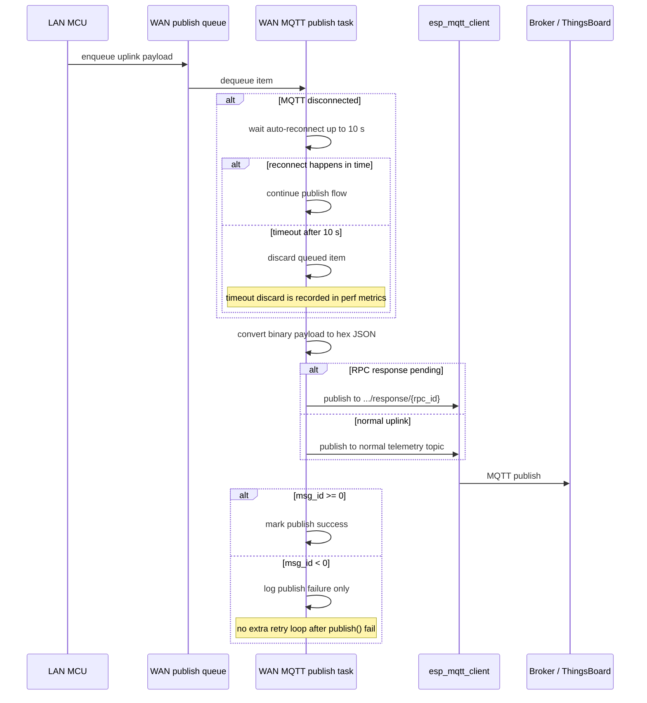
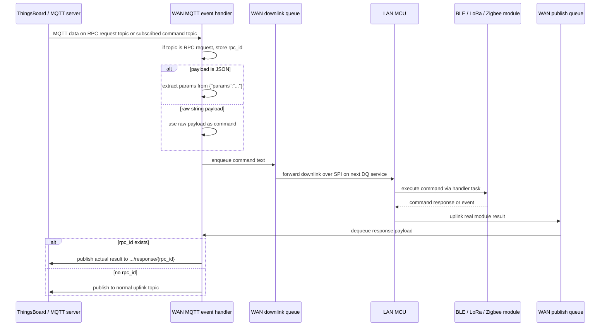
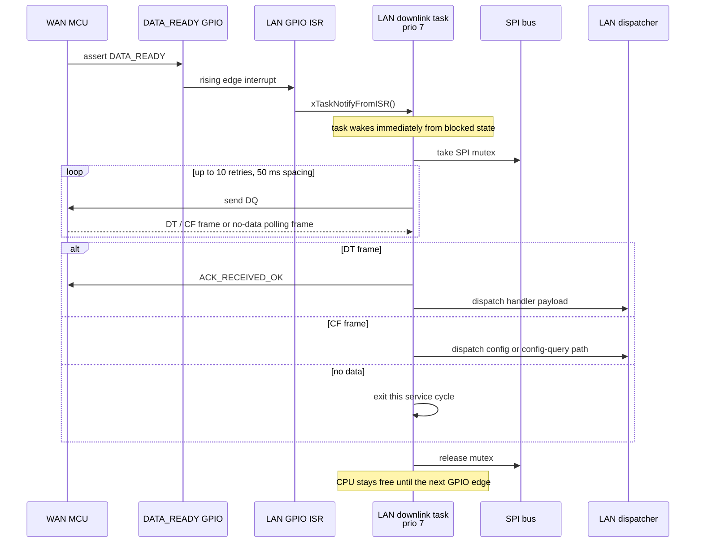
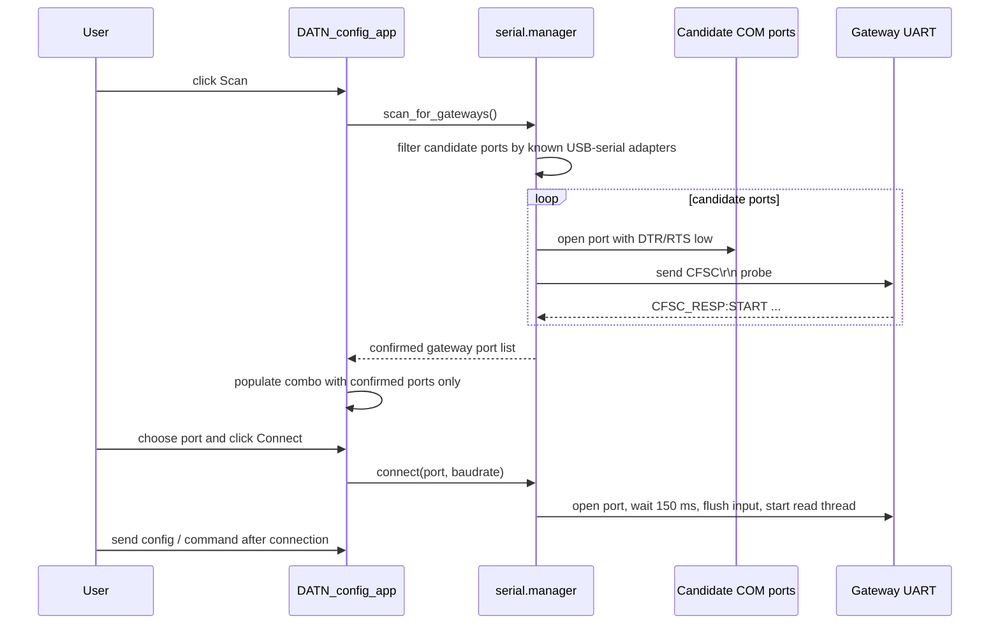
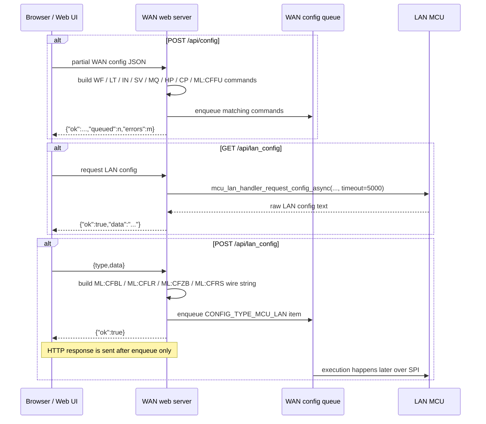

# Gateway Handler Diagrams - Current Firmware

Ban rut gon cho luan van, chi giu cac luong dung voi firmware hien tai.

Chinh sua chinh:
- MQTT chi cho reconnect toi da 10 giay, khong retry sau `publish()` fail.
- LAN duoc danh thuc bang GPIO ISR roi moi DQ.
- PC app theo thu tu scan -> connect -> thao tac.
- `POST /api/lan_config` tra ket qua sau enqueue.
- Parser LAN uu tien cu phap `MODULE_*`, van giu raw-command fallback.
- LAN FOTA di qua Wi-Fi AP `DA2-FOTA`, khong dung PPP lam duong download firmware.

---

## Figure 1 - MQTT publish and reconnect behavior



Note: firmware hien tai khong retry lai ban tin sau khi `esp_mqtt_client_publish()` tra ve loi.

---

## Figure 2 - Cloud command to node and real response path



Note: there is no separate cloud-to-node delivery-status notification path in the current code. The observable response is the actual module output routed back from LAN to WAN.

---

## Figure 3 - Async GPIO notify plus DQ fetch



Note: DQ van ton tai, nhung co che kich hoat chinh la GPIO ISR.

---

## Figure 4 - PC app scan first, connect second



Note: logic hien tai la `scan -> connect -> operate`.

---

## Figure 5 - Current web config API behavior



Note: `GET /api/lan_config` cho LAN tra loi; `POST /api/lan_config` chi xac nhan enqueue thanh cong.

---

## Figure 6 - Current BLE / LoRa / Zigbee command parser model

```mermaid
flowchart TD
    A[Lenh tu UART / Web / MQTT] --> B[WAN forward CFBL / CFLR / CFZB sang LAN]
    B --> C{Loai lenh}

    C -->|MODULE_*| D[Parse CFxx:<slot>:MODULE_*[:data]]
    D --> E[Tra JSON function config]
    E --> F[Build lenh cuoi cung cho module]

    C -->|Raw command| G[Parse CFxx:<slot>:AT+...]
    G --> H[Raw-command fallback]
    H --> F

    F --> I[Enqueue vao task BLE / LoRa / Zigbee]
    I --> J[Module thuc thi]
    J --> K[Tra ve CFxx:<slot>:OK / FAIL / EVT]
```

Vi du uu tien:
- `CFBL:0:MODULE_START_DISCOVERY:5000`
- `CFLR:0:MODULE_SET_DEVEUI:0011223344556677`
- `CFZB:0:MODULE_START_NETWORK`

Note: raw-command fallback van duoc ho tro, nhung khong nen dung cu phap Zigbee so cu lam giao thuc chinh.

---

## Figure 7 - LAN FOTA over WAN Wi-Fi AP

```mermaid
flowchart TD
    A[CFML:CFFU:<url> tuy chon] --> B[Luu URL firmware LAN vao NVS]
    B --> C[CFML:CFFW[:url][:FORCE]]
    A --> C

    C --> D[WAN nhan lenh FOTA LAN]
    D --> E[fota_ap_start]
    E --> F[Mo SoftAP DA2-FOTA + DHCP + NAPT]
    F --> G[Forward CFFW sang LAN qua SPI]
    G --> H[LAN dung MCU-WAN handler]
    H --> I[LAN start FOTA task]
    I --> J[LAN ket noi Wi-Fi toi DA2-FOTA]
    J --> K[Tai firmware tu URL da luu]
    K --> L[Ghi OTA va reboot]
    L --> M[LAN reconnect ve WAN]
    M --> N[WAN dong FOTA AP]
```

Note: duong LAN OTA hien tai la Wi-Fi STA -> WAN SoftAP -> internet qua NAPT.

---

## Figure 8 - Command syntax mapping at the current interfaces

```mermaid
flowchart TD
    A[External command source] --> B{Entry interface}

    B -->|UART / Python app| U[CFML:CFxx:...]
    B -->|Web API| W[ML:CFxx:... built internally]
    B -->|MQTT RPC| M[JSON params or raw CFxx command]

    U --> Q[WAN config queue]
    W --> Q
    M --> R[WAN MQTT parser]
    R --> S[Downlink queue]
    S --> T[LAN receives CFxx payload]
    Q -->|CONFIG_TYPE_MCU_LAN strips outer ML| T

    T --> P{LAN parser family}

    P --> BLE[CFBL:JSON:<slot>:<json><br/>CFBL:<slot>:MODULE_*[:data]<br/>CFBL:<slot>:AT+... fallback]
    P --> LOR[CFLR:JSON:<slot>:<json><br/>CFLR:<slot>:MODULE_*[:data]<br/>CFLR:<slot>:AT+... fallback]
    P --> ZB[CFZB:JSON:<slot>:<json><br/>CFZB:<slot>:MODULE_*[:data]<br/>CFZB:<slot>:AT+... fallback]
    P --> RS[CFRS:JSON:<slot>:<json><br/>CFRS:BR:<baud>]
    P --> FOTA[CFFU:<url><br/>CFFW[:url][:FORCE]]
```

Syntax notes ngan:
- UART / Python dung `CFML:...` cho lenh di LAN.
- Web API tu build `ML:...` truoc khi enqueue.
- MQTT RPC tach `params` roi forward thanh lenh `CFBL/CFLR/CFZB...`.
