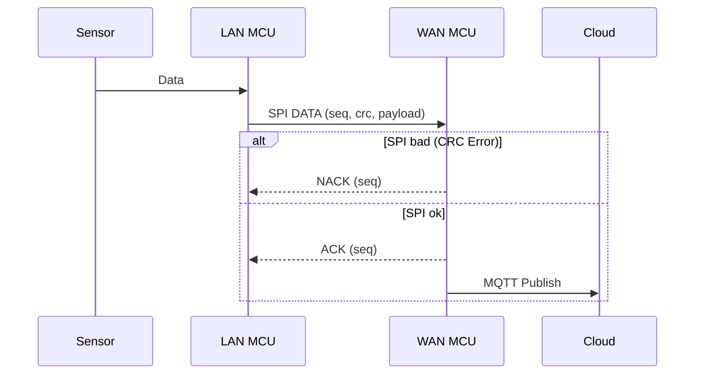
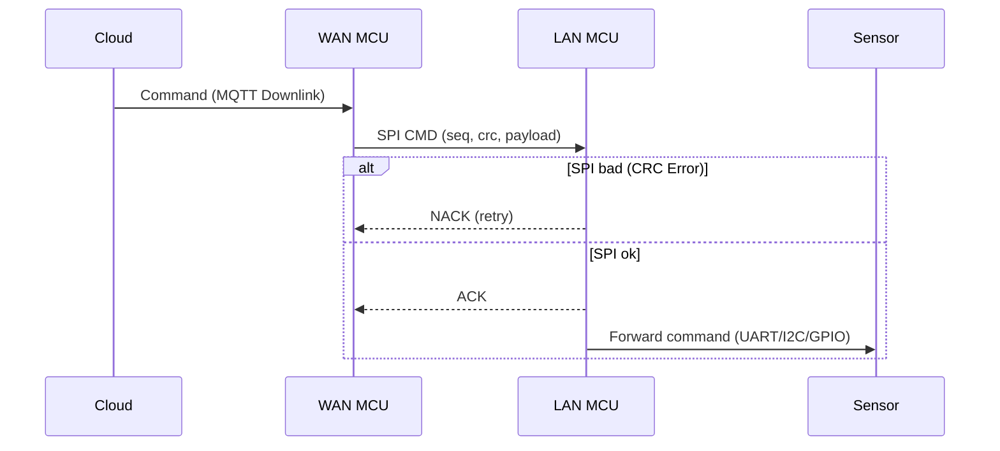
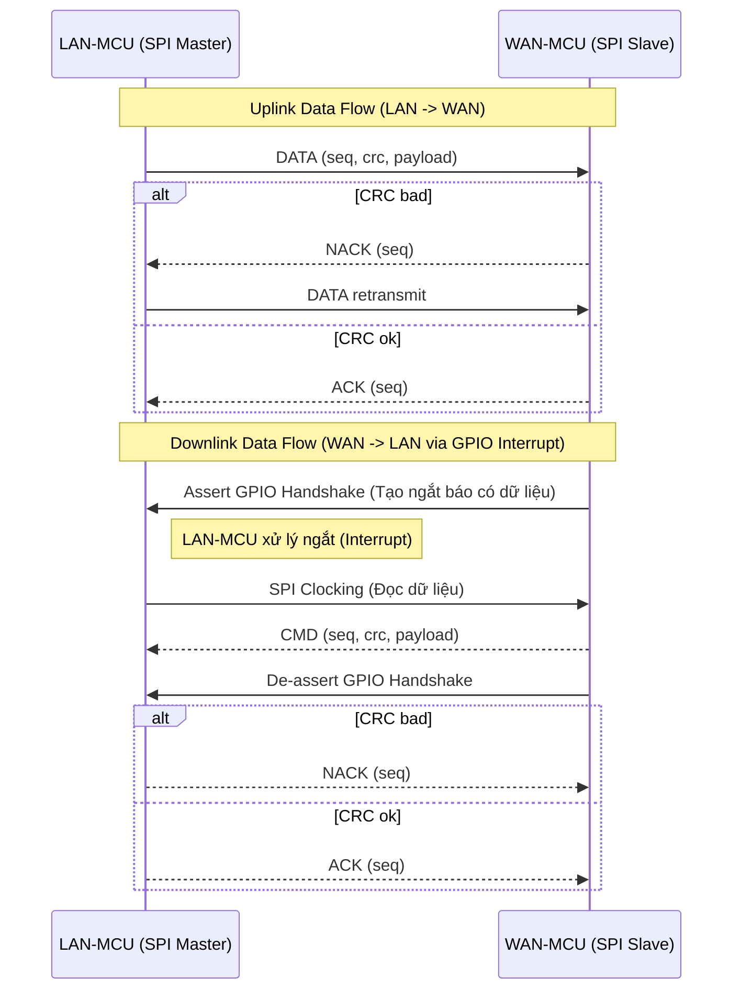
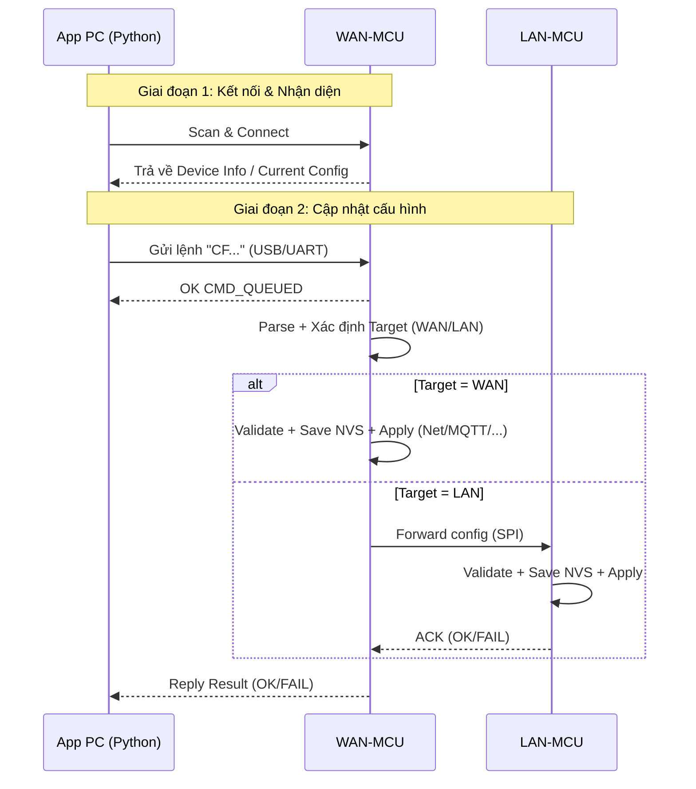
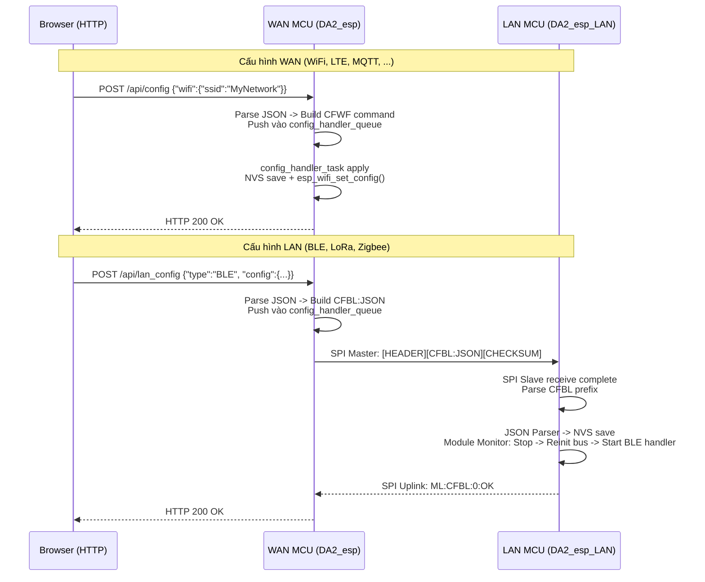
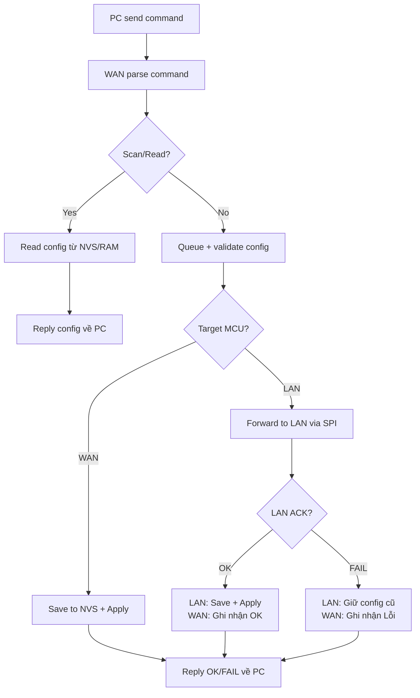
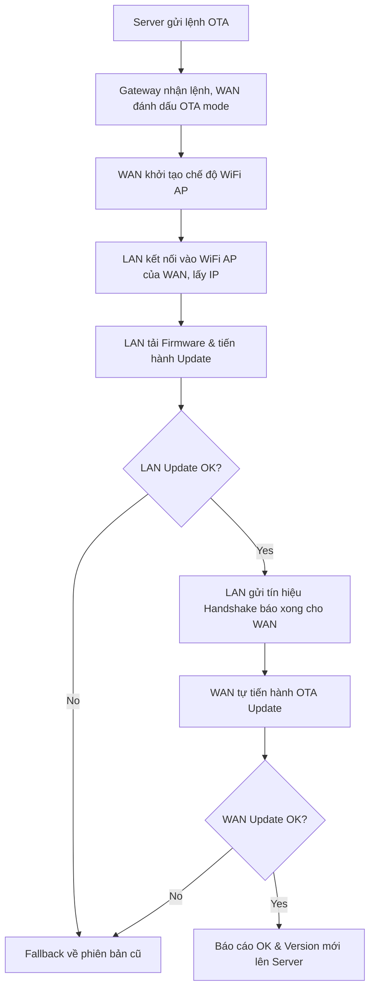
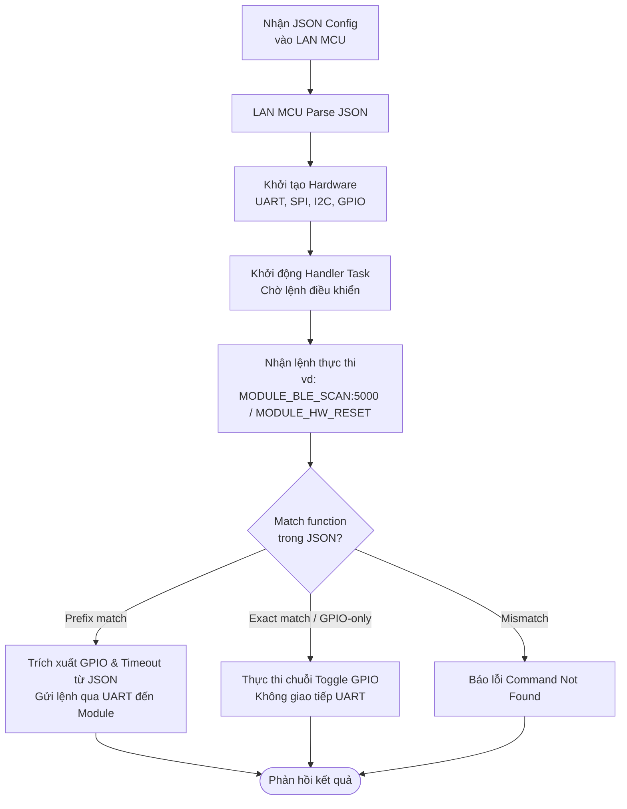
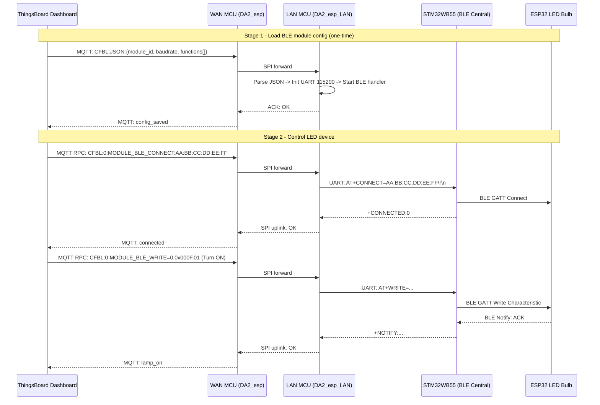

# Gateway Handler Diagrams - Current Firmware

## Hình 1: Luồng xử lý dữ liệu End-to-End Uplink

---

## Hình 2: Luồng xử lý dữ liệu End-to-End Downlink

---

## Hình 3: Giao tiếp LAN-MCU ↔ WAN-MCU qua SPI (Async GPIO Handshake)

---

## Hình 4: Cập nhật cấu hình từ App PC (USB/UART)

---

## Hình 5: Cập nhật cấu hình từ Web Config Portal

---

## Hình 6: Lưu đồ giải thuật Data Communication Handler

---

## Hình 7: Lưu đồ giải thuật FOTA Dual-MCU

---

## Hình 8 Hệ thống cấu hình Module Base Setting (JSON)

---

## Hình 9: Luồng điều khiển End-to-End từ ThingsBoard đến thiết bị BLE (ESP32 LED Bulb)

