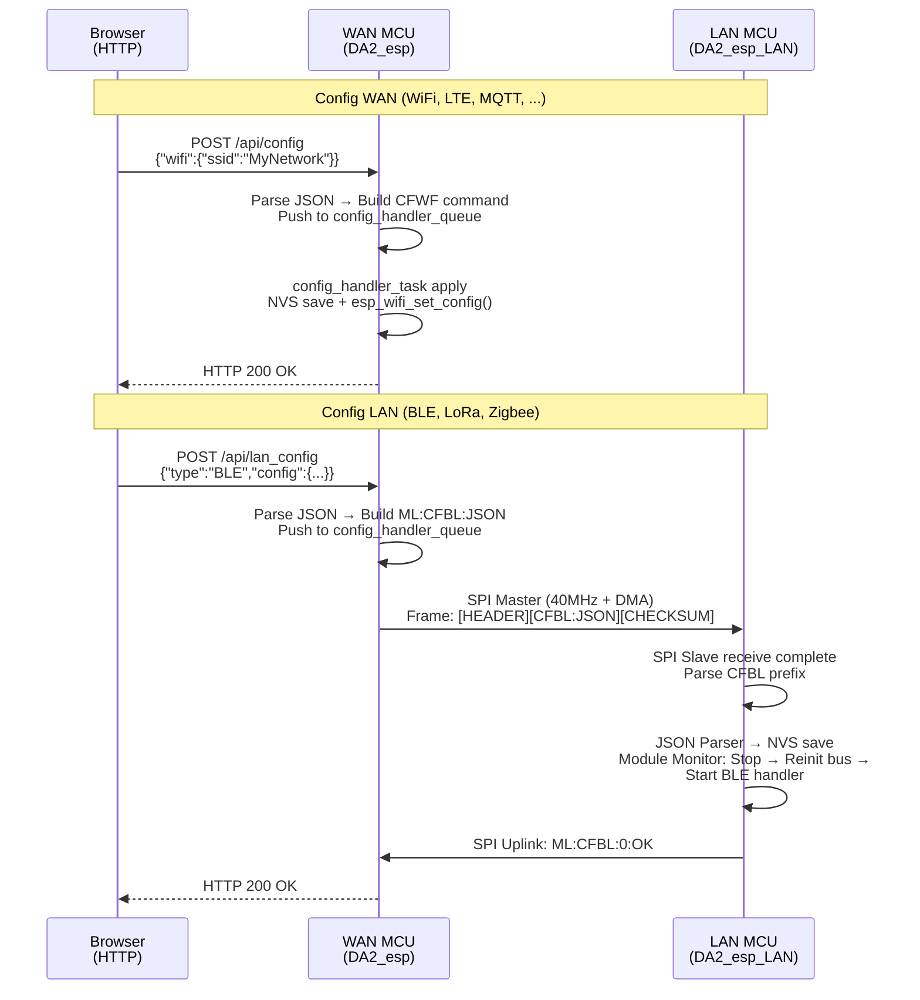

# Cơ Chế Cấu Hình Gateway Thông Qua Web Portal

## Mô Tả Tổng Thể

Cấu hình gateway từ giao diện Web Portal được thiết kế để cho phép kỹ sư và người dùng điều chỉnh các tham số mà không cần kết nối cáp USB hoặc cài đặt phần mềm desktop. Web Portal hoạt động trực tiếp trên WAN MCU qua HTTP, hỗ trợ hai chế độ truy cập:

- **AP Mode (192.168.4.1)**: Lần khởi động đầu tiên — gateway phát WiFi riêng, user kết nối từ điện thoại/laptop và cấu hình WiFi
- **STA Mode (gateway.local)**: Sau khi kết nối WiFi — truy cập từ bất kỳ thiết bị nào trên LAN thông qua mDNS

Quy trình cập nhật cấu hình gồm **3 thành phần chính:**
1. **Trình duyệt Web** — Giao diện người dùng
2. **WAN MCU** — Router cấu hình (nhận HTTP request, định tuyến)
3. **LAN MCU** — Xử lý cấu hình module (nếu cần)

**Nhân tố quan trọng:** WAN MCU đóng vai trò tương tự như App PC quản lý cấu hình. Nếu cấu hình thuộc WAN (WiFi, LTE, MQTT, HTTP, CoAP), WAN MCU tự lưu vào NVS và áp dụng ngay. Nếu cấu hình thuộc LAN (BLE, LoRa, Zigbee), WAN MCU forward qua SPI và chờ ACK/FAIL từ LAN MCU.

## Các Endpoint Web Server

| Endpoint | Phương thức | Mô tả | Định tuyến |
|---|---|---|---|
| `/` | GET | Serve giao diện SPA nhúng | Trực tiếp từ flash |
| `/api/config` | GET | Đọc cấu hình WAN hiện tại (WiFi, LTE, MQTT, HTTP, CoAP) | WAN handler local |
| `/api/config` | POST | Cập nhật cấu hình WAN → NVS + apply | WAN handler local |
| `/api/lan_config` | GET | Đọc danh sách preset JSON cho LAN modules | WAN handler forward |
| `/api/lan_config` | POST | Gửi JSON config cho module → SPI to LAN MCU | WAN handler forward |
| `/api/status` | GET | Trạng thái live (uptime, RSSI, FW version, Internet status) | WAN handler local |
| `/api/reboot` | POST | Kích hoạt restart gateway | WAN handler local |

## Luồng Cấu Hình WAN Parameters (WiFi, LTE, MQTT, ...)

```
Browser (HTTP POST /api/config)
    │ JSON: {wifi: {ssid, password, auth_mode}}
    ▼
WAN MCU api_config POST handler
    │ Parse JSON
    │ Build CFWF:<json> command
    ▼
config_handler_push() → g_config_handler_queue (CMD_SOURCE_HTTP)
    │
    ▼
config_handler_task (polling queue)
    │ Đọc CFWF command
    │ Gọi wifi_context_update()
    │ Lưu NVS
    │ Gọi esp_wifi_set_config()
    │
    ▼
WiFi update live + HTTP response 200 OK
    │ 
    ▼
Browser (có thể reboot mạng)
```

## Luồng Cấu Hình LAN Parameters (BLE, LoRa, Zigbee)

```
Browser (HTTP POST /api/lan_config)
    │ JSON: {type: "BLE", module_id: "002", stack_id: 0, config: {...}}
    ▼
WAN MCU api_config POST handler
    │ Parse JSON
    │ Build ML:CFBL:JSON:<json> command (ML = MCU LAN)
    │ Set CMD_SOURCE_HTTP
    ▼
config_handler_push() → g_config_handler_queue
    │
    ▼
config_handler_task
    │ Đọc ML:CFBL:JSON command
    │ SPI forward qua MCU_WAN_Handler
    │
    ▼
MCU_WAN_Handler (SPI Master)
    │ Tạo frame: [HEADER][CFBL_JSON_LEN][CFBL_JSON_DATA][CHECKSUM]
    │ Gửi SPI 40MHz + DMA
    ▼
LAN MCU (SPI Slave)
    │ Nhận frame SPI
    │ Parse prefix CFBL
    │ Forward → config_handler_queue LAN
    │ Parser JSON
    │ Lưu NVS
    │ Restart BLE handler task
    │ Trả lại ACK: ML:CFBL:OK
    ▼
SPI uplink frame → WAN MCU
    │
    ▼
web_server HTTP response 200 OK
    │
    ▼
Browser (display success)
```

## Sequence Diagram: Cập Nhật Cấu Hình từ Web Portal



## Điểm Khác Biệt So Với PC App

| Tiêu chí | PC App (UART) | Web Portal (HTTP) |
|---|---|---|
| **Truy cập từ** | Máy tính có chương trình Python | Bất kỳ trình duyệt trên LAN |
| **Kết nối** | Cáp USB/UART | WiFi (AP mode hoặc STA mode) |
| **Queue handler** | Chung không đổi (`g_config_handler_queue`) | Chung không đổi |
| **Định tuyến WAN vs LAN** | PC App quyết định thêm tiền tố ML | WAN MCU tự detect (prefix CFWF/CFLT v.s ML:CFBL) |
| **Lưu trữ response** | PC App log file | HTTP response + WAN MCU log |
| **Availability** | Chỉ khi PC kết nối | Luôn sẵn (khi WiFi up hoặc AP mode) |
| **Batch operations** | PC App gửi tuần tự | HTTP POST một lệnh, sau đó poll /api/status |

---

## Lợi Ích Của Web Portal

1. ✅ **Zero Setup** — Chỉ cần trình duyệt, không cài phần mềm
2. ✅ **Mobile-Friendly** — Cấu hình từ điện thoại tại công trường
3. ✅ **Automatic Provisioning** — Captive DNS portal tự động hiện khi kết nối AP
4. ✅ **Persistent** — Config được lưu NVS, auto-restore sau power cycle
5. ✅ **Real-time Status** — Dashboard hiển thị trạng thái live
6. ✅ **Fallback to PC App** — PC App vẫn hoạt động bình thường qua UART
7. ✅ **Server Integration Ready** — MQTT RPC từ ThingsBoard có thể trigger cùng config flow

---
