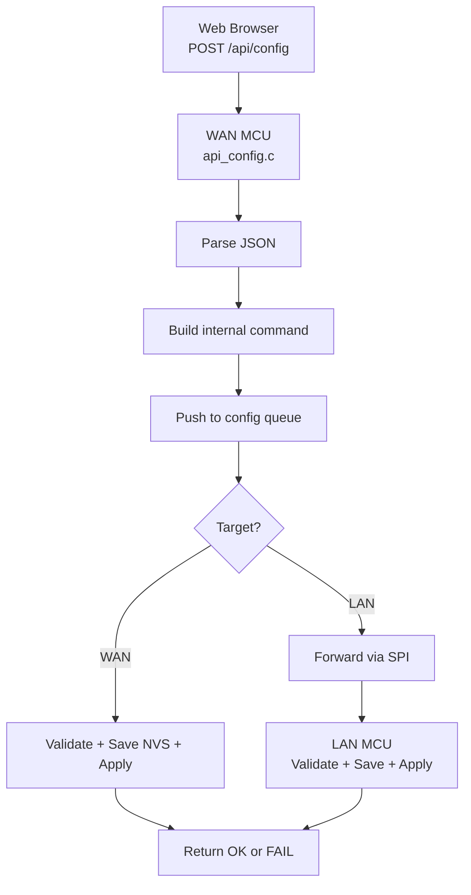

```mermaid
flowchart TD
    A[Web Browser<br/>POST /api/config] --> B[WAN MCU<br/>api_config.c]
    B --> C[Parse JSON]
    C --> D[Build internal command]
    D --> E[Push to config queue]
    E --> F{Target?}
    F -->|WAN| G[Validate + Save NVS + Apply]
    F -->|LAN| H[Forward via SPI]
    H --> I[LAN MCU<br/>Validate + Save + Apply]
    G --> J[Return OK or FAIL]
    I --> J
```