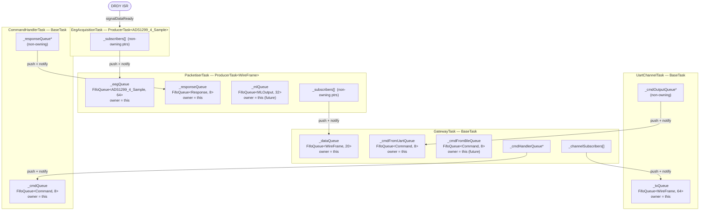

# EEG Firmware Architecture — Arduino NICLA Voice + ADS1299 Shield

**Document status:** Draft v0.4 — Sections 7 & 8 updated: queue ownership model, INotifiable wake mechanism, accurate subscription wiring, and corrected queue configuration table  
**Last updated:** 2026-04-07  
**Note:** Task-based architecture with Gateway communication hub and Publisher/Subscriber pattern

---

## Table of Contents

### PART I: OVERVIEW & REQUIREMENTS
1. [Introduction](#1-introduction)
   - 1.1 [Purpose and Scope](#11-purpose-and-scope)
   - 1.2 [Target Platform](#12-target-platform)
   - 1.3 [Document Organization](#13-document-organization)
2. [System Requirements](#2-system-requirements)
   - 2.1 [Functional Requirements](#21-functional-requirements)
   - 2.2 [Throughput Requirements](#22-throughput-requirements)
   - 2.3 [Software Constraints](#23-software-constraints)
3. [Hardware Configuration](#3-hardware-configuration)
   - 3.1 [Platform Components](#31-platform-components)
   - 3.2 [Pin Assignments](#32-pin-assignments)
   - 3.3 [Active Channels](#33-active-channels)
4. [Design Decisions & Open Questions](#4-design-decisions--open-questions)
   - 4.1 [Resolved Decisions](#41-resolved-decisions)
   - 4.2 [Open Questions](#42-open-questions)

### PART II: ARCHITECTURE
5. [Architectural Overview](#5-architectural-overview)
   - 5.1 [Layered Architecture](#51-layered-architecture)
   - 5.2 [Architectural Principles](#52-architectural-principles)
   - 5.3 [High-Level Data Flow](#53-high-level-data-flow)
6. [Task Architecture](#6-task-architecture)
   - 6.1 [Task Overview and Priorities](#61-task-overview-and-priorities)
   - 6.2 [EEG Acquisition Task](#62-eeg-acquisition-task)
   - 6.3 [Packetiser Task](#63-packetiser-task)
   - 6.4 [Gateway Task](#64-gateway-task)
   - 6.5 [Channel Tasks (UART & BLE)](#65-channel-tasks-uart--ble)
   - 6.6 [Command Handler Task](#66-command-handler-task)
   - 6.7 [ML Processor Task (Future)](#67-ml-processor-task-future)
7. [Publisher/Subscriber Pattern](#7-publishersubscriber-pattern)
   - 7.1 [Pattern Overview](#71-pattern-overview)
   - 7.2 [FIFO Queue Specification](#72-fifo-queue-specification)
   - 7.3 [Queue Ownership and Consumer Wake-up](#73-queue-ownership-and-consumer-wake-up)
   - 7.4 [Subscription Relationships](#74-subscription-relationships)
   - 7.5 [Overflow Policy](#75-overflow-policy)
8. [Data Flow & Data Model](#8-data-flow--data-model)
   - 8.1 [Path A — EEG Acquisition](#81-path-a--eeg-acquisition-sensor--packetisertask)
   - 8.2 [Path B — Data Output](#82-path-b--data-output-packetisertask--channels--wire)
   - 8.3 [Path C — Command Input](#83-path-c--command-input-wire--cmdhandler--packetisertask)
   - 8.4 [Queue Summary](#84-queue-summary)
9. [Communication Channels](#9-communication-channels)
   - 9.1 [Channel Architecture](#91-channel-architecture)
   - 9.2 [UART Channel](#92-uart-channel)
   - 9.3 [BLE Channel](#93-ble-channel)
   - 9.4 [Command Processing](#94-command-processing)

### PART III: IMPLEMENTATION
10. [Execution Flow](#10-execution-flow)
    - 10.1 [Startup Sequence](#101-startup-sequence)
    - 10.2 [Interrupt Handling (DRDY)](#102-interrupt-handling-drdy)
    - 10.3 [Task Scheduling](#103-task-scheduling)
11. [Programming Interfaces](#11-programming-interfaces)
    - 11.1 [IProducer<T>](#111-iproducert)
    - 11.2 [IConsumer<T>](#112-iconsumert)
    - 11.3 [BaseTask](#113-basetask)
    - 11.4 [Template Task Classes](#114-template-task-classes)
    - 11.5 [Concrete Task Examples](#115-concrete-task-examples)
12. [Configuration Management](#12-configuration-management)
    - 12.1 [config.h Structure](#121-configh-structure)
    - 12.2 [Configuration Sections](#122-configuration-sections)
13. [Source Tree Organization](#13-source-tree-organization)
    - 13.1 [Current Structure](#131-current-structure)
    - 13.2 [Module Reference](#132-module-reference)

---

# PART I: OVERVIEW & REQUIREMENTS

## 1. Introduction

### 1.1 Purpose and Scope

This document specifies the firmware architecture for a real-time EEG acquisition and processing system built on the Arduino NICLA Voice platform with ADS1299 EEG frontend. The architecture supports:

- **Real-time EEG data acquisition** from ADS1299 via DRDY-driven SPI
- **Concurrent ML inference** using on-board NDP120 neural processor
- **Multi-channel communication** over UART and BLE
- **Publisher/Subscriber pattern** for decoupled, queue-mediated task communication (producers never wait for queue space; brief mutex contention is the only possible wait)
- **Configurable, extensible design** for future enhancements

### 1.2 Target Platform

| Component | Description |
|-----------|-------------|
| **Board** | Arduino NICLA Voice |
| **MCU** | nRF52832 (ARM Cortex-M4F, 64KB RAM, 512KB Flash) |
| **RTOS** | Arduino Mbed OS (RTOS primitives) |
| **EEG Frontend** | ADS1299 (4-channel, 24-bit ADC) on custom shield |
| **ML Processor** | NDP120 (on-board Neural Decision Processor) |
| **Connectivity** | USB Serial, BLE 5.0 (built-in nRF radio) |

### 1.3 Document Organization

- **Part I** (Sections 1-4): System overview, requirements, hardware, and decision tracking
- **Part II** (Sections 5-9): Architecture patterns, tasks, data model, and communication
- **Part III** (Sections 10-14): Implementation details, flows, interfaces, and source organization

---

## 2. System Requirements

### 2.1 Functional Requirements

| ID | Requirement | Priority | Status |
|----|-------------|----------|--------|
| FR-01 | Continuously sample ADS1299 at configured ODR via DRDY interrupt | MUST | Defined |
| FR-02 | Send periodic time sync packets to enable host-side timestamp reconstruction | MUST | Q2 open |
| FR-03 | Distribute samples to all subscribers via `distribute()` — never waits for queue space; drop-oldest on overflow | MUST | Defined |
| FR-04 | Drop oldest sample on FIFO overflow; track dropped count | MUST | Defined |
| FR-05 | Stream raw EEG data over UART (Phase 2) and BLE (future) | MUST | In progress |
| FR-06 | Run ML inference on NDP120 concurrently with acquisition | MUST | Q6 open |
| FR-07 | Accept commands over USB Serial (UART) | MUST | Q13 open |
| FR-08 | Accept commands over BLE (control channel) | MUST | Q10-Q11 open |
| FR-09 | All system parameters configurable in single `config.h` | MUST | Defined |
| FR-10 | Task priorities configurable via `config.h` | MUST | Resolved |
| FR-11 | Enable/disable UART and BLE channels independently via flags | MUST | Defined |
| FR-12 | Gateway validates incoming commands (lightweight check) | MUST | Defined |
| FR-13 | Gateway prioritizes command responses over streaming data | MUST | Defined |
| FR-14 | PacketiserTask serialises each input item (EEG, Response, ML) to IES wire format individually; priority order: Response > EEG > ML | MUST | Resolved |
| FR-15 | UART and BLE share identical command vocabulary | SHOULD | Q13 open |
| FR-16 | Channel tasks handle protocol-specific framing independently | MUST | Defined |
| FR-17 | FIFO overflow count and dropped count queryable at runtime | SHOULD | Defined |
| FR-18 | Publisher/subscriber relationships configurable at startup | MUST | Defined |

### 2.2 Throughput Requirements

| Requirement | Details | Status |
|-------------|---------|--------|
| **BLE throughput** | Must accommodate highest ADS1299 ODR (16 kSPS) for raw data per channel | ✅ Q5 RESOLVED: Design for max, test at 1000 SPS |
| **ADS1299 ODR** | Design capacity: 16 kSPS (max); Default: 1000 SPS | ✅ **Q5 RESOLVED** |
| **Channel coexistence** | BLE data and control channels must not starve each other | Resolved (Q3) |
| **Packet format** | Frame format for EEG/ML/command packets | **Q9 OPEN** |

**Throughput calculation dependencies:**
- Q5 (ADS1299 ODR) ✅ RESOLVED: Designed for 16 kSPS max (320 kB/s struct); default 1000 SPS (20 kB/s)
- Q9 (packet format) determines framing overhead and packing efficiency
- Q11 (BLE library) affects achievable throughput
- **Note:** 16 kSPS requires BLE packet optimization to fit within 2 Mbps PHY (see Q5)

### 2.3 Software Constraints

| Constraint | Implementation |
|------------|----------------|
| **RTOS** | Arduino Mbed OS with RTOS primitives (Thread, Mutex, Semaphore, Queue) |
| **Concurrency** | All inter-task communication via FIFO queues; no indefinite blocking (only brief, bounded mutex contention) |
| **ISR safety** | No SPI access or blocking calls in DRDY ISR; use semaphore signaling only |
| **Memory** | 64KB RAM total (nRF52832); Estimated usage: ~32KB Phase 2 (50%), ~38KB with BLE+ML (59%) |
| **Configuration** | Single source of truth: `config.h` for all tuning parameters |

---

## 3. Hardware Configuration

### 3.1 Platform Components

| Component | Part | Interface | Notes |
|-----------|------|-----------|-------|
| **EEG Frontend** | ADS1299 (4-channel, 24-bit) | Hardware SPI | Custom shield for NICLA Voice |
| **ML Processor** | NDP120 | On-board | Neural Decision Processor |
| **BLE Radio** | nRF52832 (built-in) | BLE 5.0 | Shared with MCU |
| **Debug/Control** | USB Serial (CDC) | UART | 1000000 baud (Q12 resolved) |
| **Reference Code (Primary)** | iES_v0.3-master | TI-RTOS | `code_references/iES_v0.3-master/` (ADS1299 driver, FIFO queue) |
| **Reference Code (Secondary)** | OpenBCI_8 | Arduino | `code_references/OpenBCI_8/` (ADS1299 register definitions) |

### 3.2 Pin Assignments

All pin assignments are defined in `pinDef.h`:

| Signal | Arduino Pin | Function | Notes |
|--------|-------------|----------|-------|
| `ADS_RST_PIN` | 10 | ADS1299 Reset | Active-low |
| `ADS_DRDY_PIN` | 11 | Data Ready Interrupt | Active-low, FALLING edge trigger |
| `SPI_CS` | 6 | SPI Chip Select | Active-low |
| `SPI_MISO` | 7 | SPI Master In Slave Out | Hardware SPI |
| `SPI_MOSI` | 8 | SPI Master Out Slave In | Hardware SPI |
| `SPI_SCK` | 9 | SPI Clock | Hardware SPI |

**Status:** ✅ All pin assignments resolved (Q16).

### 3.3 Active Channels

| Channel | Status | Configuration |
|---------|--------|---------------|
| **CH1** | Reference/test | Both IN1P and IN1N tied to AVDD (+2.5V); reads ~0V differential |
| **CH2** | Not used | EEG-capable in schematic; powered down (not intended for use) |
| **CH3** | Active | EEG input (primary channel) |
| **CH4** | Active | EEG input (primary channel) |

---

## 4. Design Decisions & Open Questions

### 4.1 Resolved Decisions

| ID | Decision | Resolution |
|----|----------|------------|
| **Q3** | PacketiserTask dispatch order | ✅ Each input item serialised and dispatched individually. Priority: Response first (immediate delivery), then EEG, then ML. No combining. |
| **Q4** | Debug task priority | ✅ No dedicated debug task; use USB Serial in main loop |
| **Q1** | CH2 channel configuration | ✅ CH2 is EEG-capable but not used; powered down to reduce noise |
| **Q5** | ADS1299 output data rate (ODR) | ✅ Design for 16 kSPS max capacity; default 1000 SPS for testing |
| **Q7** | FIFO queue depths | ✅ Defined in `config.h`: STREAMING=64, EEG_BLE=64, EEG_ML=32 |
| **Q12** | Debug output transport | ✅ USB CDC Serial at 1000000 baud |
| **Q14** | Thread stack sizes | ✅ Defined in `config.h` for each task |
| **Q16** | SPI pin assignments | ✅ CS=6, MISO=7, MOSI=8, SCK=9 (see Section 3.2) |
| **Q17** | Role of loop() | ✅ Empty or minimal background work; all real work in RTOS tasks |

### 4.2 Open Questions

Each item below blocks specific implementation modules. Questions are annotated with blocking scope and recommendations.

---

#### Q1 — CH2 Configuration
**Status:** ✅ **RESOLVED**  
**Decision:** CH2 is a normal EEG input in the schematic (same as CH3/CH4) but is **not intended to be used**. It will be **powered down** to reduce noise and power consumption.

**Rationale:** 
- Hardware supports 4-channel ADS1299 with all channels EEG-capable
- Only CH3, CH4 are active EEG channels (CH1 is reference/test, CH2 is unused)
- Powering down unused channels reduces analog noise and current draw
- Can be enabled later if needed via configuration change

---

#### Q2 — Time Sync Packet Interval
**Status:** 🔴 OPEN  
**Blocks:** `PacketiserTask`, TIME_SYNC frame generation, packet format (Q9)  
**Question:** How often should the system send time sync packets? Options:
- Every N samples (e.g., every 250 samples = 1 second @ 250 SPS)
- Every T milliseconds (e.g., every 1000ms)
- On-demand only (host requests via command)

**Design rationale:** Following iES firmware pattern (`IES_TIME_SYNC 't'` command), use periodic time sync packets instead of per-sample timestamps. This significantly reduces data overhead:
- **Per-sample timestamps:** 4 bytes × 16,000 samples/s = 64 KB/s overhead @ max rate
- **Periodic sync packets:** ~10 bytes/s @ 1 Hz sync rate
- Host reconstructs timestamps: `timestamp = last_sync_time + ((sample_number - sync_sample_number) × sample_period)`

**Impact:** Time sync packets contain `uint32_t timestamp_us` (microseconds since boot) and `uint32_t sample_counter` (current value of the global sample counter).  
**Recommendation:** Send time sync packet every 1 second (configurable in `config.h`). Host can reconstruct sample timestamps with <1µs error accumulation between syncs.

---

#### Q5 — ADS1299 Output Data Rate (ODR)
**Status:** ✅ **RESOLVED**  
**Decision:** System designed for **maximum capacity of 16 kSPS**, but will use **1000 SPS as default** for testing and validation.

**Design Impact (16 kSPS maximum):**
- Raw ADC data: 4 channels × 3 bytes × 16,000 SPS = 192 kB/s (from ADS1299 SPI)
- Struct data: 20 bytes × 16,000 SPS = **320 kB/s** (`ADS1299_4_Sample` including sample_number)
- FIFO sizing: 64-sample buffer = **4ms** latency at max rate
- BLE throughput: Requires ~2.56 Mbps (320 kB/s × 8 bits/byte) — **exceeds BLE 5.0 2 Mbps PHY** ⚠️
  - **Mitigation:** Pack multiple samples per packet; omit sample_number in dense streaming (reconstruct from time sync)
  - Alternative: Send raw 16-byte channel data only (256 kB/s = 2.05 Mbps, still tight)
- Time synchronization: Periodic time sync packets (Q2) allow host to reconstruct timestamps without per-sample overhead

**Default Operation (1000 SPS):**
- Raw ADC data: 4 channels × 3 bytes × 1000 SPS = 12 kB/s
- Struct data: 20 bytes × 1000 SPS = **20 kB/s** (`ADS1299_4_Sample`)
- FIFO sizing: 64-sample buffer = **64ms** latency
- BLE throughput: Only ~160 kbps, well within BLE capacity
- Conservative starting point for validation; proven feasible in literature

**Configuration:** ODR is configurable in `config.h`; runtime switching via command interface (Q13).

---

#### Q6 — How ADS1299 Data Is Fed Into the NDP120
**Status:** 🔴 OPEN — Most technically uncertain  
**Blocks:** `ndp120_driver`, `ml_processor` placeholder  
**Question:** The NDP120 is natively designed for audio and IMU inputs. The mechanism by which raw ADS1299 time-series data is presented to the NDP120 inference engine is not defined.  
**Options:**
1. Memory-mapped buffer sharing
2. Re-encode EEG as "pseudo-audio" format
3. NDP120 SDK custom sensor interface

**Recommendation:** Consult NDP120 SDK documentation; may require vendor support or custom interface layer.

---

#### Q8 — ML Output Data Structure (`MLOutput` fields)
**Status:** 🔴 OPEN  
**Blocks:** `IMLOutput` interface, `packetiser`, `WireFrame` IES ML frame format  
**Question:** What does the ML inference produce? Options:
- Class label only (1-2 bytes)
- Class label + confidence score
- Feature vector
- All of the above

**Impact:** Determines `MLOutput` struct size and PacketiserTask IES serialization logic.  
**Recommendation:** Define minimal output (label + confidence) for Phase 1; extend later if needed.

---

#### Q9 — BLE / UART Packet Frame Format
**Status:** ⚠️ PARTIALLY RESOLVED  
**Blocks:** `packetiser.h/.cpp` (Response and ML frames), `ble_channel.h/.cpp`

**Resolved — EEG and TIME_SYNC frames:** IES native format adopted (see `ies_message_protocol.md` Section 5.1).
```
[0xA0 start][frame_count 1B][type_ch 1B: (type<<4)|num_ch][ch_data N×3B][0xC0 stop]
     type nibble:  0=EEG  5=TIME_SYNC
     ch nibble:    number of 3-byte channel data fields

EEG (4-channel, 250 SPS):   [A0][cnt][0x04][ch0 3B][ch1 3B][ch2 3B][ch3 3B][C0] = 16 B
TIME_SYNC:                  [A0][cnt][0x51][ts_us 4B][sample_cnt 4B][C0]          = 12 B
```

**Still open — Response and ML frames:** IES-extension frame formats for `Response` and `MLOutput` are TBD. Proposed type nibble values:
- `4` — RESPONSE: `cmd_id (1B)` + `status (1B)` + `payload_len (1B)` + `payload (≤8B)` → frame ≤ 15 B
- `6` — ML_OUTPUT: `class_label (1B)` + `confidence (4B)` → frame = 9 B (future, Q8)

**Wire object:** `WireFrame { uint8_t len; uint8_t bytes[IES_MAX_FRAME_SIZE]; }` (21 B) — produced by PacketiserTask, consumed as-is by channel tasks (`Serial.write(frame.bytes, frame.len)`).

---

#### Q10 — BLE Service and Characteristic UUIDs
**Status:** 🔴 OPEN  
**Blocks:** `ble_app` placeholder  
**Question:** Custom 128-bit UUIDs needed for:
- EEG streaming service
- EEG data characteristic (notify)
- ML output characteristic (notify, future)
- Control/status characteristic (write/read)

**Recommendation:** Generate UUIDs using standard UUID generator; document in separate BLE protocol spec.

---

#### Q11 — BLE Library Selection
**Status:** 🔴 OPEN  
**Blocks:** `ble_app` placeholder  
**Question:** Which BLE library or stack?
- ArduinoBLE (simpler, may have throughput limits)
- Nordic SoftDevice (complex, best performance)
- Mbed BLE API

**Impact:** Affects achievable throughput, API style, and implementation complexity.  
**Recommendation:** Start with ArduinoBLE for Phase 2; migrate to SoftDevice if throughput insufficient.

---

#### Q13 — UART Command Vocabulary and Message Format
**Status:** 🔴 OPEN  
**Blocks:** Command Handler implementation  
**Question:** Define specific command identifiers, argument formats, and response formats.  
**Proposed minimal command set for Phase 2:**
- `START` / `STOP` — begin/halt EEG streaming
- `SET_GAIN <gain>` — configure ADS1299 gain (1, 2, 4, 6, 8, 12, 24)
- `SET_ODR <odr>` — configure output data rate (250, 500, 1000, 2000)
- `ENABLE_UART` / `DISABLE_UART` — set enUART flag at Gateway
- `ENABLE_BLE` / `DISABLE_BLE` — set enBLE flag at Gateway
- `STATUS` — query current configuration and channel states

**Recommendation:** ASCII format for Phase 2 (easy debugging); binary for production. Define formal command grammar.

---

#### Q15 — Error Handling and Recovery Strategy
**Status:** 🔴 OPEN  
**Blocks:** All modules  
**Question:** What should happen when:
- ADS1299 is unresponsive
- NDP120 model fails to load
- BLE disconnects unexpectedly
- FIFO overflows persistently

**Recommendation:** Define error states and recovery actions:
- **ADS1299 failure:** Halt acquisition, set error flag, notify via status
- **BLE disconnect:** Disable `enBLE`, buffer data in FIFO, resume on reconnect
- **FIFO overflow:** Log in diagnostics, continue operation (drop-oldest policy)

---

#### Q18 — FifoQueue Thread-Safety Mechanism
**Status:** 🔴 OPEN  
**Blocks:** `fifo_queue.h` implementation  
**Question:** Should `FifoQueue` use:
1. `rtos::Mutex` (simpler, brief blocking)
2. Lock-free ring buffer with atomic index operations (higher throughput, complex)

**Impact:** Affects ISR-safety and worst-case push latency.  
**Recommendation:** Start with Mutex for simplicity. Profile in Phase 2; migrate to lock-free if latency issues arise.

---

# PART II: ARCHITECTURE

## 5. Architectural Overview

### 5.1 Layered Architecture

The firmware is organized into five layers, from hardware to application:

```
┌─────────────────────────────────────────────────────────────────────┐
│                       COMMUNICATION LAYER                           │
│   UART Channel Task  │  BLE Channel Task  │  Gateway Task           │
│   (framing + I/O)    │  (framing + I/O)   │  (routing + control)    │
├─────────────────────────────────────────────────────────────────────┤
│                       PROCESSING LAYER                              │
│   PacketiserTask    │  Command Handler   │  ML Processor [future]  │
│   (IES serialiser)  │  (cmd execution)   │  (NDP120 inference)     │
├─────────────────────────────────────────────────────────────────────┤
│                       DATA UTILITY LAYER                            │
│   FifoQueue<T> │ Task base classes │ Publisher/Subscriber pattern   │
├─────────────────────────────────────────────────────────────────────┤
│                       ACQUISITION LAYER                             │
│   EEG Acquisition Task (highest priority, DRDY-driven SPI read)     │
├─────────────────────────────────────────────────────────────────────┤
│                       HARDWARE LAYER                                │
│   ADS1299 (SPI) │ NDP120 (on-board) │ BLE (nRF) │ USB Serial        │
└─────────────────────────────────────────────────────────────────────┘
```

### 5.2 Architectural Principles

| Principle | Implementation |
|-----------|----------------|
| **No wait on queue space** | Producers never wait for a consumer to free a slot — drop-oldest guarantees forward progress; brief mutex contention between concurrent `push()`/`pop()` is possible but bounded |
| **Publisher/Subscriber** | Tasks publish data to subscriber queues; producers don't know consumers |
| **Thread-safe** | All queue operations are mutex-guarded (or lock-free atomics, Q18) |
| **Drop-oldest** | On FIFO overflow, drop oldest entry; producer never waits for queue space (brief mutex contention with a concurrent `pop()` is the only possible wait) |
| **Priority-based** | RTOS scheduler runs highest-priority runnable task |
| **Configurable** | All parameters in single `config.h`; no hardcoded magic numbers |

### 5.3 High-Level Data Flow

```
DRDY ISR → EEG Acquisition Task → [PacketiserTask, ML Processor]
                                        ↓
                                   PacketiserTask ← [EEG, ML, Responses]
                                   (serialises each item to IES WireFrame)
                                        ↓
                                   Gateway Task
                                   ↙         ↘
                         UART Channel    BLE Channel
                              ↓                ↓
                        Physical I/O     Physical I/O

[Commands flow reverse: UART/BLE RX → Gateway → Command Handler → Response]
```

---

## 6. Task Architecture

### 6.1 Task Overview and Priorities

All tasks are RTOS threads managed by Arduino Mbed OS. Task priorities follow CMSIS-RTOS v2 convention.

| Task | Priority | Stack (bytes) | Trigger | Role |
|------|----------|---------------|---------|------|
| **EegAcquisitionTask** | `osPriorityRealtime` (+3) | 4096 | DRDY ISR semaphore | SPI read → distribute to subscribers |
| **PacketiserTask** | `osPriorityAboveNormal` (+1) | 2048 | Queue non-empty | Serialise EEG/ML/responses to IES WireFrames |
| **GatewayTask** | `osPriorityNormal` (0) | 2048 | Queue non-empty | Route data/commands between channels |
| **UartChannelTask** | `osPriorityNormal` (0) | 2048 | RX/TX events | UART I/O + framing |
| **BleChannelTask** (future) | `osPriorityBelowNormal` (-1) | 4096 | BLE events | BLE I/O + framing |
| **CommandHandlerTask** | `osPriorityNormal` (0) | 2048 | Queue non-empty | Execute commands |
| **MlProcessorTask** (future) | `osPriorityBelowNormal` (-1) | 2048 | Queue non-empty | NDP120 inference |

**Notes:**
- All priorities and stack sizes are configurable in `config.h`
- Distribution happens inline within producer's thread (no separate distribution task)

### 6.2 EEG Acquisition Task

**Type:** `ProducerTask<ADS1299_4_Sample>`

**Implementation:** `eeg.h/.cpp`

**Responsibilities:**
- Wait on DRDY semaphore (signaled by ISR)
- Read ADS1299 via SPI (`updateChannelData()`)
- Increment sample counter
- Distribute sample to all subscribers

**Priority:** Highest (`osPriorityRealtime`) to ensure real-time response to DRDY

**Pseudocode:**
```cpp
void EegAcquisitionTask::run() {
    while (!_stopRequested) {
        _drdySemaphore.acquire();      // Block until DRDY ISR signals
        
        ADS1299_4_Sample sample;
        sample.sample_number = _sampleCounter++;  // Global counter for time sync
        
        ads1299.updateChannelData();
        for (int i = 0; i < 4; i++) {
            sample.channel[i] = ads1299.getChannelData(i+1);
        }
        
        distribute(sample);  // Mutex-guarded per queue; never waits for space (drop-oldest)
    }
}
```

### 6.3 Packetiser Task

**Type:** Multi-consumer, single-producer (consumes three typed queues; produces `WireFrame`)

**Implementation:** `packetiser.h/.cpp`

**Responsibilities:**
- Pop from three typed input queues with fixed priority: Response > EEG > ML
- Serialize each item to IES native wire format (see Q9 / `ies_message_protocol.md` Section 5.1)
- Generate periodic TIME_SYNC frames (Q2: interval configurable in `config.h`)
- Maintain per-stream frame counter (IES byte 1)
- Produce ready-to-transmit `WireFrame` objects; push to Gateway

**Priority:** `osPriorityAboveNormal` (+1) — minimises latency between acquisition and wire

**Dispatch logic:**
```cpp
void PacketiserTask::run() {
    while (!_stopRequested) {
        WireFrame frame;

        // TIME_SYNC: periodic, inserted ahead of any data
        if (millis() - _lastSyncMs >= PACKETISER_SYNC_INTERVAL_MS) {
            frame = serializeTimeSync(micros(), _eegSampleCounter);
            distribute(frame);
            _lastSyncMs = millis();
        }

        // Priority 1: command responses
        Response resp;
        if (_responseQueue.pop(resp)) {
            frame = serializeResponse(resp, _frameCnt++);
            distribute(frame);
            continue;
        }

        // Priority 2: EEG samples
        ADS1299_4_Sample eeg;
        if (_eegQueue.pop(eeg)) {
            frame = serializeEeg(eeg, _frameCnt++);
            distribute(frame);
            continue;
        }

        // Priority 3: ML results (future)
        MLOutput ml;
        if (_mlQueue.pop(ml)) {
            frame = serializeMl(ml, _frameCnt++);
            distribute(frame);
            continue;
        }

        sleepUntilNotified(PACKETISER_SLEEP_MS);
    }
}
```

**IES serialisation helpers:**
```cpp
// EEG frame: [A0][cnt][0x04][ch0 3B][ch1 3B][ch2 3B][ch3 3B][C0] = 16 B
WireFrame serializeEeg(const ADS1299_4_Sample& s, uint8_t cnt);

// Response frame: [A0][cnt][0x4N][cmd_id][status][len][payload...][C0] <= 15 B  (Q9)
WireFrame serializeResponse(const Response& r, uint8_t cnt);

// TIME_SYNC frame: [A0][cnt][0x51][ts_us 4B][sample_cnt 4B][C0] = 12 B
WireFrame serializeTimeSync(uint32_t ts_us, uint32_t sample_cnt);

// ML frame: [A0][cnt][0x61][label][confidence 4B][C0] = 9 B  (future, Q8/Q9)
WireFrame serializeMl(const MLOutput& m, uint8_t cnt);
```
```

### 6.4 Gateway Task

**Type:** `ConsumerProducerTask<GatewayInput, GatewayOutput>`

**Implementation:** `gateway.h/.cpp`

**Responsibilities:**
- Route `WireFrame` objects from PacketiserTask to enabled channels (UART, BLE)
- Route commands from channels to Command Handler
- Maintain channel enable flags: `enUART`, `enBLE`
- Prioritize responses over streaming data
- Lightweight command validation (discard malformed)

**Priority:** `osPriorityNormal` (0)

**Routing Logic:**
```cpp
void GatewayTask::run() {
    while (!_stopRequested) {
        GatewayInput input;
        if (_incomingQueue.pop(input)) {
            
            if (input.isCommand()) {
                // Validate and forward to Command Handler
                if (validateCommand(input.command)) {
                    distributeToHandler(input.command);
                }
            }
            else if (input.isData()) {
                // Broadcast to enabled channels
                if (enUART) distributeToUART(input.data);
                if (enBLE) distributeToBLE(input.data);
            }
        }
        else {
            thisThread::sleep_for(1ms);
        }
    }
}
```

### 6.5 Channel Tasks (UART & BLE)

**Type:** `ConsumerProducerTask<WireFrame, Command>`

**Implementation:** `uart_channel.h/.cpp`, `ble_channel.h/.cpp`

**Responsibilities:**
- **RX path:** Parse incoming bytes → validate → construct `Command` → send to Gateway
- **TX path:** Pop `WireFrame` from input queue → `Serial.write(frame.bytes, frame.len)` (no format knowledge)

**Framing:** None — IES serialization is done by PacketiserTask. Channel task is a pure transport pump.

**Priority:** `osPriorityNormal` (UART), `osPriorityBelowNormal` (BLE)

### 6.6 Command Handler Task

**Type:** `ConsumerProducerTask<Command, Response>`

**Implementation:** `cmd_handler.h/.cpp`

**Responsibilities:**
- Parse and execute commands: START, STOP, SET_GAIN, SET_ODR, ENABLE_UART, etc. (Q13)
- Generate `Response` packets
- Publish responses to PacketiserTask (for priority dispatch before EEG/ML)

**Priority:** `osPriorityNormal` (0)

**Command Execution:**
```cpp
void CommandHandlerTask::run() {
    while (!_stopRequested) {
        Command cmd;
        if (_incomingQueue.pop(cmd)) {
            Response resp;
            resp.cmd_id = cmd.cmd_id;
            
            switch (cmd.cmd_id) {
                case CMD_START:
                    eegTask->start();
                    resp.status = STATUS_OK;
                    break;
                case CMD_STOP:
                    eegTask->stop();
                    resp.status = STATUS_OK;
                    break;
                // ... other commands
            }
            
            distribute(resp);  // Send to PacketiserTask._responseQueue
        }
        else {
            thisThread::sleep_for(5ms);
        }
    }
}
```

### 6.7 ML Processor Task (Future)

**Type:** `ConsumerProducerTask<ADS1299_4_Sample, MLOutput>`

**Implementation:** `ml_processor.h/.cpp`

**Responsibilities:**
- Consume EEG samples from EEG Acquisition Task
- Run inference on NDP120 (Q6 mechanism TBD)
- Produce `MLOutput` (Q8 structure TBD)
- Publish to PacketiserTask

**Priority:** `osPriorityBelowNormal` (-1) — can tolerate latency

---

## 7. Publisher/Subscriber Pattern

### 7.1 Pattern Overview

**Core Concepts:**
- **Producers** (`IProducer<T>`) generate data and fan-out to all subscribed queues via `distribute()`
- **Consumers** (`IConsumer<T>`) **own** their incoming `FifoQueue<T>` and expose it via `getQueue()`
- **Tasks** can be producer-only, consumer-only, or hybrid (both)
- **Ownership:** A consumer task owns the queue; a producer holds a **non-owning pointer** to it
- **No wait on queue space:** `distribute()` never waits for a consumer to free a slot — drop-oldest guarantees immediate insertion; brief mutex contention (with a concurrent `pop()`) is possible but bounded by the critical section
- **Wake-up:** A queue holds a non-owning back-reference to its owner (`INotifiable*`) so it can unblock the consumer the moment data arrives

**Base Interfaces (`task.h`):**
```cpp
// Producer: distributes data to N subscriber queues (non-owning pointers)
template<typename T>
class IProducer {
    virtual void subscribe(IQueue<T>* queue) = 0;  // Called at setup; adds to _subscribers[]
};

// Consumer: owns the incoming queue, exposes a pointer for producers to subscribe to
template<typename T>
class IConsumer {
    virtual IQueue<T>* getQueue() = 0;  // Returns a non-owning pointer to the owned queue
};
```

**Concurrency roles:**
- `ProducerTask<T>::distribute()` → calls `queue->push()` on each subscriber (producer thread context)
- `ConsumerTask<T>::run()` → calls `queue->pop()` (consumer thread context)
- `FifoQueue` → `rtos::Mutex` ensures `push()` and `pop()` are mutually exclusive

### 7.2 FIFO Queue Specification

**Template:** `FifoQueue<T, CAPACITY>` (defined in `fifo_queue.h`)

**Key API:**
```cpp
template<typename T, size_t CAPACITY>
class FifoQueue : public IQueue<T> {
    bool        push(const T& item);         // Mutex-guarded; drop-oldest on full; notifies owner
    bool        pop(T& item);                // Mutex-guarded; returns false immediately if empty
    bool        peek(T& item) const;         // Mutex-guarded; non-destructive; false if empty
    void        clear();                     // Resets ring buffer and all diagnostic counters
    size_t      size() const;                // Thread-safe current item count
    size_t      capacity() const;            // Compile-time constant; no mutex needed
    uint32_t    droppedCount() const;        // Cumulative eviction count since last clear()
    QueueStatus status() const;              // Fill-level / health enum (OVERFLOWED is sticky)
    void        setOwner(INotifiable* owner);// Bind the consuming task; enables push() wake-up
};
```

**Thread-safety:** Every `push()`, `pop()`, `peek()`, `size()`, and `status()` acquires `mutable rtos::Mutex _mutex` (priority-inheritance mutex from Mbed OS). **Not ISR-safe.**

**`QueueStatus` enum** (ordered by severity; highest severity wins):

| Value | Meaning |
|-------|---------|
| `EMPTY` | Queue holds no items |
| `NORMAL` | Items present; fill below `FIFO_NEAR_FULL_PCT`% |
| `NEAR_FULL` | Fill ≥ `FIFO_NEAR_FULL_PCT`% of capacity |
| `OVERFLOWED` | ≥ 1 item evicted since last `clear()` — **sticky until `clear()` is called** |

**Configurable thresholds (both defined in `config.h`):**

| Parameter | Config key | Default | Role |
|-----------|------------|---------|------|
| Near-full status trigger | `FIFO_NEAR_FULL_PCT` | `75` | `status()` → `NEAR_FULL` when fill ≥ 75% of capacity |
| Consumer wake threshold | `TASK_WAKE_THRESHOLD_PCT` | `0` | `push()` calls `owner->notify()` on every push (wake on every item) |

### 7.3 Queue Ownership and Consumer Wake-up

**Ownership model:** Each consumer task owns its input queue(s) as member variables and registers itself as the owner by calling `setOwner(this)` in its constructor. The queue holds a non-owning `INotifiable*` back-pointer. Producers only ever hold non-owning `IQueue<T>*` pointers acquired via `getQueue()`.

```
┌──────────────────────────────────────────────────────────────────────────┐
│  Consumer Task  (concrete: PacketiserTask, GatewayTask, UartChannelTask…) │
│                                                                          │
│   Owns ──────────────────────────────────────────────────────────────┐   │
│                                                                      ▼   │
│   ┌───────────────────────────────────────────────────────────────────┐  │
│   │  FifoQueue<T, N>                                                  │  │
│   │                                                                   │  │
│   │  _buf[N]             static ring buffer (zero heap after ctor)    │  │
│   │  _mutex              rtos::Mutex (priority-inheritance)           │  │
│   │  _owner ──────────────────────────────────────────────────────────┼──┼──► INotifiable*
│   │  _count / _head / _tail                                           │  │    (back-ref to
│   │  _dropped_count                                                   │  │     owning task)
│   │  _status                                                          │  │
│   └───────────────────────────────────────────────────────────────────┘  │
│                                                                          │
│   getQueue() ──► returns &_member_queue   ← called by producer at setup  │
│                                                                          │
│   notify() ◄── called by FifoQueue::push() when fill ≥ threshold         │
│     └─ INotifiable impl: _wakeSem.release() (binary semaphore)           │
│                                                                          │
│   sleepUntilNotified() ← run() loop idles here between data bursts       │
│     └─ _wakeSem.try_acquire_for(timeout_ms)  — woken by notify()         │
└──────────────────────────────────────────────────────────────────────────┘
             ▲
             │  queue->push(item)  [mutex-guarded]
             │  (non-owning IQueue<T>* obtained from getQueue())
┌────────────┴───────────────────┐
│  ProducerTask<T>               │
│                                │
│  _subscribers[]   ◄── non-owning IQueue<T>* list (set up at setup())
│                                │
│  distribute(item):             │
│    for each q in _subscribers: │
│        q->push(item)           │
└────────────────────────────────┘
```

**Consumer wake flow** (triggered by a producer push):

```
[Producer Thread]                          [Consumer Thread]
      │                                          │
      │  queue->push(item)                       │  sleepUntilNotified(timeout_ms)
      │   ├─ _mutex.lock()                       │   └─ _wakeSem.try_acquire_for(...)
      │   ├─ write item to ring buffer           │         BLOCKING ◄──────────────────┐
      │   ├─ _updateStatus()                     │                                     │
      │   ├─ captureSnapshot = _count            │                                     │
      │   ├─ _mutex.unlock()                     │                                     │
      │   └─ if owner && snapshot >= threshold ──┼──► owner->notify()                  │
      │                                          │      └─ _wakeSem.release() ─────────┘
      │                                          │           (unblocks consumer)
      │                                          │   sleepUntilNotified() returns
      │                                          │   run() drains queue via pop()
```

**`setOwner()` is called in each task constructor**, linking the queue to its owning task:

```cpp
// PacketiserTask owns three input queues — all three wake the same task
PacketiserTask::PacketiserTask() : ProducerTask(osPriorityAboveNormal, ...) {
    _eegQueue.setOwner(this);       // EegAcquisitionTask pushes here
    _responseQueue.setOwner(this);  // CommandHandlerTask pushes here
    _mlQueue.setOwner(this);        // ML task pushes here (future)
}

// GatewayTask owns three input queues
GatewayTask::GatewayTask() : BaseTask(osPriorityNormal, ...) {
    _dataQueue.setOwner(this);          // PacketiserTask pushes here
    _cmdFromUartQueue.setOwner(this);   // UartChannelTask pushes here
    _cmdFromBleQueue.setOwner(this);    // BleChannelTask pushes here (future)
}
```

### 7.4 Subscription Relationships

Wired during `setup()` in `ADS1299NiclaFW.ino` **before** any task is started. Producers subscribe to consumer queues by calling `getQueue()`; the returned pointer is stored in `_subscribers[]`:

```cpp
// ── EEG data path ──────────────────────────────────────────────────────────

// EegAcquisitionTask (producer) → PacketiserTask._eegQueue (consumer, depth 64)
eegAcquisitionTask.subscribe(packetiserTask.getEegQueue());

// PacketiserTask (producer) → GatewayTask._dataQueue (consumer, depth 128)
packetiserTask.subscribe(gatewayTask.getDataQueue());

// GatewayTask (producer) → UartChannelTask._txQueue (consumer, depth 64)
gatewayTask.subscribeChannel(uartChannelTask.getTxQueue());

// ── Command / response path ────────────────────────────────────────────────

// UartChannelTask RX (producer) → GatewayTask._cmdFromUartQueue (consumer, depth 8)
uartChannelTask.setCmdOutputQueue(gatewayTask.getUartCommandQueue());

// GatewayTask (producer) → CommandHandlerTask._cmdQueue (consumer, depth 8)
gatewayTask.setCmdHandlerQueue(cmdHandlerTask.getCommandQueue());

// CommandHandlerTask (producer) → PacketiserTask._responseQueue (consumer, depth 8)
cmdHandlerTask.setResponseQueue(packetiserTask.getResponseQueue());
```

**Full subscription topology:**



### 7.5 Overflow Policy

**Drop-Oldest Strategy** (implemented in `FifoQueue::push()`):

1. On `push()` when `_count == CAPACITY`:
   - Advance `_head` by 1 (evict oldest item — no copy needed)
   - Write new item at `_tail`, advance `_tail`, keep `_count` unchanged
   - Increment `_dropped_count`
   - `_updateStatus()` sets `QueueStatus::OVERFLOWED` (sticky)

2. Rationale:
   - **Producer never waits for queue space** — critical for `EegAcquisitionTask` at `osPriorityRealtime`; brief mutex contention with a concurrent `pop()` is the only possible wait, and it is bounded to the duration of the critical section
   - **Newest data preferred** — most recent EEG samples are most useful for real-time streaming
   - **Sticky `OVERFLOWED`** — persists until `clear()`, preventing silent loss

**`OVERFLOWED` is sticky:** `status()` remains `QueueStatus::OVERFLOWED` even after the queue drains. Use `droppedCount()` for precise loss accounting; call `clear()` to reset.

---

## 8. Data Flow & Data Model

Each path below shows the task chain end-to-end. Data structure definitions
appear **at the first queue boundary where that type crosses** — so when you
trace a path you immediately see what is being passed, without jumping elsewhere.

---

### 8.1 Path A — EEG Acquisition (sensor → PacketiserTask)

```
[ADS1299 hardware]
      │  DRDY pin falls (pin 11, active-low)
      ▼
[DRDY ISR]
      │  eegAcquisitionTask.signalDataReady()  →  _drdySemaphore.release()
      │  (no SPI in ISR — Mbed OS constraint)
      ▼
[EegAcquisitionTask]  osPriorityRealtime
      │  _drdySemaphore.acquire()
      │  ads1299.updateChannelData()  →  SPI read, fills channel[0..3]
      │  construct ADS1299_4_Sample { channel[4], sample_number++ }
      │
      │  distribute(sample)  — push to every _subscribers queue
      │
      │  ┌─────────────────────────────────────────────────────┐
      │  │  Queue: PacketiserTask._eegQueue                     │
      │  │  Type:  ADS1299_4_Sample  (20 B)                    │
      │  │  Depth: FIFO_DEPTH_STREAMING = 64  →  1,280 B       │
      │  │  Drop policy: drop-oldest (never blocks producer)    │
      │  └─────────────────────────────────────────────────────┘
      │  ┌─────────────────────────────────────────────────────┐
      │  │  Queue: PacketiserTask._mlQueue  (future, ML Processor)│
      │  │  Type:  ADS1299_4_Sample  (20 B)                    │
      │  │  Depth: FIFO_DEPTH_EEG_ML = 32  →  640 B            │
      │  └─────────────────────────────────────────────────────┘
      ▼
[task sleeps — awaits next DRDY semaphore]
```

**`ADS1299_4_Sample`** — EEG sample unit (`eeg.h`, 20 B, no padding):

```cpp
struct ADS1299_4_Sample {
    int32_t   channel[4];    // CH1–CH4: 24-bit ADC, sign-extended to int32
    uint32_t  sample_number; // monotonic counter — gap detection & timestamp reconstruction
};
```

No per-sample timestamp. Host reconstructs time:
`timestamp_us = sync_ts + (sample_number − sync_sample_number) × period_us`
Scale: **≈ 0.5364 µV/LSB** (Vref = 4.5 V, gain = 1, 24-bit two's complement).

---

### 8.2 Path B — Data Output (PacketiserTask → channels → wire)

```
[PacketiserTask]  osPriorityAboveNormal
      │
      │  Pop with priority order:
      │    1. Response          from  _responseQueue  (highest — immediate delivery)
      │    2. ADS1299_4_Sample  from  _eegQueue
      │    3. MLOutput          from  _mlQueue        (future)
      │
      │  Serialize each item to IES native wire format:
      │    ADS1299_4_Sample  →  [A0][cnt][0x04][ch0 3B][ch1 3B][ch2 3B][ch3 3B][C0]  (16 B)
      │    Response          →  [A0][cnt][0x4N][cmd_id][status][len][payload…][C0]   (≤15 B) (Q9)
      │    MLOutput          →  [A0][cnt][0x61][label][confidence 4B][C0]            ( 9 B)  (future, Q9)
      │    TIME_SYNC         →  [A0][cnt][0x51][ts_us 4B][sample_cnt 4B][C0]         (12 B)
      │
      │  Increments per-stream frame counter (IES byte 1)
      │  One input item → one WireFrame; no combining
      │
      │  construct WireFrame { len, bytes[IES_MAX_FRAME_SIZE] }
      │
      │  distribute(frame)  — push to every _subscribers queue
      │
      │  ┌─────────────────────────────────────────────────────┐
      │  │  Queue: GatewayTask._dataQueue                      │
      │  │  Type:  WireFrame  (21 B)                           │
      │  │  Depth: FIFO_DEPTH_GATEWAY_DATA = 128  →  2,688 B   │
      │  └─────────────────────────────────────────────────────┘
      ▼
[GatewayTask]  osPriorityNormal
      │
      │  pop WireFrame from _dataQueue
      │  read _uartEnabled, _bleEnabled flags (Mutex-guarded)
      │  push to each enabled channel queue
      │
      │  ┌────────────────────────────────────────────────────────┐
      │  │  Queue: UartChannelTask._txQueue                       │
      │  │  Type:  WireFrame  (21 B)                              │
      │  │  Depth: UART_TX_QUEUE_SIZE = 64  →  1,344 B            │
      │  └────────────────────────────────────────────────────────┘
      │  ┌────────────────────────────────────────────────────────┐
      │  │  Queue: BleChannelTask._txQueue  (future)              │
      │  │  Type:  WireFrame  (21 B)                              │
      │  │  Depth: BLE_TX_QUEUE_SIZE = 10  →  210 B               │
      │  └────────────────────────────────────────────────────────┘
      ▼
[UartChannelTask]  osPriorityNormal        [BleChannelTask]  (future)
      │                                           │
      │  pop WireFrame from _txQueue              │  pop WireFrame
      │  Serial.write(frame.bytes, frame.len)     │  fragment to BLE MTU
      │  — no format knowledge required —         │  characteristic.notify()
      ▼                                           ▼
[Physical UART TX]                        [Physical BLE notify]
```

**`WireFrame`** — pre-serialized IES wire frame (`packetiser.h`, 21 B):

```cpp
#define IES_MAX_FRAME_SIZE  20  // 4-ch EEG frame = 16 B; headroom for future types

struct WireFrame {
    uint8_t  len;                       // valid bytes in bytes[]
    uint8_t  bytes[IES_MAX_FRAME_SIZE]; // ready-to-transmit IES-format frame
};
// sizeof = 21 B
```

IES native frame structure (see `ies_message_protocol.md` Section 5.1):
```
[0xA0 start][frame_count 1B][type_ch 1B: (type<<4)|num_ch][ch0 3B]...[chN 3B][0xC0 stop]
     type nibble: 0=EEG  4=RESPONSE  5=TIME_SYNC  6=ML_OUTPUT
     ch nibble:   number of 3-byte channel data fields
```

**`Response`** — reply from CmdHandler, consumed from `_responseQueue` (`cmd.h`, 12 B):

```cpp
struct Response {
    uint8_t   cmd_id;                        // echoes Command::cmd_id
    CmdStatus status;                        // OK | ERR_UNKNOWN | ERR_BAD_PAYLOAD | …
    uint8_t   payload[IES_CMD_PAYLOAD_MAX];  // response data (command-specific, ≤ 8 B)
    uint8_t   payload_len;
    CmdSource dest;                          // transport for the reply
};  // sizeof == 12 B  (IES_CMD_PAYLOAD_MAX = 8, from config.h)
```

**`MLOutput`** — ML result, future (`packetiser.h`, ≈ 8 B):

```cpp
struct MLOutput {
    uint8_t  class_label;  // classification result
    float    confidence;   // [0.0, 1.0]
};  // sizeof ≈ 8 B (1 B + 3 B padding + 4 B float)
```

---

### 8.3 Path C — Command Input (wire → CmdHandler → PacketiserTask)

```
[UART RX bytes]                         [BLE Write event]
      │                                        │
[UartChannelTask]  osPriorityNormal     [BleChannelTask]  (future)
      │                                        │
      │  accumulate bytes, detect frame        │  parse BLE payload
      │  unescape, validate CRC                │
      │  construct Command { cmd_id,           │  construct Command
      │      payload[], source=UART }          │      source=BLE }
      │                                        │
      │  ┌──────────────────────────────────────────────────────┐
      │  │  Queue: GatewayTask._cmdFromUartQueue                │
      │  │  Type:  Command  (11 B)                              │
      │  │  Depth: FIFO_DEPTH_CMD = 8  →  88 B                  │
      │  └──────────────────────────────────────────────────────┘
      │  ┌──────────────────────────────────────────────────────┐
      │  │  Queue: GatewayTask._cmdFromBleQueue  (future)       │
      │  │  Type:  Command  (11 B)                              │
      │  │  Depth: FIFO_DEPTH_CMD = 8  →  88 B                  │
      │  └──────────────────────────────────────────────────────┘
      ▼
[GatewayTask]  osPriorityNormal
      │
      │  pop Command from either cmd queue
      │  lightweight validation (ID range, payload_len)
      │  discard malformed; forward valid
      │
      │  ┌──────────────────────────────────────────────────────┐
      │  │  Queue: CommandHandlerTask._cmdQueue                 │
      │  │  Type:  Command  (11 B)                              │
      │  │  Depth: FIFO_DEPTH_CMD = 8  →  88 B                  │
      │  └──────────────────────────────────────────────────────┘
      ▼
[CommandHandlerTask]  osPriorityNormal
      │
      │  pop Command; execute action:
      │    START / STOP acquisition
      │    SET_GAIN / SET_ODR  →  ADS1299 SPI register writes
      │    ENABLE_UART / ENABLE_BLE  →  Gateway flag update
      │    STATUS query
      │  construct Response { cmd_id, status, payload[], dest }
      │
      │  ┌──────────────────────────────────────────────────────┐
      │  │  Queue: PacketiserTask._responseQueue                │
      │  │  Type:  Response  (12 B)  ← defined in Path B above  │
      │  │  Depth: FIFO_DEPTH_RESPONSE = 8  →  96 B             │
      │  └──────────────────────────────────────────────────────┘
      ▼
[PacketiserTask]  — Response dispatched at highest priority (before EEG/ML)
      │
      └──► serialized to WireFrame → GatewayTask → channel → wire
```

**`Command`** — control-plane message (`cmd.h`, 11 B):

```cpp
struct Command {
    uint8_t   cmd_id;                        // IES_CMD_* ('b', 's', 't', …)
    uint8_t   payload[IES_CMD_PAYLOAD_MAX];  // command arguments (≤ 8 B)
    uint8_t   payload_len;
    CmdSource source;                        // UART | BLE
};  // sizeof == 11 B  (IES_CMD_PAYLOAD_MAX = 8, from config.h)
```

---

### 8.4 Queue Summary

**Rule: every queue is owned (declared as a member variable) by its consumer task.**
Producers hold only a non-owning `IQueue<T>*` pointer. The consumer's constructor calls `setOwner(this)`.
Every `push()` / `pop()` acquires a per-queue `rtos::Mutex`.

| Consumer task | Queue member | Item type | Item size | Depth | Config key | BSS cost |
|---|---|---|---|---|---|---|
| `PacketiserTask` | `_eegQueue` | `ADS1299_4_Sample` | 20 B | 64 | `FIFO_DEPTH_STREAMING` | 1,280 B |
| `PacketiserTask` | `_mlQueue` | `MLOutput` | 8 B | 32 | `FIFO_DEPTH_EEG_ML` | 256 B |
| `PacketiserTask` | `_responseQueue` | `Response` | 12 B | 8 | `FIFO_DEPTH_RESPONSE` | 96 B |
| `GatewayTask` | `_dataQueue` | `WireFrame` | 21 B | 128 | `FIFO_DEPTH_GATEWAY_DATA` | 2,688 B |
| `GatewayTask` | `_cmdFromUartQueue` | `Command` | 11 B | 8 | `FIFO_DEPTH_CMD` | 88 B |
| `GatewayTask` | `_cmdFromBleQueue` | `Command` | 11 B | 8 | `FIFO_DEPTH_CMD` | 88 B |
| `UartChannelTask` | `_txQueue` | `WireFrame` | 21 B | 64 | `UART_TX_QUEUE_SIZE` | 1,344 B |
| `BleChannelTask` | `_txQueue` | `WireFrame` | 21 B | 10 | `BLE_TX_QUEUE_SIZE` | 210 B |
| `CommandHandlerTask` | `_cmdQueue` | `Command` | 11 B | 8 | `FIFO_DEPTH_CMD` | 88 B |

**Active BSS (Phase 2, no BLE/ML):** ~5,584 B (~5.5 KB)  
**With BLE + ML (future):** ~6,138 B (~6.0 KB)

---

### 9.1 Channel Architecture

**Concept:** UART and BLE are **independent**, **bidirectional** communication channels that:
- Run as separate RTOS tasks
- Implement identical `ConsumerProducerTask` pattern
- Share common command vocabulary (Q13)
- Add protocol-specific framing independently

**Gateway Control:**
- `enUART` flag (bool) — enable/disable UART output
- `enBLE` flag (bool) — enable/disable BLE output
- Controlled via commands: `ENABLE_UART`, `DISABLE_UART`, etc.

### 9.2 UART Channel

**Task:** `UartChannelTask`  
**Interface:** USB Serial (CDC), 1000000 baud  
**Priority:** `osPriorityNormal` (0)

**RX Path:**
1. Poll `Serial.available()` in task loop
2. Read bytes into buffer
3. Parse frame (detect delimiters, unescape, validate CRC)
4. Construct `Command`
5. Push to Gateway's input queue

**TX Path:**
1. Pop `WireFrame` from input queue
2. `Serial.write(frame.bytes, frame.len)` — IES-format bytes transmitted directly
3. No additional framing — PacketiserTask has already serialized to IES native format

**Framing:** None at this layer. IES wire format ([0xA0]…[0xC0]) is produced by PacketiserTask.

### 9.3 BLE Channel

**Task:** `BleChannelTask`  
**Interface:** BLE 5.0 (nRF52832 built-in)  
**Priority:** `osPriorityBelowNormal` (-1)

**RX Path:**
1. BLE write event callback (characteristic write)
2. Parse BLE payload
3. Validate format
4. Construct `Command`
5. Push to Gateway's input queue

**TX Path:**
1. Pop `WireFrame` from input queue
2. Fragment to BLE MTU if frame.len > ATT_MTU-3
3. `characteristic.notify()` to BLE peer

**Framing:** None at this layer. IES wire format already in WireFrame.
**BLE Stack:** Q11 open (ArduinoBLE vs. SoftDevice)  
**UUIDs:** Q10 open

### 9.4 Command Processing

**Flow:**
```
UART RX / BLE Write → Channel Task → Gateway → Command Handler → Response → PacketiserTask → Gateway → Channel TX
```

**Gateway Role:**
- **Lightweight validation:** Check packet structure, discard malformed
- **Routing:** Forward valid commands to Command Handler
- **Priority:** Responses before streaming data in output queue

**Command Handler Role:**
- **Full parsing:** Decode command ID and arguments
- **Execution:** Perform system action (start/stop, configure, query)
- **Response generation:** Construct `Response` with status code and payload

**Command Vocabulary:** Q13 open — proposed commands in Section 4.2 Q13

---

# PART III: IMPLEMENTATION

## 10. Execution Flow

### 10.1 Startup Sequence

**Detailed Initialization:**

```cpp
void setup() {
    // ===== 1. Board Initialization =====
    nicla::begin();  // NICLA Voice board-specific init (enables VDDIO_EXT 3.3V)

    Serial.begin(SERIAL_BAUD_RATE);  // 1000000 baud (Q12 resolved)
    // Wait for USB CDC up to SERIAL_CONNECT_TIMEOUT_MS
    unsigned long t0 = millis();
    while (!Serial && (millis() - t0) < SERIAL_CONNECT_TIMEOUT_MS) {
        delay(SERIAL_CONNECT_POLL_MS);
    }

    // ===== 2. ADS1299 Initialization =====
    ads1299.verbosity = true;
    ads1299.initialize();          // SPI init, reset, register config
    ads1299.verbosity = false;

    // Verify device ID
    byte id = ads1299.ADS_getDeviceID(BOARD_ADS);  // expected: ADS_ID (0x3C)

    // Configure default sample rate
    eegAcquisitionTask.setSampleRate(ADS1299_Library::SAMPLE_RATE_1000);

    // ===== (DEBUG) Test signal routing =====
    #ifdef DEBUG_ENABLE
    ads1299.configureInternalTestSignal(ADSTESTSIG_AMP_2X, ADSTESTSIG_PULSE_FAST);
    for (int i = 0; i < ads1299.numChannels; i++) {
        ads1299.channelSettings[i][INPUT_TYPE_SET] = ADSINPUT_TESTSIG;
    }
    ads1299.writeChannelSettings();
    #endif

    // ===== 3. Wire Publisher/Subscriber Relationships =====
    eegAcquisitionTask.subscribe(packetiserTask.getEegQueue());
    packetiserTask.subscribe(gatewayTask.getDataQueue());
    gatewayTask.subscribeChannel(uartChannelTask.getTxQueue());
    uartChannelTask.setCmdOutputQueue(gatewayTask.getUartCommandQueue());
    gatewayTask.setCmdHandlerQueue(cmdHandlerTask.getCommandQueue());
    cmdHandlerTask.setResponseQueue(packetiserTask.getResponseQueue());

    // ===== 4. Attach DRDY Interrupt =====
    pinMode(ADS_DRDY_PIN, INPUT);
    attachInterrupt(digitalPinToInterrupt(ADS_DRDY_PIN), DRDY_ISR, FALLING);

    // ===== 5. Start All Tasks (lowest to highest priority) =====
    cmdHandlerTask.start();
    gatewayTask.start();
    uartChannelTask.start();
    packetiserTask.start();
    eegAcquisitionTask.start();
    // bleChannelTask.start();  // Future

    // ===== 6. Start ADS1299 Acquisition =====
    ads1299.startADS();  // sends RDATAC + START commands
}

void loop() {
    // Heartbeat LED (1 Hz blink via HEARTBEAT_LED_INTERVAL_MS)
    // Memory health report every 5 s (DEBUG_ENABLE only)
    // All real EEG work is done in RTOS task threads
}
```

### 10.2 Interrupt Handling (DRDY)

**DRDY ISR Flow:**

```
[nRF52832 GPIO Interrupt]
      │
      │  FALLING edge detected on pin 11 (ADS_DRDY_PIN)
      ▼
[NVIC Interrupt Vector]
      │
      │  Preempt current task
      │  Enter ISR context (elevated priority)
      ▼
void onDRDY_ISR() {
    // CRITICAL: Keep ISR minimal
    // NO SPI access (Mbed OS constraint)
    // NO blocking calls (printf, mutex, etc.)
    
    eegAcquisitionTask.signalDataReady();  // Inline function:
                                           // _drdySemaphore.release()
}
      │
      │  Return from ISR
      ▼
[Mbed RTOS Scheduler]
      │
      │  Check runnable tasks
      │  EEG Acquisition Task now unblocked (semaphore released)
      │  osPriorityRealtime (+3) → highest priority
      │  Preempt current task (if lower priority)
      ▼
[EEG Acquisition Task Resumes]
      │
      │  _drdySemaphore.acquire() returns immediately
      │  Begin SPI read...
```

**Why ISR Doesn't Read SPI:**
- Mbed OS SPI transactions are protected by RTOS mutex
- ISR context cannot call blocking primitives (undefined behavior)
- Semaphore signal is ISR-safe and minimal latency
- Keeps ISR short to avoid interference with BLE SoftDevice timing

**Time Synchronization (Q2):** Separate time sync packets sent periodically (e.g., every 1 second) contain microsecond timestamp and current sample counter. Host reconstructs sample timestamps via interpolation.

### 10.3 Task Scheduling

**Mbed RTOS Scheduling Policy:**

1. **Priority-based preemptive scheduler**
   - Highest-priority runnable task always runs
   - Same-priority tasks use round-robin

2. **Task States:**
   - **Running:** Currently executing on CPU
   - **Ready:** Runnable, waiting for CPU
   - **Blocked:** Waiting on semaphore/queue/sleep
   - **Suspended:** Stopped by `task.stop()`

3. **Scheduling Example:**

```
Timeline (simplified):

T=0ms:    [All tasks blocked on queues/semaphores]
          → Main loop (osPriorityNormal) runs

T=4ms:    [DRDY ISR]
          → EEG Acquisition Task unblocked (osPriorityRealtime)
          → Preempts main loop
          → Reads SPI, distributes sample (1ms total)
          → Blocks on semaphore again

T=5ms:    [PacketiserTask wakes: queue non-empty]
          → osPriorityAboveNormal (+1)
          → Preempts main loop (osPriorityNormal)
          → Pops sample, serializes to IES WireFrame, distributes (0.5ms)
          → Blocks on queue again

T=5.5ms:  [Gateway wakes: queue non-empty]
          → osPriorityNormal (0)
          → Main loop also ready (same priority)
          → Gateway runs (queued first)
          → Routes packet to UART Channel (0.2ms)
          → Blocks on queue again

T=5.7ms:  [UART Channel wakes: queue non-empty]
          → osPriorityNormal (0)
          → Adds framing, writes to Serial (0.5ms)
          → Blocks on queue again

T=6.2ms:  [All tasks blocked again]
          → Main loop resumes (heartbeat LED check)

T=8ms:    [Next DRDY ISR]
          → Cycle repeats...
```

**Key Insights:**
- EEG Acquisition always preempts (highest priority)
- PacketiserTask runs before Gateway/Channels (above-normal priority)
- Gateway, UART, Command Handler share same priority (round-robin)
- Main loop only runs when all tasks blocked

---

## 11. Programming Interfaces

### 11.1 IProducer<T>

**Purpose:** Interface for tasks that produce data of type `T` and distribute to subscribers.

**Definition:** (`task.h`)

```cpp
template<typename T>
class IProducer {
public:
    virtual ~IProducer() = default;
    
    // Subscribe a consumer queue to receive data from this producer.
    // NOT thread-safe — call during setup() only, before start().
    virtual void subscribe(IQueue<T>* queue) = 0;
};
```

**Usage:**
```cpp
ProducerTask<ADS1299_4_Sample> eegTask;
ConsumerTask<ADS1299_4_Sample> muxTask;

eegTask.subscribe(muxTask.getQueue());  // Wire subscription in setup()
```

### 11.2 IConsumer<T>

**Purpose:** Interface for tasks that consume data of type `T` from an input queue.

**Definition:** (`task.h`)

```cpp
template<typename T>
class IConsumer {
public:
    virtual ~IConsumer() = default;
    
    // Get a non-owning pointer to this consumer's incoming queue.
    // Producers call this to subscribe.
    virtual IQueue<T>* getQueue() = 0;
};
```

**Usage:**
```cpp
ConsumerTask<ADS1299_4_Sample> muxTask;

IQueue<ADS1299_4_Sample>* queue = muxTask.getQueue();
// Producer subscribes to this queue
```

### 11.3 BaseTask

**Purpose:** Abstract base class for all RTOS tasks.

**Definition:** (`task.h`)

```cpp
class BaseTask {
protected:
    rtos::Thread*  _thread;
    bool           _stopRequested;
    bool           _isRunning;
    osPriority     _priority;
    uint32_t       _stackSize;
    
    // Pure virtual — concrete tasks implement task loop
    virtual void run() = 0;
    
    // Static thread entry point (required by Mbed OS)
    static void threadEntry(void* arg);
    
public:
    BaseTask(osPriority priority, uint32_t stackSize);
    virtual ~BaseTask();
    
    // Lifecycle management
    void start();           // Spawn thread, begin run()
    void stop();            // Signal stop, join thread
    bool isRunning() const;
};
```

**Usage:**
```cpp
class MyTask : public BaseTask {
protected:
    void run() override {
        while (!_stopRequested) {
            // Task work...
            thisThread::sleep_for(10ms);
        }
    }
    
public:
    MyTask() : BaseTask(osPriorityNormal, 1024) {}
};
```

### 11.4 Template Task Classes

**ProducerTask<T>:**

```cpp
template<typename T>
class ProducerTask : public BaseTask, public IProducer<T> {
protected:
    std::vector<IQueue<T>*>  _subscribers;
    
    // Distribute item to all subscriber queues.
    // push() is mutex-guarded and never waits for space (drop-oldest on full).
    void distribute(const T& item) {
        for (auto* queue : _subscribers) {
            queue->push(item);  // Mutex-guarded; never waits for space (drop-oldest on full)
        }
    }
    
public:
    void subscribe(IQueue<T>* queue) override {
        _subscribers.push_back(queue);
    }
};
```

**ConsumerTask<T>:**

```cpp
template<typename T>
class ConsumerTask : public BaseTask, public IConsumer<T> {
protected:
    FifoQueue<T, FIFO_DEPTH_STREAMING>*  _incomingQueue;
    
public:
    ConsumerTask(size_t queueDepth) 
        : _incomingQueue(new FifoQueue<T, queueDepth>()) {}
    
    IQueue<T>* getQueue() override {
        return _incomingQueue;
    }
};
```

**ConsumerProducerTask<TIn, TOut>:**

```cpp
template<typename TIn, typename TOut>
class ConsumerProducerTask : public BaseTask, 
                              public IConsumer<TIn>, 
                              public IProducer<TOut> {
protected:
    FifoQueue<TIn, FIFO_DEPTH_STREAMING>*  _incomingQueue;
    std::vector<IQueue<TOut>*>              _subscribers;
    
    void distribute(const TOut& item) {
        for (auto* queue : _subscribers) {
            queue->push(item);
        }
    }
    
public:
    IQueue<TIn>* getQueue() override {
        return _incomingQueue;
    }
    
    void subscribe(IQueue<TOut>* queue) override {
        _subscribers.push_back(queue);
    }
};
```

### 11.5 Concrete Task Examples

**EegAcquisitionTask:**

```cpp
class EegAcquisitionTask : public ProducerTask<ADS1299_4_Sample> {
private:
    rtos::Semaphore  _drdySemaphore;
    uint32_t         _sampleCounter;  // Global counter for time sync
    ADS1299          _ads1299;
    
protected:
    void run() override {
        while (!_stopRequested) {
            _drdySemaphore.acquire();  // Block until DRDY ISR signals
            
            ADS1299_4_Sample sample;
            sample.sample_number = _sampleCounter++;  // No per-sample timestamp (Q2 resolved)
            
            _ads1299.updateChannelData();
            for (int i = 0; i < 4; i++) {
                sample.channel[i] = _ads1299.getChannelData(i+1);
            }
            
            distribute(sample);  // Mutex-guarded per queue; never waits for space (drop-oldest)
        }
    }
    
public:
    EegAcquisitionTask() 
        : ProducerTask(osPriorityRealtime, 2048),
          _drdySemaphore(0, 1),
          _sampleCounter(0) {}
    
    // Called from DRDY ISR
    void signalDataReady() {
        _drdySemaphore.release();
    }
};
```

**GatewayTask:**

```cpp
class GatewayTask : public ConsumerProducerTask<GatewayInput, GatewayOutput> {
private:
    bool  _enUART;
    bool  _enBLE;
    
protected:
    void run() override {
        while (!_stopRequested) {
            GatewayInput input;
            if (_incomingQueue->pop(input)) {
                
                if (input.isCommand()) {
                    if (validateCommand(input.command)) {
                        // Route to Command Handler
                        distribute(input.command);
                    }
                }
                else if (input.isData()) {
                    // Route to enabled channels
                    if (_enUART) distributeToUART(input.data);
                    if (_enBLE) distributeToBLE(input.data);
                }
            }
            else {
                thisThread::sleep_for(1ms);
            }
        }
    }
    
public:
    GatewayTask() 
        : ConsumerProducerTask(osPriorityNormal, 1536),
          _enUART(true),
          _enBLE(false) {}
    
    void enableChannel(ChannelType channel, bool enable) {
        if (channel == CHANNEL_UART) _enUART = enable;
        if (channel == CHANNEL_BLE) _enBLE = enable;
    }
};
```

---

## 12. Configuration Management

### 12.1 config.h Structure

**Purpose:** Single source of truth for all system parameters.

**Principles:**
- No magic numbers in code
- All tuning parameters in one file
- Grouped by functional category
- Includes calculated memory budget validation

**File:** `firmware/ADS1299NiclaFW/config.h`

### 12.2 Configuration Sections

#### Section 1: FIFO Queue Depths

```cpp
// EEG sample buffer (PacketiserTask _eegQueue input)
#define FIFO_DEPTH_STREAMING       64    // 64 × 20 bytes = 1280 bytes
                                         // @ 1000 SPS → 64ms buffer
                                         // @ 16 kSPS (max) → 4ms buffer

// EEG to BLE channel buffer
#define FIFO_DEPTH_EEG_BLE         64    // 1280 bytes

// EEG to ML processor buffer
#define FIFO_DEPTH_EEG_ML          32    // 640 bytes

// Gateway input buffer
#define FIFO_DEPTH_GATEWAY         20

// UART Channel output buffer
#define FIFO_DEPTH_UART            10

// BLE Channel output buffer (future)
#define FIFO_DEPTH_BLE             10

// Command Handler input buffer
#define FIFO_DEPTH_CMD             5

// Near-full threshold (percentage)
#define FIFO_NEAR_FULL_PCT         75
```

#### Section 2: RTOS Task Configuration

```cpp
// Task Priorities (CMSIS-RTOS v2)
// Priorities are hardcoded in each task constructor using these config.h constants.
#define TASK_PRIORITY_ACQUISITION    osPriorityRealtime     // +3 (EEG, must be highest)
#define TASK_PRIORITY_BLE            osPriorityNormal       // future
#define TASK_PRIORITY_ML             osPriorityAboveNormal  // future
#define TASK_PRIORITY_LOG            osPriorityLow          // future
#define TASK_PRIORITY_COMMAND        osPriorityNormal       // future
// Note: PacketiserTask, GatewayTask, UartChannelTask, CommandHandlerTask use
// priorities hardcoded in their constructors (osPriorityAboveNormal / osPriorityNormal)

// Task Stack Sizes (bytes)
// Oversized vs. Phase 1 estimates to accommodate CDC USB + debug float paths.
#define STACK_SIZE_ACQUISITION   4096  // SPI call chain + ISR nesting headroom
#define STACK_SIZE_PACKETISER    2048  // snprintf(float) path dominates
#define STACK_SIZE_GATEWAY       2048
#define STACK_SIZE_UART          2048  // processTx/Rx + snprintf(float)
#define STACK_SIZE_CMD_HANDLER   2048  // may invoke ADS1299 SPI writes
#define STACK_SIZE_BLE           4096  // nRF52 SoftDevice internal stack ~1.5 KB
#define STACK_SIZE_ML            2048  // future
#define STACK_SIZE_LOG           1024  // printf-only, no deep calls
```

#### Section 2.5: ADS1299 Hardware Configuration

```cpp
// ADS1299 Sampling Rate (Q5 resolved)
#define ADS1299_DEFAULT_ODR          SPS_250    // Default: 250 SPS for testing
#define ADS1299_MAX_ODR              SPS_16000  // Maximum capacity: 16 kSPS

// ADS1299 Channel Configuration
#define ADS1299_GAIN_DEFAULT         GAIN_24    // Default gain setting
#define ADS1299_ACTIVE_CHANNELS      4          // 4-channel ADS1299

// Notes:
// - System designed for 16 kSPS maximum throughput:
//   * Raw ADC data: 192 kB/s (4 ch × 3 bytes × 16 kSPS)
//   * ADS1299_4_Sample struct: 320 kB/s (20 bytes × 16 kSPS)
//   * BLE: Requires packet optimization to fit 2 Mbps PHY
// - Default 1000 SPS for validation (20 kB/s struct, BLE-proven)
// - ODR can be changed at runtime via command interface (Q13)
```

#### Section 3: Serial/UART Configuration

```cpp
#define SERIAL_BAUD_RATE             1000000    // USB CDC baud rate
#define SERIAL_CONNECT_TIMEOUT_MS    5000       // max wait for host to open port in setup()
#define SERIAL_CONNECT_POLL_MS       10         // polling interval during that wait
#define SERIAL_WRITE_TIMEOUT_MS      100        // blocking-write deadline
#define UART_BACKPRESSURE_SLEEP_MS   5          // back-off when USB CDC TX is full
```

#### Section 4: Data Stream Format

```cpp
#define STREAM_FORMAT_CSV     0   // human-readable, easy to plot
#define STREAM_FORMAT_BINARY  1   // compact, needed above ~500 SPS
#define STREAM_FORMAT         STREAM_FORMAT_CSV   // active format

// CSV options
#define CSV_INCLUDE_HEADER        1   // emit column header once on connect
#define CSV_FIELD_SEPARATOR       ','
#define CSV_INCLUDE_FRAME_COUNTER 1   // monotonic counter column for drop detection

// Binary options
#define BINARY_PACKET_SYNC_BYTE   0xA5  // framing byte at start of each packet
#define BINARY_INCLUDE_CRC        1     // append CRC-8 for integrity
```

#### Section 5: Debug Logging

```cpp
#define DEBUG_ENABLE  1   // Best-effort debug logging; may drop logs under CDC backpressure

// Per-subsystem enable bits — OR into DEBUG_DEFAULT_MASK
#define DEBUG_ADS1299_INIT    (1 << 0)  // register init sequence
#define DEBUG_ADS1299_SPI     (1 << 1)  // per-transaction SPI trace (very verbose)
#define DEBUG_FIFO_OVERFLOW   (1 << 2)  // log every drop event
#define DEBUG_TASK_TIMING     (1 << 3)  // loop rate / max loop ms per task
#define DEBUG_BLE             (1 << 4)  // future
#define DEBUG_ML              (1 << 5)  // future
#define DEBUG_COMMAND         (1 << 6)  // future
#define DEBUG_UART_CHANNEL    (1 << 7)  // TX/RX stats and fault events
#define DEBUG_STACK_HEALTH    (1 << 8)  // heap free + stack watermark

#define DEBUG_DEFAULT_MASK    (DEBUG_ADS1299_INIT | DEBUG_FIFO_OVERFLOW | \
                               DEBUG_UART_CHANNEL | DEBUG_STACK_HEALTH)
```

#### Section 6: Timing

```cpp
#define HEARTBEAT_LED_INTERVAL_MS    500   // loop() LED blink half-period
```

#### Section 7: System Limits

```cpp
#define IES_MAX_FRAME_SIZE    20   // max IES frame body bytes (4-ch EEG = 16 B)
#define IES_CMD_PAYLOAD_MAX    8   // max bytes in a Command payload field
```

#### Section 8: BLE Configuration (Future)

```cpp
// Q10 open — UUIDs TBD
#define BLE_SERVICE_UUID             "12345678-1234-1234-1234-123456789abc"
#define BLE_DATA_CHAR_UUID           "..."
#define BLE_CONTROL_CHAR_UUID        "..."

#define BLE_MTU                      244  // Maximum (BLE 5.0)
#define BLE_CONN_INTERVAL_MS         7.5  // 7.5ms (minimum for high throughput)
```

#### Section 9: ML/NDP120 Configuration (Future)

```cpp
#define ML_MODEL_PATH                "/fs/model.synpkg"
#define ML_INFERENCE_INTERVAL_MS     100
#define ML_INPUT_WINDOW_SAMPLES      128
```

#### Section 10: Memory Budget Validation

```cpp
// ===== FIFO Queue Memory =====
// ADS1299_4_Sample queues (20 bytes each - no per-sample timestamp)
#define RAM_FIFO_STREAMING     (FIFO_DEPTH_STREAMING * 20)      // 64 × 20 = 1,280 bytes
#define RAM_FIFO_EEG_ML        (FIFO_DEPTH_EEG_ML * 20)         // 32 × 20 = 640 bytes

// WireFrame queues (1 + IES_MAX_FRAME_SIZE = 21 bytes each)
#define RAM_FIFO_GATEWAY       (FIFO_DEPTH_GATEWAY_DATA * 21)   // 128 × 21 = 2,688 bytes
#define RAM_FIFO_UART          (UART_TX_QUEUE_SIZE * 21)        // 64 × 21 = 1,344 bytes
#define RAM_FIFO_BLE           (BLE_TX_QUEUE_SIZE * 21)         // 10 × 21 = 210 bytes (future)

// Command / Response queues (11 / 12 bytes each)
#define RAM_FIFO_CMD           (FIFO_DEPTH_CMD * 11)            // 8 × 11 = 88 bytes (each)
#define RAM_FIFO_RESP          (FIFO_DEPTH_RESPONSE * 12)       // 8 × 12 = 96 bytes

// Total FIFO memory (Phase 2, no BLE/ML)
#define RAM_FIFO_PHASE2        (RAM_FIFO_STREAMING + RAM_FIFO_EEG_ML + \
                                RAM_FIFO_GATEWAY + RAM_FIFO_UART + \
                                RAM_FIFO_CMD * 3 + RAM_FIFO_RESP)
                                // = 1280 + 640 + 420 + 1344 + 264 + 96 = 4,044 bytes (3.9 KB)

#define RAM_FIFO_WITH_BLE      (RAM_FIFO_PHASE2 + RAM_FIFO_BLE)
                                // = 4,044 + 210 = 4,254 bytes (4.2 KB)

// ===== Task Stack Memory =====
#define RAM_STACKS_PHASE2      (STACK_SIZE_ACQUISITION + STACK_SIZE_PACKETISER + \
                                STACK_SIZE_GATEWAY + STACK_SIZE_UART + STACK_SIZE_CMD_HANDLER)
                                // = 4096 + 2048 + 2048 + 2048 + 2048 = 12,288 bytes (12.0 KB)

#define RAM_STACKS_WITH_BLE    (RAM_STACKS_PHASE2 + STACK_SIZE_BLE)
                                // = 12,288 + 4096 = 16,384 bytes (16.0 KB)

#define RAM_STACKS_WITH_ML     (RAM_STACKS_WITH_BLE + STACK_SIZE_ML)
                                // = 16,384 + 2048 = 18,432 bytes (18.0 KB)

// ===== Other Memory Allocations =====
// Estimated global variables and driver state
#define RAM_GLOBALS_EST        1024   // ADS1299 driver, task objects, etc.
#define RAM_MBED_KERNEL_EST    8192   // Mbed OS RTOS kernel overhead (estimated)
#define RAM_HEAP_RESERVE       5120   // Reserved for dynamic allocations

// ===== Total RAM Estimates =====
#define RAM_TOTAL_PHASE2       (RAM_FIFO_PHASE2 + RAM_STACKS_PHASE2 + \
                                RAM_GLOBALS_EST + RAM_MBED_KERNEL_EST + RAM_HEAP_RESERVE)
                                // = 11,300 + 7,168 + 1,024 + 8,192 + 5,120 = 32,804 bytes (32.0 KB)

#define RAM_TOTAL_WITH_BLE     (RAM_FIFO_WITH_BLE + RAM_STACKS_WITH_BLE + \
                                RAM_GLOBALS_EST + RAM_MBED_KERNEL_EST + RAM_HEAP_RESERVE)
                                // = 13,890 + 8,704 + 1,024 + 8,192 + 5,120 = 36,930 bytes (36.1 KB)

#define RAM_TOTAL_WITH_ML      (RAM_FIFO_WITH_BLE + RAM_STACKS_WITH_ML + \
                                RAM_GLOBALS_EST + RAM_MBED_KERNEL_EST + RAM_HEAP_RESERVE)
                                // = 13,890 + 10,752 + 1,024 + 8,192 + 5,120 = 38,978 bytes (38.1 KB)

// ===== Compile-Time Safety Check =====
// nRF52832 has 64KB (65,536 bytes) total RAM
// Conservative limit: 48KB (49,152 bytes) to leave margin for unexpected allocations
#if RAM_TOTAL_PHASE2 > 49152
#error "RAM budget exceeded for Phase 2! Reduce FIFO depths or stack sizes."
#endif

#if RAM_TOTAL_WITH_ML > 49152
#warning "RAM usage for full system (BLE + ML) exceeds safe limit. Profiling required."
#endif

/*
 * RAM Budget Summary:
 * 
 * Phase 2 (UART only):          32.0 KB / 64 KB (50% utilization)
 * With BLE:                      36.1 KB / 64 KB (56% utilization)
 * With BLE + ML:                 38.1 KB / 64 KB (59% utilization)
 * 
 * Remaining for user code/heap:
 * - Phase 2:      ~32 KB free
 * - With BLE:     ~28 KB free
 * - With ML:      ~26 KB free
 * 
 * Memory savings from time sync design (Q2 resolved):
 *   Removed 4-byte timestamp per sample = 640 bytes saved in FIFOs
 * 
 * NOTE: Mbed OS kernel overhead is estimated. Actual usage should be 
 *       measured with runtime profiling tools.
 */
```

#### Section 11: Feature Enable/Disable Flags

```cpp
#define ENABLE_ML                    0  // Future
#define ENABLE_BLE                   0  // Future
#define ENABLE_UART                  1  // Phase 2
#define ENABLE_STATUS_LED            1
#define ENABLE_FIFO_DIAGNOSTICS      1
```

---

### 12.3 Runtime Configuration Management

**Purpose:** Centralized management of runtime-modifiable system state.

**Files:** `system_config.h`, `system_config.cpp`

#### Managed Parameters

| Category | Parameters |
|----------|-----------|
| **ADS1299 Channels** | Active/inactive state, gain per channel (CH1-CH4) |
| **Streaming** | Enable/disable, sample rate, downsampling factor |
| **Communication** | UART enable, BLE enable, SD card enable |

**Not managed:** Compile-time constants (`config.h`), pin assignments (`pinDef.h`).

#### Design Features

**Single Global Instance:**
```cpp
extern SystemConfig g_systemConfig;
```

**Validated Setters:**
- `setChannelActive(channel, active)` → validate channel number (1-4)
- `setChannelGain(channel, gain)` → validate gain code (ADS_GAINxx)
- `setSampleRate(rate)` → validate SAMPLE_RATE enum
- Returns `bool` for success/failure

**Dirty Flag Mechanism:**
- Hardware-affecting changes set `_dirty = true`
- Check with `isDirty()`, apply with `applyToHardware(&ads1299)`
- Supports batched updates

**Query Interface:**
- `isChannelActive(channel)`, `getChannelGain(channel)`, `getActiveChannelCount()`
- `isStreamingEnabled()`, `getDownsamplingFactor()`, `getSampleRate()`
- `isUartEnabled()`, `isBleEnabled()`, `isSdCardEnabled()`

#### Usage

```cpp
// Initialize defaults
g_systemConfig.initialize();

// Batch configuration changes
g_systemConfig.setChannelActive(3, true);
g_systemConfig.setChannelGain(3, ADS_GAIN24);
if (g_systemConfig.isDirty()) {
    g_systemConfig.applyToHardware(&ads1299);
}

// Query state
if (g_systemConfig.isStreamingEnabled()) {
    uint8_t factor = g_systemConfig.getDownsamplingFactor();
}
```

#### Integration

- **Command Handler:** Updates configuration based on received commands
- **EEG Task:** Queries active channels
- **PacketiserTask:** Queries streaming state and downsampling
- **Channel Tasks:** Query output routing flags

**Memory:** ~32 bytes per instance.

---

## 13. Source Tree Organization

### 13.1 Current Structure

```
NICLA_Voice/
├── pinDef.h                          ← Pin assignments (SPI, DRDY, RST)
│
├── test/SPI_Test/                    ← Development project (Phase 2)
│   ├── SPI_Test.ino                  ← Arduino entry point: setup(), loop()
│   │
│   ├── config.h                      ← SINGLE centralized configuration (12 sections)
│   ├── system_config.h/.cpp          ← Runtime configuration manager (Section 12.3)
│   │
│   ├── task.h, task.cpp              ← Base classes: BaseTask, ProducerTask, ConsumerTask
│   ├── fifo_queue.h                  ← Thread-safe FifoQueue<T,N> template
│   ├── eeg.h, eeg.cpp                ← ADS1299_4_Sample, EegAcquisitionTask
│   │
│   ├── ADS1299_Library.h/.cpp        ← Ported ADS1299 SPI driver
│   ├── ADS1299_Definitions.h         ← Register definitions
│   ├── DSPI.h, DSPI.cpp              ← SPI wrapper (compatibility layer)
│   │
│   ├── cmd.h, cmd.cpp                ← Command/Response structures (Q13 TBD)
│   │
│   └── (future additions):
│       ├── packetiser.h/.cpp         ← PacketiserTask (IES serialiser)
│       ├── gateway.h/.cpp            ← Gateway task
│       ├── uart_channel.h/.cpp       ← UART Channel task
│       ├── ble_channel.h/.cpp        ← BLE Channel task (Q10-Q11)
│       ├── cmd_handler.h/.cpp        ← Command Handler task (Q13)
│       └── ml_processor.h/.cpp       ← ML Processor task (Q6, Q8)
│
├── code_references/                  ← Read-only reference (do not edit)
│   ├── iES_v0.3-master/              ← PRIMARY reference: Original iES firmware (TI-RTOS)
│   │   ├── Board.h, main_tirtos.c, platform.h, ...
│   │   └── ies_app/                  ← ADS1299 driver, circular queue, porting source
│   └── OpenBCI_8/                    ← SECONDARY reference: OpenBCI ADS1299 (Arduino)
│       ├── ADS1299.cpp/.h, Definitions.h, OpenBCI_8.cpp/.h, ...
│
├── NICLA_docs/                       ← Board documentation and scripts
│   ├── general.md, example1-4.md
│   ├── check_consistency.py, convert.py, format_html.py, format_md.py
│   └── deep_code_check.py
│
└── Documentation files:
    ├── firmware_architecture.md              ← Original architecture doc
    ├── firmware_architecture_restructured.md ← This file (restructured version)
    ├── streaming_implementation_proposal.md
    ├── config_parameters_analysis.md
    ├── porting_analysis_app.md
    ├── porting_analysis_driver.md
    └── technical_notes.md
```

### 13.2 Module Reference

| Module | Files | Purpose | Status |
|--------|-------|---------|--------|
| **Entry Point** | `SPI_Test.ino` | Arduino setup(), loop(), task wiring | Implemented |
| **Configuration** | `config.h` | Central configuration (12 sections) | Defined |
| **Runtime Config** | `system_config.h/.cpp` | Runtime configuration manager | Implemented |
| **Pin Definitions** | `pinDef.h` | Hardware pin mapping | Defined |
| **Task Framework** | `task.h/.cpp` | BaseTask, Producer/Consumer templates | Implemented |
| **FIFO Queue** | `fifo_queue.h` | Thread-safe ring buffer | Implemented (Q18 open) |
| **EEG Acquisition** | `eeg.h/.cpp` | ADS1299_4_Sample, EegAcquisitionTask | Implemented |
| **ADS1299 Driver** | `ADS1299_Library.h/.cpp`, `DSPI.h/.cpp` | SPI driver for ADS1299 | Ported from iES_v0.3-master |
| **Packetiser** | `packetiser.h/.cpp` | IES serialiser task; WireFrame producer | Current |
| **Gateway** | `gateway.h/.cpp` | Command/data router | Future |
| **UART Channel** | `uart_channel.h/.cpp` | UART I/O + framing | Future (Q9, Q13) |
| **BLE Channel** | `ble_channel.h/.cpp` | BLE I/O + framing | Future (Q10, Q11) |
| **Command Handler** | `cmd_handler.h/.cpp` | Command parser + executor | Future (Q13) |
| **ML Processor** | `ml_processor.h/.cpp` | NDP120 inference task | Future (Q6, Q8) |

---

*End of Document — firmware_architecture_restructured.md*
