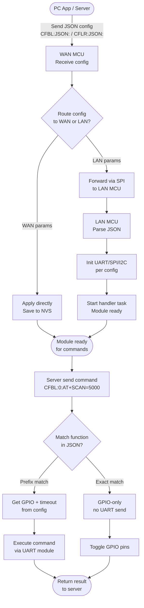
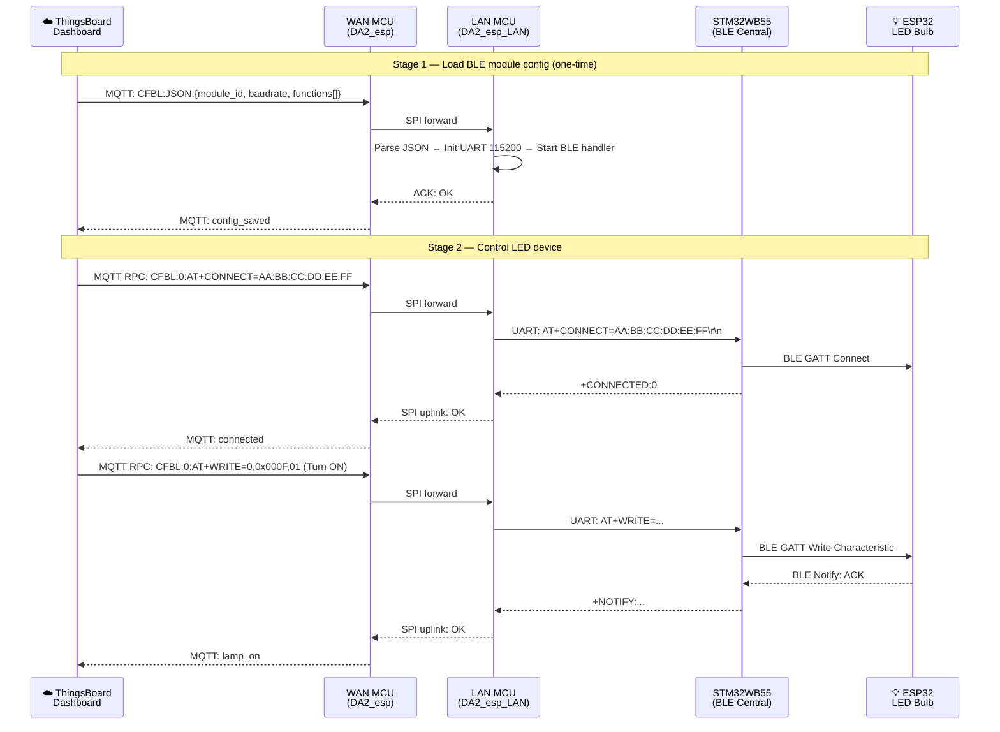

> **Vị trí trong báo cáo:** Mục 4.5.3 — Hệ thống cấu hình module dựa trên JSON

---

## 4.5.3. Hệ Thống Cấu Hình Module Dựa Trên JSON (Module Base Setting)

### 4.5.3.1. Bối Cảnh Và Vấn Đề

Trong kiến trúc ban đầu của gateway, loại module RF gắn vào từng khe phần cứng được coi là cố định tại thời điểm biên dịch. Toàn bộ thông tin đặc thù của module -- cú pháp lệnh AT, chuỗi điều khiển chân GPIO cho reset phần cứng, tốc độ baud, kiểu parity -- được viết trực tiếp vào mã nguồn firmware. Điều này đặt ra một giới hạn căn bản: mỗi khi hệ thống cần chuyển sang loại module mới, bất kể lý do là thay thế phần cứng hay nâng cấp lên module có tính năng cao hơn, đội kỹ thuật phải vào sửa firmware, biên dịch lại và nạp lại cho toàn bộ thiết bị đã triển khai.

Vấn đề này trở nên rõ ràng hơn khi tiến hành phân tích so sánh tám module BLE phổ biến trên thị trường. Phân tích cho thấy một điều nghịch lý: **100% chức năng là giống nhau** giữa tất cả các module -- đặt tên thiết bị, quét thiết bị lân cận, kết nối, ngắt kết nối, reset phần mềm, reset phần cứng -- nhưng **100% cú pháp lệnh lại khác hoàn toàn**. Ví dụ, chức năng đặt tên thiết bị được gọi bằng `AT+NAME=` trên HC-05, `AT+BLENAME=` trên module ESP32, và `AT+GAPDEVNAME=` trên nRF52. Việc chuẩn hóa theo lệnh là không khả thi; nhưng chuẩn hóa theo **tên chức năng** thì hoàn toàn có thể thực hiện và đây chính là nền tảng của hệ thống Module Base Setting.

---

### 4.5.3.2. Ý Tưởng Triển Khai

Thay vì để firmware "biết" từng loại module cụ thể, hệ thống Module Base Setting đưa toàn bộ kiến thức đặc thù của module ra ngoài firmware dưới dạng một file cấu hình JSON có thể cập nhật tại runtime. File JSON mô tả đầy đủ mọi điều firmware cần để vận hành module đó: loại giao tiếp vật lý và các tham số kèm theo, cùng danh sách tất cả chức năng module hỗ trợ. Mỗi chức năng trong danh sách được định nghĩa bởi một tên chuẩn hóa dùng làm khóa tra cứu, một template lệnh AT với placeholder cho tham số động, chuỗi điều khiển GPIO cần thực hiện trước và sau khi gửi lệnh, và giá trị timeout chờ phản hồi.

Bằng cách này, firmware không còn quan tâm đến việc module đang dùng là STM32WB55 hay nRF52840 -- nó chỉ biết rằng khi cần thực hiện chức năng `MODULE_SCAN`, nó sẽ tra cứu tên này trong cấu hình đã nạp và thực thi theo chính xác những gì JSON mô tả. Toàn bộ logic đặc thù của module nằm trong file JSON, không nằm trong firmware. Thay đổi module đồng nghĩa với gửi một file JSON mới, không phải biên dịch lại firmware.

Sáu file cấu hình preset đã được chuẩn bị cho giai đoạn kiểm thử: Zigbee E180-ZG120B, BLE STM32WB55, LoRa RAK3172, một biến thể BLE tùy chỉnh, Zigbee trên STM32WB55, và LoRa Wio-E5. Một file ánh xạ `stack_id_map.json` liên kết định danh khe phần cứng với preset module tương ứng.

---

### 4.5.3.3. Luồng Hoạt Động

Hệ thống hoạt động theo hai giai đoạn tách biệt: giai đoạn **nạp cấu hình module** và giai đoạn **thực thi lệnh điều khiển**. Hình dưới đây mô tả toàn bộ luồng từ khi ứng dụng PC hoặc server gửi JSON config đến khi gateway sẵn sàng thực thi lệnh điều khiển module.

*Hình 4.x: Module Base Setting workflow — from JSON config loading to command execution*

Cơ chế **prefix command matching** đáng được chú ý riêng trong luồng thực thi. Thay vì firmware phải duy trì một danh sách `switch-case` dài cho từng lệnh AT của từng module, hệ thống cho phép server hoặc ứng dụng PC gửi lệnh động. Khi gateway nhận được `AT+SCAN=5000`, nó tra cứu trong JSON đã nạp để tìm hàm có template lệnh bắt đầu bằng `AT+SCAN=`. Sau khi tìm thấy, nó áp dụng toàn bộ chuỗi GPIO, delay và timeout được định nghĩa trong cấu hình cho hàm đó và thực thi theo đúng trình tự. Cách này loại bỏ hoàn toàn sự phụ thuộc của firmware vào cú pháp lệnh của bất kỳ nhà sản xuất cụ thể nào.

---

### 4.5.3.4. Ứng Dụng Trong Hệ Thống IoT Thực Tế

Giá trị của Module Base Setting thể hiện rõ khi xem toàn bộ pipeline từ server đám mây xuống thiết bị đầu cuối. Kịch bản kiểm thử được thiết kế xung quanh điều khiển bóng đèn LED ESP32 từ dashboard ThingsBoard thông qua gateway DA2.

Luồng hoạt động: Server gửi lệnh AT qua MQTT (ví dụ `CFBL:0:AT+CONNECT=AA:BB:CC:DD:EE:FF`). WAN MCU nhận, chuyển tiếp qua SPI sang LAN MCU. LAN MCU **sử dụng prefix matching để tìm function trong JSON đã nạp**, lấy ra GPIO sequences và timing parameters cho function đó, **áp dụng những tham số này** vào quá trình thực thi, rồi gửi lệnh AT qua UART đến STM32WB55. Module STM32WB55 kết nối GATT đến bóng đèn ESP32 và ghi payload điều khiển. Bóng đèn nhận lệnh và thay đổi trạng thái.

**Điểm quan trọng:** Server **phải biết cú pháp AT command** để gửi lệnh hợp lệ, nhưng **không cần biết chi tiết physical** như GPIO pins, timing delays hay hàm reset. Toàn bộ chi tiết này được quản lý nội bộ bởi gateway thông qua file JSON. Khi thay module BLE sang loại khác với GPIO sequences khác nhau, chỉ cần nạp JSON config mới -- server tiếp tục gửi lệnh AT hoàn toàn giống cũ mà không cần sửa gì.

*Hình 4.x: Luồng điều khiển end-to-end từ ThingsBoard đến bóng đèn ESP32 qua gateway DA2*

Kiến trúc này thể hiện một nguyên tắc quan trọng: **tầng gateway che giấu chi tiết physical từ server**. Server hoạt động ở mức protocol -- hiểu cú pháp AT command và có thể xây dựng lệnh hợp lệ -- nhưng không cần quan tâm đến GPIO implementation của module. Mọi chi tiết về GPIO control sequences, timing delays hay pinout variations được đóng gói trong JSON config của gateway và được áp dụng trong quá trình prefix matching. Kết quả là khi thay một module BLE khác vào gateway, lệnh của server vẫn hoàn toàn giống cũ và không cần bất kỳ thay đổi gì.

---

### 4.5.3.5. Kết Quả Kiểm Thử

Toàn bộ pipeline từ ứng dụng PC qua UART đến WAN MCU, chuyển tiếp qua SPI sang LAN MCU, qua JSON parser, lưu NVS, khởi động lại handler task và thực thi lệnh BLE đã được kiểm thử và xác nhận hoạt động đúng trên phần cứng thực tế. Boot log xác nhận chuỗi phát hiện module và auto-restore hoạt động chính xác sau khi mất nguồn. Lệnh `MODULE_HW_RESET` được xác nhận không gửi bất kỳ dữ liệu nào qua UART mà chỉ thực thi chuỗi GPIO đúng như JSON mô tả. Lệnh prefix `AT+SCAN=5000` được tra cứu đúng chức năng `MODULE_START_DISCOVERY` và áp dụng timeout 7000ms từ cấu hình.

| Hạng mục kiểm thử | Kết quả |
|---|---|
| Gửi JSON config từ PC App → WAN MCU → SPI → LAN MCU | Hoàn thành |
| Parse đúng tất cả trường: module_id, baudrate, parity, danh sách chức năng | Hoàn thành |
| Lưu NVS và tự động phục hồi cấu hình sau khi mất nguồn | Hoàn thành |
| Module Monitor Task tự khởi động lại handler khi nhận config mới | Hoàn thành |
| Prefix matching: `AT+SCAN=5000` khớp đúng `MODULE_START_DISCOVERY` | Hoàn thành |
| GPIO-only command: `MODULE_HW_RESET` không gửi UART, chỉ toggle chân RST | Hoàn thành |
| Chuyển đổi loại module tại runtime mà không cần flash lại firmware | Hoàn thành |

Kiểm thử đầu cuối với bóng đèn Tuya E27 -- tức là thiết bị vật lý thay đổi trạng thái để đáp lại lệnh phát ra từ dashboard ThingsBoard qua gateway -- đang được lên lịch cho giai đoạn tiếp theo, phụ thuộc vào việc hoàn thiện board phần cứng mới.
