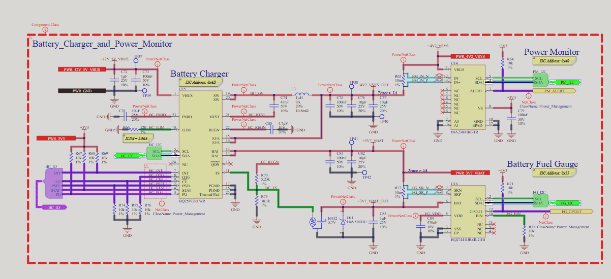
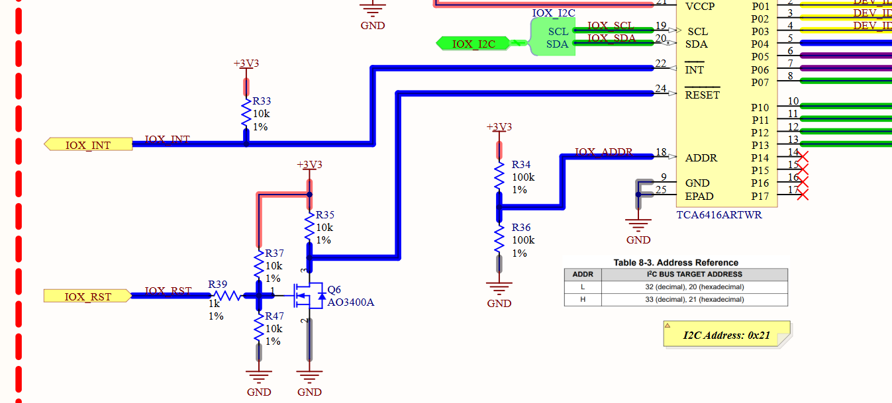
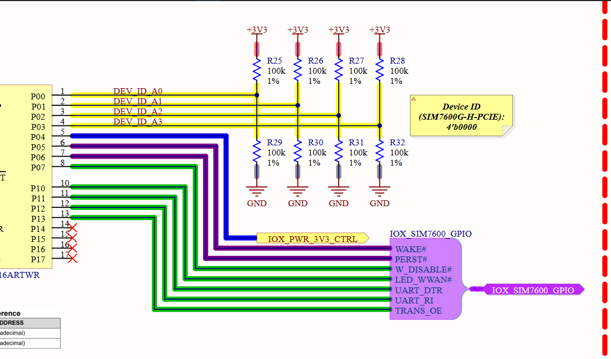
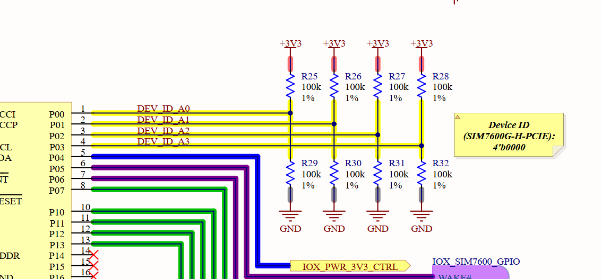
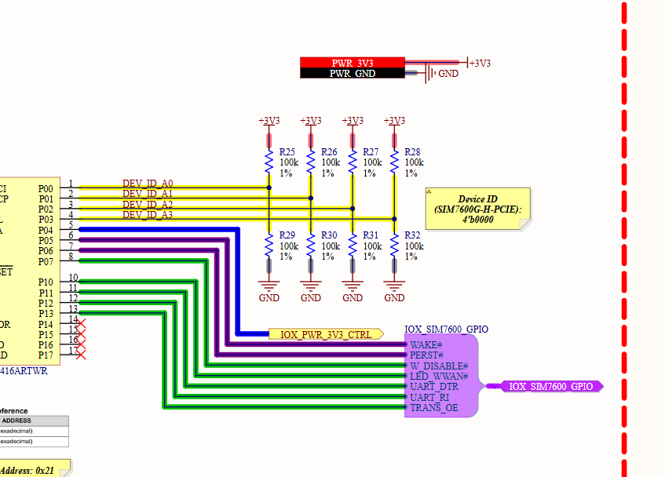
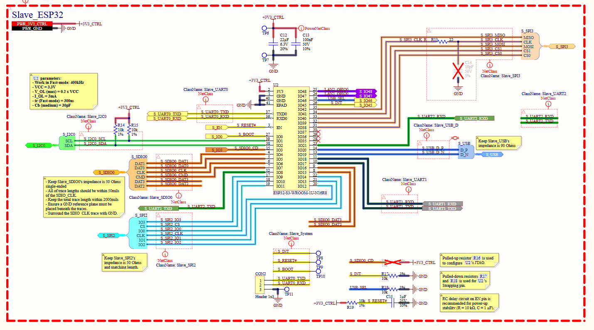

### Task update for the compatitive with the new version of hardware:
1. First, Update MCU WAN and LAN SPI Communicate PIN for matching the new hardware design. (DONE)
In the master size:
CS: GPIO_NUM_10
CLK: GPIO_NUM_12
IO0: GPIO_NUM_11
IO1: GPIO_NUM_13
In the slave size:
CS: GPIO_NUM_10
CLK: GPIO_NUM_12
IO0: GPIO_NUM_11
IO1: GPIO_NUM_13
2. INT, RESET, DATA_READY pin for the new hardware design. (DONE)
3. MCU LAN - WAN UART Compatibility Check:
- WAN: M_UART2_TX_GPIO_NUM = GPIO_NUM_42, M_UART2_RX_GPIO_NUM = GPIO_NUM_41 (SAME, DONE)
- LAN: M_UART0_TX_GPIO_NUM = GPIO_NUM_TX0, M_UART0_RX_GPIO_NUM = GPIO_NUM_RX0 (SAME, DONE)
- New mechanisum for switching UART between Display and LAN MCU: 

4. Power and charger module control Design and Implementation (NOT STARTED): 

5. ADAPTER CONNECTOR PIN CHECK:
FOR WAN:
M_BOOT_MODE_GPIO_NUM = GPIO_NUM_0 (SAME, DONE)
M_PWR_CONTROL_GPIO_NUM = GPIO_NUM_3 (SAME, DONE)
S_BOOT_MODE_GPIO_NUM = GPIO_NUM_39 (SAME, DONE)
M_UART1_RXD_GPIO_NUM = GPIO_NUM_18 (SAME, DONE)
M_UART1_TXD_GPIO_NUM = GPIO_NUM_17 (SAME, DONE)
M_UART1_RTS_GPIO_NUM = GPIO_NUM_15 (SAME, DONE)
M_UART1_CTS_GPIO_NUM = GPIO_NUM_16 (SAME, DONE)
M_SPI3_CS_GPIO_NUM = GPIO_NUM_4 (SAME, DONE)
M_SPI3_CLK_GPIO_NUM = GPIO_NUM_6 (SAME, DONE)
M_SPI3_MISO_GPIO_NUM = GPIO_NUM_7 (SAME, DONE)
M_SPI3_MOSI_GPIO_NUM = GPIO_NUM_5 (SAME, DONE)
M_I2C0_SDA_GPIO_NUM = GPIO_NUM_2 (SAME, DONE)
M_I2C0_SCL_GPIO_NUM = GPIO_NUM_1 (SAME, DONE)
IO_EXPANDER_RST_GPIO_NUM = GPIO_NUM_48
IO_EXPANDER_INT_GPIO_NUM = GPIO_NUM_47 
PIN SET:

Fix the stack handler mechanism for the new hardware design, change:
No more mapping like this:
```c
typedef enum {
  STACK_GPIO_PIN_1    = 0,
  STACK_GPIO_PIN_2    = 1,
  STACK_GPIO_PIN_3    = 2,
  STACK_GPIO_PIN_4    = 3,
  STACK_GPIO_PIN_5    = 4,
  STACK_GPIO_PIN_6    = 5,
  STACK_GPIO_PIN_7    = 6,
  STACK_GPIO_PIN_8    = 7,
  STACK_GPIO_PIN_9    = 8,
  STACK_GPIO_PIN_10   = 9,
  STACK_GPIO_PIN_11   = 10,
  STACK_GPIO_PIN_WAKE  = 11,  /**< WAKE#  – active-low wake signal  ("WK")  */
  STACK_GPIO_PIN_PERST = 12   /**< PERST# – active-low reset signal ("PE")  */
} stack_gpio_pin_num_t;
```
instead use gpio number of io expander directly like:

```c
typedef enum {
STACK_GPIO_PIN_00    = 0,   /**< P00 ADDR bit 0*/
STACK_GPIO_PIN_01    = 1,   /**< P01 ADDR bit 1*/
STACK_GPIO_PIN_02    = 2,   /**< P02 ADDR bit 2*/
STACK_GPIO_PIN_03    = 3,   /**< P03 ADDR bit 3*/
STACK_GPIO_PIN_04    = 4,   /**< P04 */
STACK_GPIO_PIN_05    = 5,   /**< P05 */
STACK_GPIO_PIN_06    = 6,   /**< P06 */
STACK_GPIO_PIN_07    = 7,   /**< P07 */
STACK_GPIO_PIN_10    = 8,   /**< P10 */
STACK_GPIO_PIN_11    = 9,   /**< P11 */
STACK_GPIO_PIN_12    = 10,  /**< P12 */
STACK_GPIO_PIN_13    = 11,  /**< P13*/
STACK_GPIO_PIN_14    = 12,  /**< P14 */
STACK_GPIO_PIN_15    = 13,  /**< P15 */ 
STACK_GPIO_PIN_16    = 14,  /**< P16 */
STACK_GPIO_PIN_17    = 15,  /**< P17 */
} stack_gpio_pin_num_t;
```
Flow of stack handler get id:
1. first start reading tca6416a address, it could be 0x20 or 0x21.
2. then start reading P00, P01, P02, P03, in order to get the address, from 0b0000 to 0b1111 like the picture above.

that is WAN address.
after we get the WAN address, we can proceed with the next steps.
LTE Control pin mapping:
have to change the default value and logic of lte control pin:
change the new lte config command, add pin sellection for these gpio, for example:
CFLT: ..... (you should determine this)
WAKE# go to P05
PERST# go to P06

FOR LAN:

S_SDIO0 CHECK:
MSD_CD
LAN1&2_ADAPTER_CHECK:
S_UART1_TXD = GPIO_NUM_17 (SAME, DONE) for LAN1
S_UART1_RXD = GPIO_NUM_18 (SAME, DONE) for LAN1
S_UART2_TXD = GPIO_NUM_8 (DIFF) for LAN2
S_UART2_RXD = GPIO_NUM_21 (DIFF) for LAN2
S_SPI3_CS0 = GPIO_NUM_38 (DIFF) for both LAN1 and LAN2
S_SPI3_CS1 = GPIO_NUM_39 (DIFF) for both LAN1 and LAN2
S_SPI3_CLK = GPIO_NUM_41 (DIFF) for both LAN1 and LAN2
S_SPI3_MISO = GPIO_NUM_42 (DIFF) for both LAN1 and LAN2
S_SPI3_MOSI = GPIO_NUM_40 (DIFF) for both LAN1 and LAN2
S_I2C0_SDA = GPIO_NUM_02 (SAME, DONE) for both LAN1 and LAN2
S_I2C0_SCL = GPIO_NUM_01 (SAME, DONE) for both LAN1 and LAN2
S_USB_DM and S_USB_DP (SAME MCU FIXED PINS, DONE) for both LAN1 and LAN2 (only 1 adapter can be used at a time, use by usb switch with control pin is GPIO46)
LAN1_GPIO0 = GPIO_NUM_47 (DIFF, use for IO expander interrupt)
LAN2_GPIO0 = GPIO_NUM_48 (DIFF, use for IO expander interrupt)
Change the stack handler mechanism for the new hardware design, change:
No more mapping like this:
```c
typedef enum {
  STACK_GPIO_PIN_1    = 0,
  STACK_GPIO_PIN_2    = 1,
  STACK_GPIO_PIN_3    = 2,
  STACK_GPIO_PIN_4    = 3,
  STACK_GPIO_PIN_5    = 4,
  STACK_GPIO_PIN_6    = 5,
  STACK_GPIO_PIN_7    = 6,
  STACK_GPIO_PIN_8    = 7,
  STACK_GPIO_PIN_9    = 8,
  STACK_GPIO_PIN_10   = 9,
  STACK_GPIO_PIN_11   = 10,
  STACK_GPIO_PIN_WAKE  = 11,  /**< WAKE#  – active-low wake signal  ("WK")  */
  STACK_GPIO_PIN_PERST = 12   /**< PERST# – active-low reset signal ("PE")  */
} stack_gpio_pin_num_t;
```
instead use gpio number of io expander directly like:

```c
typedef enum {
STACK_GPIO_PIN_00    = 0,   /**< P00 ADDR bit 0*/
STACK_GPIO_PIN_01    = 1,   /**< P01 ADDR bit 1*/
STACK_GPIO_PIN_02    = 2,   /**< P02 ADDR bit 2*/
STACK_GPIO_PIN_03    = 3,   /**< P03 ADDR bit 3*/
STACK_GPIO_PIN_04    = 4,   /**< P04 */
STACK_GPIO_PIN_05    = 5,   /**< P05 */
STACK_GPIO_PIN_06    = 6,   /**< P06 */
STACK_GPIO_PIN_07    = 7,   /**< P07 */
STACK_GPIO_PIN_10    = 8,   /**< P10 */
STACK_GPIO_PIN_11    = 9,   /**< P11 */
STACK_GPIO_PIN_12    = 10,  /**< P12 */
STACK_GPIO_PIN_13    = 11,  /**< P13*/
STACK_GPIO_PIN_14    = 12,  /**< P14 */
STACK_GPIO_PIN_15    = 13,  /**< P15 */ 
STACK_GPIO_PIN_16    = 14,  /**< P16 */
STACK_GPIO_PIN_17    = 15,  /**< P17 */
} stack_gpio_pin_num_t;
```
However, now the io expander is now in the adapter board, not fixed on the main board, so the stack handler code much be imple again for the new hardware design, the flow of stack handler get id:
1. first start reading tca6416a address, it could be 0x20 or 0x21. (bug there, both adapter could have same address so the gateway 2 adapter must have different address).
2. the there is gpio called IOX_SLOTDET which adatper read the P17 pin the value is 0 is slot LAN ADAPTER 1, 1 is slot LAN ADAPTER 2. 
3. Now init the stack handler with the slot information, so we can know which slot is using when reading the gpio value for getting the address.
3. when we get the address and the slot, we can start reading P00, P01, P02, P03, in order to get the address, from 0b0000 to 0b1111 like the WAN flow.
4. now we get the stack_1_id and stack_2_id, we can proceed with the next steps like normal.

